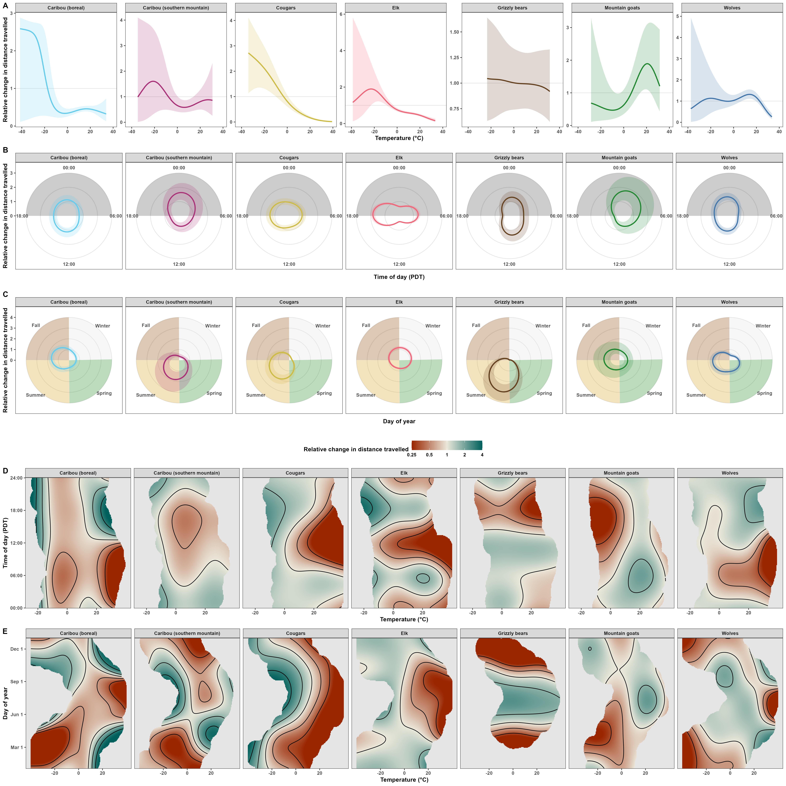
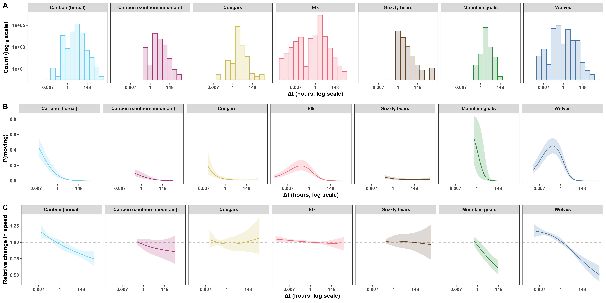

```{r setup, include=FALSE}
# set chunk defaults: don't print code, images text width and centered
knitr::opts_chunk$set(echo = FALSE, out.width = '\\textwidth',
                      fig.align = 'center', cache = TRUE, warning = FALSE,
                      message = FALSE)
```

\clearpage

# Effects of temperature on movement rates

```{r splits, fig.cap="Histograms of each species' estimated speed. Continuous red lines indicate the values used to determine whether an animal was moving or not, which were determined visually using the inflection points of the histograms. Dashed blue lines indicate the minimum speed corresponding to a moving animal as determined by $k$-means algorithms with 2 clusters. For ease of readability, the x axes range from 0 the 0.99 quantile, while the y axes range from 0 to one fortieth of the total number of estimates."}
knitr::include_graphics('../figures/moving-0-1-split.png')
```

\noindent The two models for the probability of moving and speed when moving were fit using the code below:

\footnotesize

\singlespacing

```{r hgam_1, eval=FALSE, echo=TRUE}
m_moving <- bam(moving ~ # model estimating probability of moving
                  # random intercept for each animal
                  s(animal, bs = 're') +
                  # fixed intercept for each species
                  species +
                  # to account for changes in behavior within days
                  s(tod_pdt, by = species, k = 5, bs = 'cc') +
                  # to account for changes in behavior within years
                  s(doy, by = species, k = 5, bs = 'cc') +
                  # species-level effect of temperature
                  s(temp_c, by = species, k = 5, bs = 'tp') +
                  # to account for seasonal changes in day length
                  ti(doy, tod_pdt, by = species, k = 5, bs = c('cc', 'cc')) +
                  # to account for changes in day nocturnality with temperature
                  ti(temp_c, tod_pdt, by = species, k = 5, bs = c('tp', 'cc')) +
                  # to account for changes in fur coats seasonally
                  ti(temp_c, doy, by = species, k = 5, bs = c('tp', 'cc')) +
                  # larger sampling intervals underestimate movement speed
                  s(log(dt), k = 3) +
                  s(log(dt), species, k = 3, bs = 'fs'),
                family = binomial(link = 'logit'),
                data = d,
                method = 'fREML', # fast REML
                discrete = TRUE, # discretize the covariates for faster computation
                knots = list(tod_pdt = c(0, 1), doy = c(0.5, 366.5)), #' for `bs = 'cc'`
                control = gam.control(trace = TRUE))
```

\clearpage

```{r hgam_2, eval=FALSE, echo=TRUE}
m_speed <- bam(speed_est ~ # model estimating speed when moving (i.e., speed > 0)
                 # random intercept for each animal
                 s(animal, bs = 're') +
                 # fixed intercept for each species
                 species +
                 # to account for changes in behavior within days
                 s(tod_pdt, by = species, k = 5, bs = 'cc') +
                 # to account for changes in behavior within years
                 s(doy, by = species, k = 5, bs = 'cc') +
                 # species-level effect of temperature
                 s(temp_c, by = species, k = 5, bs = 'tp') +
                 # to account for seasonal changes in day length
                 ti(doy, tod_pdt, by = species, k = 5, bs = c('cc', 'cc')) +
                 # to account for changes in day nocturnality with temperature
                 ti(temp_c, tod_pdt, by = species, k = 5, bs = c('tp', 'cc')) +
                 # to account for changes in fur coats seasonally
                 ti(temp_c, doy, by = species, k = 5, bs = c('tp', 'cc')) +
                 # larger sampling intervals underestimate movement speed
                 s(log(dt), k = 3) +
                 s(log(dt), species, k = 3, bs = 'fs'),
               family = Gamma(link = 'log'), # can use Gamma because no zeros
               data = d_2,
               method = 'fREML', # fast REML
               discrete = TRUE, # discretize the covariates for faster computation
               knots = list(tod_pdt = c(0, 1), doy = c(0.5, 366.5)), #' for `bs = 'cc'`
               control = gam.control(trace = TRUE))
```

\normalsize

\doublespacing

```{r data-hist, fig.cap="Histograms of the number of states (\\textbf{A}) and speed estimates (\\textbf{B}) over time of day (Pacific Daylight Time, PDT), day of year (Julian date), and air temperature."}
knitr::include_graphics('../figures/temperature-movement-rates-hist.png')
```

```{r pred-vs-pred-hgams, fig.cap="Hexplot of the fitted values from the HGAMs with and without including temperature for the probability of movement (\\textbf{A}) and speed when moving (\\textbf{B})."}

```

```{r p-full, fig.cap="\\textbf{A.} Estimated effects of temperature on each species' probability of moving on June 1$^{\\text{st}}$ at 12:00, Pacific Daylight Time (PDT). The rug plot indicates each species' data on June 1$^{\\text{st}}$. \\textbf{B.} Estimated effects of time of day on each species' probability of moving on June 1$^{\\text{st}}$ at $0^\\circ$C. The grey area indicates evening and night (hours between 18:00 and 6:00). \\textbf{C.} Estimated effects of day of year on each species' probability of moving at 12:00 with a temperature of 0$^\\circ$C. The year is divided into the four seasons: winter (white), spring (green), summer (gold), and fall (brown). In panels A-C, ribbons indicate 95\\% Bayesian Credible Intervals, and the sampling rate was post-stratified to $\\Delta t = 1$ hour for all species. \\textbf{D.} Effects of time of day and temperature on species' probability of moving on June 1$^{\\text{st}}$ at 12:00 PDT. \\textbf{E.} Effects of day of year and temperature on species' probability of moving at 12:00 PDT. Surfaces in panels D and E extend to 10\\% of the range away from each datum."}
knitr::include_graphics('../figures/p-moving-full.png')
```

<!-- speed and displacement don't need specifications on time of day because the change is relative, but keeping them anyway for consistency -->

```{r s-full, fig.cap="\\textbf{A.} Estimated effects of temperature on each species' speed when moving on June 1$^{\\text{st}}$ at 12:00, Pacific Daylight Time (PDT). The rug plot indicates each species' data points where an animal was moving on June 1$^{\\text{st}}$. \\textbf{B.} Estimated effects of time of day on each species' speed when moving on June 1$^{\\text{st}}$ at $0^\\circ$C. The grey area indicates evening and night (hours between 18:00 and 6:00). \\textbf{C.} Estimated effects of day of year on each species' speed when moving at 12:00 with a temperature of 0$^\\circ$C. The year is divided into the four seasons: winter (white), spring (green), summer (gold), and fall (brown). In panels A-C, ribbons indicate 95\\% Bayesian Credible Intervals, and the sampling rate was post-stratified to $\\Delta t = 1$ hour for all species. \\textbf{D.} Effects of time of day and temperature on species' speed when moving on June 1$^{\\text{st}}$. \\textbf{E.} Effects of day of year and temperature on species' speed when moving, if the animal was moving at 12:00 PM PDT. Surfaces extend to 10\\% of the range away from each datum. The color bar is on the $\\log_2$ scale to help visualize patterns in doubling."}
knitr::include_graphics('../figures/speed-full.png')
```

```{r d-full, fig.cap="\\textbf{A.} Estimated effects of temperature on each species' distance traveled on June 1$^{\\text{st}}$ at 12:00, Pacific Daylight Time (PDT). The rug plot indicates each species' data points where an animal was moving on June 1$^{\\text{st}}$. \\textbf{B.} Estimated effects of time of day on each species' distance traveled on June 1$^{\\text{st}}$ at $0^\\circ$C. The grey area indicates evening and night (hours between 18:00 and 6:00). \\textbf{C.} Estimated effects of day of year on each species' distance traveled at 12:00 with a temperature of 0$^\\circ$C. The year is divided into the four seasons: winter (white), spring (green), summer (gold), and fall (brown). In panels A-C, ribbons indicate 95\\% Bayesian Credible Intervals, and the sampling rate was post-stratified to $\\Delta t = 1$ hour for all species. \\textbf{D.} Effects of time of day and temperature on species' distance traveled on June 1$^{\\text{st}}$ at 12:00 PDT. \\textbf{E.} Effects of day of year and temperature on species' distance traveled at 12:00 PDT. Surfaces extend to 10\\% of the range away from each datum. The color bar is on the $\\log_2$ scale to help visualize patterns in doubling."}

```

```{r op, fig.cap="Relationsips between the observed and predicted values for probability of movement (\\textbf{A}) and speed given that an animal was moving (\\textbf{B}). The color in panel \\textbf{A} indicates the number of points used to calculate the estimate (on the $\\log_{2}$ scale), while the grey lines in both panels indicate perfect prediction (i.e., the 1:1 line)."}
knitr::include_graphics('../figures/p-and-speed-observed-vs-predicted.png')
```

```{r dt-smooths, fig.cap="\\textbf{A.} Histograms of sampling intervals between GPS locations. \\textbf{B.} Species-level smooth effects of sampling interval on the estimated probability of the animal moving. \\textbf{C.} Species-level estimated smooth effects of sampling interval on an animal's speed when moving. All x axes are on the natural logarithm scale."}

```

```{r t-p-mov, fig.cap="\\textbf{The direction and magnitude of changes in probability of moving due to climate change varies among species, but worse climate-change scenarios result in the greatest change.} Lines indicate the median projected change in probability of moving due to changes in temperature changes in temperature within the area delimitated by the 99.9% Autocorrelated Densitity Kernel Estimates of space use. Shaded areas indicate the range of predicted values between the $95^\\text{th}$ and $5^\\text{th}$ percentiles. Changes are relative to the predicted mean probabilies of moving in 2025 across the four Shared Socioeconomic Pathways (SSPs). If the intervals are fully above the dashed line, at least 90% of the estimated means increased, relative to the each pixel's average of the four climate scenarios in 2025. Similar conclusions can be drawn regarding a decrease if the ribbons are below the dashed line. The projections only account for changes in movement behaviour and ignore changes in physiology or movement costs."}
knitr::include_graphics('../figures/p-moving-local-cc-predictions.png')
```

```{r t-speed, fig.cap="\\textbf{The direction and magnitude of changes in speed due to climate change varies among species, but worse climate-change scenarios result in the greatest change.} Lines indicate the median projected change in speed due to changes in temperature within the area delimitated by the 99.9% Autocorrelated Densitity Kernel Estimates of space use. Shaded areas indicate the range of predicted values between the $95^\\text{th}$ and $5^\\text{th}$ percentiles. Changes are relative to the predicted mean speeds in 2025 across the four Shared Socioeconomic Pathways (SSPs). If the intervals are fully above the dashed line, at least 90% of the estimated means increased, relative to the each pixel's average of the four climate scenarios in 2025. Similar conclusions can be drawn regarding a decrease if the ribbons are below the dashed line. The projections only account for changes in movement behaviour and ignore changes in physiology or movement costs."}
knitr::include_graphics('../figures/speed-local-cc-predictions.png')
```

\clearpage

# Effects of temperature on habitat selection

\noindent Each species had a Hierarchical Resource Selection Function fit with the code below. See @aarts_estimating_2008 for additional information on fitting Resource Selection Functions using Poisson models.

\singlespacing

\footnotesize

```{r rsf, eval=FALSE, echo=TRUE}
rsf <- bam(detected ~ # 1 for telemetry locations, 0 for quadrature points
             # species-level average resource preference
             s(forest_perc, k = 4, bs = 'cr') +
             s(elevation_m, k = 4, bs = 'cr') +
             s(dist_water_m, k = 4, bs = 'cr') +
             # animal-level deviations from the species-level average
             s(animal, bs = 're') +
             s(forest_perc, animal, k = 4, bs = 'fs', xt = list(bc = 'cr')) +
             s(elevation_m, animal, k = 4, bs = 'fs', xt = list(bc = 'cr')) +
             s(dist_water_m, animal, k = 4, bs = 'fs', xt = list(bc = 'cr')) +
             # changes in preference with temperature
             ti(forest_perc, temperature_C, k = 4, bs = 'cr') +
             ti(elevation_m, temperature_C, k = 4, bs = 'cr') +
             ti(dist_water_m, temperature_C, k = 4, bs = 'cr') +
             # include marginals of temperature to post-stratify over afterwards
             s(temperature_C, k = 4, bs = 'cr') +
             s(temperature_C, animal, k = 4, bs = 'fs', xt = list(bc = 'cr')),
           family = poisson(link = 'log'),
           data = d,
           weights = weight, # based on AKDE
           subset = species == sp, # subset to the species of interest
           method = 'fREML',
           discrete = TRUE)
```

\normalsize

\doublespacing

\clearpage

```{r kept-hrsf}
readr::read_csv('../data/tracking-data/telemetry-metadata.csv',
                show_col_types = FALSE) %>%
  mutate(keep_for_RSF = if_else(keep_for_RSF == 'yes', 'yes', 'no')) %>%
  group_by(species, keep_for_RSF) %>%
  summarize(n = n()) %>%
  mutate(prop = n / sum(n)) %>%
  # fix species names
  mutate(species = case_when(
    species == 'Rangifer tarandus (s. mountain)' ~ 'R. tarandus (sm)',
    species == 'Rangifer tarandus (boreal)' ~ 'R. tarandus (b)',
    .default = species)) %>%
  mutate(species = paste0('\\emph{', species, '}') %>%
           gsub(')}', ')', .) %>%
           gsub(' \\(', '} \\(', .)) %>%
  bind_rows(.,
            group_by(., keep_for_RSF) %>%
              summarize(species = 'Total',
                        n = sum(n)) %>%
              mutate(prop = n / sum(n))) %>%
  rename(Species = species, `Kept` = keep_for_RSF, Proportion = prop) %>%
  knitr::kable(format = 'markdown', digits = 3, caption = "Number of animals (n) and proportion of animals (Proportion) used or excluded (Kept) when fitting the hierarchical resource selection function. The models only used animals that showed stationary range residency or two clear seasonal ranges within the tracking period. We excluded animals with insufficient data to estimate a range size and animals that migrated but did not establish clear ranges within the tracking period.")
```

```{r resources, fig.cap="Resource rasters used for each species' hierarchical resource selection function."}
knitr::include_graphics('../figures/local-resources.png')
```

```{r avail-used, out.width='95%', fig.cap="Histograms of available (red) and used (blue) resources. Each GPS fix counts as one observation. The y axis is on the square-root scale to help visualize values with low counts."}
knitr::include_graphics('../figures/available-vs-used.png')
```

```{r avail-used-w, out.width='95%', fig.cap="Histograms of available (red) and used (blue) resources. All GPS fixes are weighted according to their independence relative to the respective animals' range crossing time and Autocorrelated Kernel Density Estimate (i.e., the weights returned by AKDE weights multiplied by the number of home-range-crossing degrees of freedom). The y axis is on the square-root scale to help visualize values with low counts."}
knitr::include_graphics('../figures/available-vs-used-weighted.png')
```

```{r pred-vs-pred-hrsfs, fig.cap="Hexplot of the fitted values from the HRSFs with and without including temperature. For ease of visibility, values < -20 (0.41%) were set to -20."}
knitr::include_graphics('../figures/hrsf-with-without-temp-prediction-agreement.png')
```

```{r hrsf-se, fig.cap="Estimated standard error in the relative selection strength (RSS) for forest cover (\\%), elevation (km), and distance from water (km) as a function of temperature (see Fig. 3 in the main text). The black contours indicate the extent of each speices' observed data. For ease of readability, the color bar values were capped to a maximum of 3 (original maximum was 7.00)."}
knitr::include_graphics('../figures/hrsf-surface-plots-se.png')
```

\clearpage

# Model selection

```{r temp-comparison}
setwd('..')
library('dplyr')
source('analysis/figures/default-ggplot-theme.R') #' for `SPECIES` object

temp_comp <- tibble(
  Model = c('$P(M)$', 'Speed', rep('HRSF', 7)),
  Species = c('All', 'All', sort(as.character(SPECIES))),
  DDE =
    c(10.72 - 10.23, 79.26 - 79.11, 9.16, 4.62, 18.6, 8.0, 5.30, 12.0, 17.7) %>%
    round(1) %>%
    paste0('%'),
  DAIC = c(5927, 1682, 6566, 4448, 813, 966, 5637, 342, 914) %>%
    round())

if(FALSE) {
  range(as.numeric(gsub('%', '', temp_comp$DDE)))
  range(as.numeric(gsub('%', '', temp_comp$DDE))[- c(1:2)])
  max(temp_comp$DAIC)
}

colnames(temp_comp)[colnames(temp_comp) == 'DAIC'] <- paste0('\U0394', 'AIC')
colnames(temp_comp)[colnames(temp_comp) == 'DDE'] <- paste0('\U0394', 'DE')

knitr::kable(temp_comp, digits = 1, format = 'markdown', caption = "Changes in deviance expained ($\\Delta$DE) and Akaike Information Criterion ($\\Delta$AIC) from including temperature in the models estimating probability of movement ($P(M)$) and speed when moving (Speed) as well as in species-level Hierarchical Resource Selection Functions (HRSF). Unlike conventional marginal AIC [@akaike_new_1974], The AIC values provided by the `mgcv` package for `R` are calculated using the models' estimated effective degrees of freedom and the Bayesian variance-covariance matrices, which avoids issues related to random effects or Restricted Maximum Likelihood (REML).")
```

\clearpage

## Analyses of Deviance

\noindent Here we produce approximate p-values for analyses of deviance (a form of generalized likelihood ratio tests) following the methods of Section 3.3 in @wood_generalized_2017. We use an $F$ test rather than a $\chi^2$ test for the Gamma models because the scale parameter for the Gamma distribution is estimated rather than known or fixed [as in the case of binomial or Poisson distributions -- see table 3.1 on page 104 of @wood_generalized_2017].

\singlespacing

\footnotesize

```{r, echo=TRUE}
# P(moving)
anova(readRDS('../models/binomial-gam-without-temperature.rds'),
      readRDS('../models/binomial-gam.rds'),
      test = 'Chisq')
```

\clearpage

```{r, echo=TRUE}
# speed when moving
anova(readRDS('../models/gamma-gam-without-temperature.rds'),
      readRDS('../models/gamma-gam.rds'),
      test = 'F')
```

<!-- \clearpage -->

```{r, echo=TRUE}
# HRSFs
anova(readRDS('../models/rsf-Canis lupus-2025-01-20.rds'),
      readRDS('../models/rsf-Canis lupus-no-temperature-2025-01-20.rds'),
      test = 'Chisq')
```

\clearpage

```{r, echo=TRUE}
anova(readRDS('../models/rsf-Cervus canadensis-2025-01-20.rds'),
      readRDS('../models/rsf-Cervus canadensis-no-temperature-2025-01-20.rds'),
      test = 'Chisq')
```

<!-- \clearpage -->

```{r, echo=TRUE}
anova(readRDS('../models/rsf-Oreamnos americanus-2025-01-20.rds'),
      readRDS('../models/rsf-Oreamnos americanus-no-temperature-2025-01-20.rds'),
      test = 'Chisq')
```

\clearpage

```{r, echo=TRUE}
anova(readRDS('../models/rsf-Puma concolor-2025-01-20.rds'),
      readRDS('../models/rsf-Puma concolor-no-temperature-2025-01-20.rds'),
      test = 'Chisq')
```

<!-- \clearpage -->

```{r, echo=TRUE}
anova(
  readRDS('../models/rsf-Rangifer tarandus boreal-2025-01-21.rds'),
  readRDS('../models/rsf-Rangifer tarandus boreal-no-temperature-2025-01-20.rds'),
  test = 'Chisq')
```

\clearpage

```{r, echo=TRUE}
anova(readRDS('../models/rsf-Rangifer tarandus southern mountain-2025-01-20.rds'),
      readRDS('../models/rsf-Rangifer tarandus southern mountain-no-temperature-2025-01-20.rds'),
      test = 'Chisq')
```

<!-- \clearpage -->

```{r, echo=TRUE}
anova(readRDS('../models/rsf-Ursus arctos horribilis-2025-01-20.rds'),
      readRDS('../models/rsf-Ursus arctos horribilis-no-temperature-2025-01-20.rds'),
      test = 'Chisq')
```

\normalsize

\doublespacing

\clearpage

# Refences
