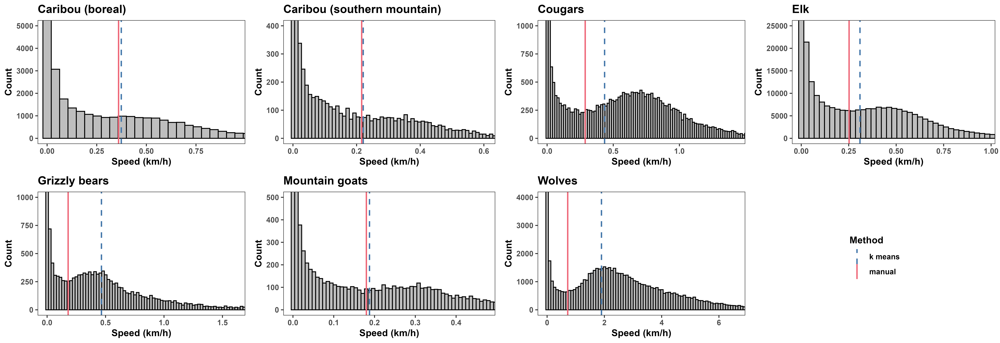
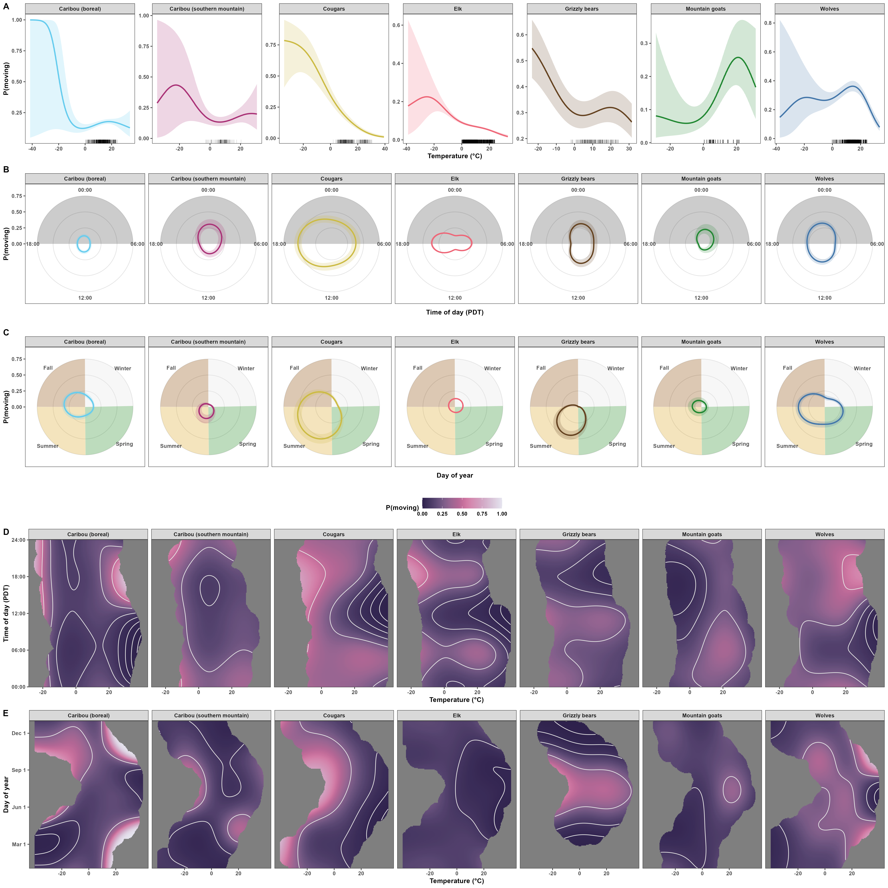
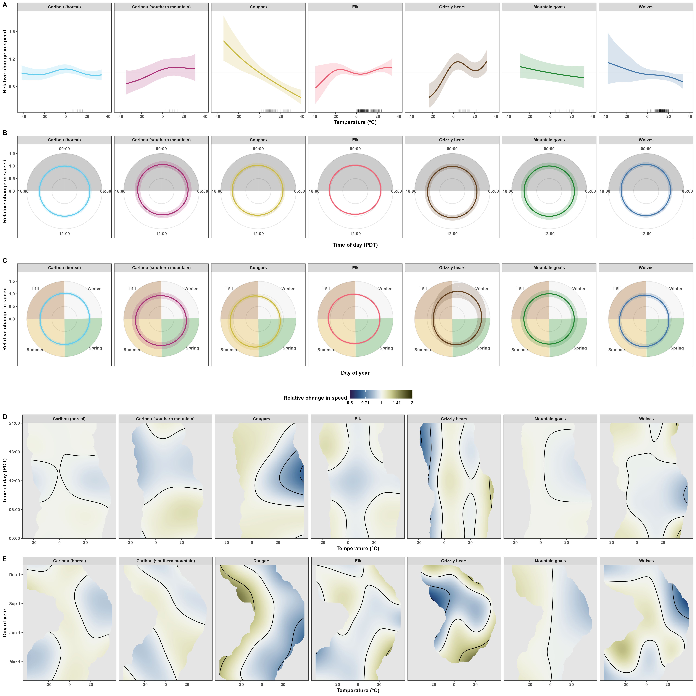
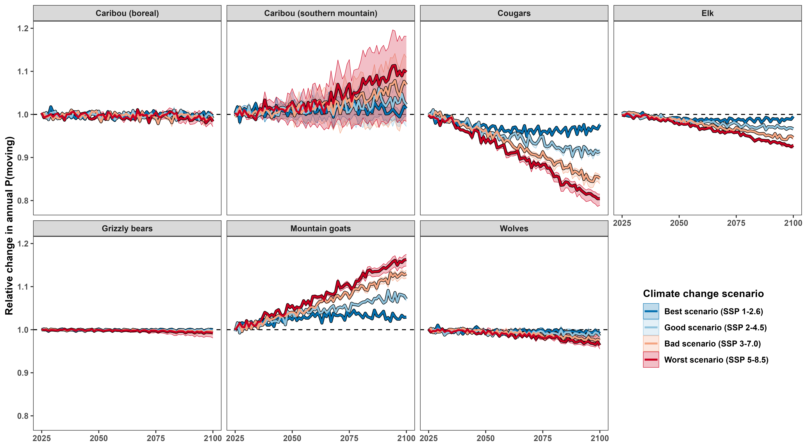
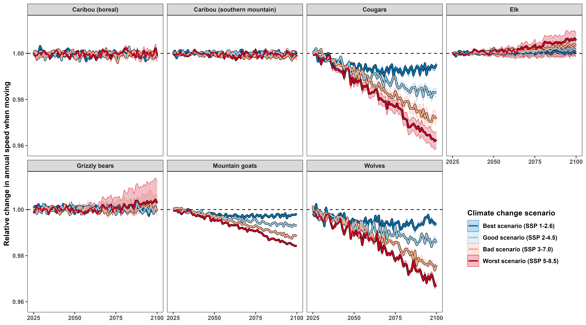
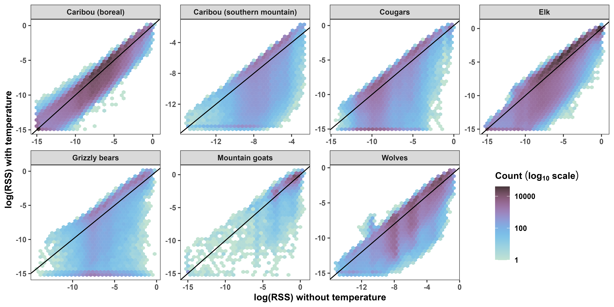

```{r setup, include=FALSE}
# set chunk defaults: don't print code, images text width and centered
knitr::opts_chunk$set(echo = FALSE, out.width = '\\textwidth',
                      fig.align = 'center', cache = TRUE, warning = FALSE,
                      message = FALSE)
```

\clearpage

# Directed Acyclical Graphs

```{r hgam-dag,  message=FALSE, warning=FALSE, fig.cap="Directed Acyclical Graph assumed for inferring the causal effects of temperature (Temp) on probability of moving, speed when moving, or distance traveled ($Y$) while accounting for the effects of time of day (TOD), day of year (DOY), and their interaction effects. Temperature directly affects $Y$, but the effects of temperature depend on the time of day and season. Time of day and day of year also affect $Y$ directly, but the effect of time of day changes throughout the year due to changes in day length and seasonality.", fig.height=4, fig.width=4, out.width='40%'}
library('dplyr')   # for data wrangling
library('ggplot2') # for fancy plots
library('ggdag')   # for directed acyclical graphs

dagify(Y ~ TOD + DOY + Temp,
       Temp ~ TOD + DOY,
       TOD ~ DOY,
       outcome = 'Y',
       coords = list(x = c(Y = 0, TOD = -1, DOY = 1, Temp = 0),
                     y = c(Y = 1.2, TOD = 2, DOY = 2, Temp = 0))) %>%
  tidy_dagitty() %>%
  mutate(col = case_when(name == 'Y' ~ '1',
                         name == 'TOD' ~ '0',
                         name == 'DOY' ~ '0',
                         name == 'Temp' ~ '2')) %>%
  ggplot(aes(x = x, y = y, xend = xend, yend = yend)) +
  geom_dag_point(aes(color = col), size = 20, alpha = 0.5) +
  geom_dag_point(color = 'black', size = 20, shape = 1) +
  geom_dag_edges() +
  geom_dag_text(aes(label = name), color = 'black', size = 4.5) +
  scale_color_manual(values = c('grey', 'darkorange', 'red')) +
  theme_dag() +
  theme(legend.position = 'none')
```

```{r hrsf-dag, message=FALSE, warning=FALSE, fig.cap="Directed Acyclical Graph assumed for inferring the causal effects of temperature (Temp) on Relative Selection Strength (RSS) for percent forest cover (F), elevation (E), and distance from water (W). The RSS for of a given habitat depends on all three resources, and the selection for each resource is independent of the other two resources and dependent on temperature.", fig.height=4, fig.width=4, out.width='40%'}
library('dplyr')   # for data wrangling
library('ggplot2') # for fancy plots
library('ggdag')   # for directed acyclical graphs

dagify(RSS ~ `F` + E + W,
       `F` ~ Temp,
       E ~ Temp,
       W ~ Temp,
       outcome = 'RSS',
       coords = list(x = c(RSS = 0, `F` = -1, E = 0, W = 1, Temp = 0),
                     y = c(RSS = 2, `F` = 1, E = 1, W = 1, Temp = 0))) %>%
  tidy_dagitty() %>%
  mutate(col = case_when(name == 'RSS' ~ '1',
                         name == 'F' ~ '0',
                         name == 'E' ~ '0',
                         name == 'W' ~ '0',
                         name == 'Temp' ~ '2')) %>%
  ggplot(aes(x = x, y = y, xend = xend, yend = yend)) +
  geom_dag_point(aes(color = col), size = 20, alpha = 0.5) +
  geom_dag_point(color = 'black', size = 20, shape = 1) +
  geom_dag_edges() +
  geom_dag_text(aes(label = name), color = 'black', size = 4.5) +
  scale_color_manual(values = c('grey', 'darkorange', 'red')) +
  theme_dag() +
  theme(legend.position = 'none')
```

\clearpage

# Effects of temperature on movement rates

```{r splits, fig.cap="Histograms of each species' estimated speed. Continuous red lines indicate the values used to determine whether an animal was moving or not, which were determined visually using the inflection points of the histograms. Dashed blue lines indicate the minimum speed corresponding to a moving animal as determined by $k$-means algorithms with 2 clusters. For ease of readability, the x axes range from 0 the 0.99 quantile, while the y axes range from 0 to one fortieth of the total number of estimates."}

```

```{r data-hist, fig.cap="Histograms of the number of states (\\textbf{A}) and speed estimates (\\textbf{B}) over time of day (Pacific Daylight Time, PDT), day of year (Julian date), and air temperature."}
knitr::include_graphics('../figures/temperature-movement-rates-hist.png')
```

```{r pred-vs-pred-hgams, fig.cap="Scatterplot of the fitted values from the HGAMs with and without including temperature for the probability of movement (\\textbf{A}) and speed when moving (\\textbf{B})."}
knitr::include_graphics('../figures/hgam-with-without-temp-prediction-agreement.png')
```

```{r p-full, fig.cap="\\textbf{A.} Estimated effects of temperature on each species' probability of moving on June 1$^{\\text{st}}$ at 12:00, Pacific Daylight Time (PDT). The rug plot indicates each species' data on June 1$^{\\text{st}}$. \\textbf{B.} Estimated effects of time of day on each species' probability of moving on June 1$^{\\text{st}}$ at $0^\\circ$C. The grey area indicates evening and night (hours between 18:00 and 6:00). \\textbf{C.} Estimated effects of day of year on each species' probability of moving at 12:00 with a temperature of 0$^\\circ$C. The year is divided into the four seasons: winter (white), spring (green), summer (gold), and fall (brown). In panels A-C, ribbons indicate 95\\% Bayesian Credible Intervals, and the sampling rate was post-stratified to $\\Delta t = 1$ hour for all species. \\textbf{D.} Effects of time of day and temperature on species' probability of moving on June 1$^{\\text{st}}$ at 12:00 PDT. \\textbf{E.} Effects of day of year and temperature on species' probability of moving at 12:00 PDT. Surfaces in panels D and E extend to 10\\% of the range away from each datum."}

```

<!-- speed and displacement don't need specifications on time of day because the change is relative, but keeping them anyway for consistency -->

```{r s-full, fig.cap="\\textbf{A.} Estimated effects of temperature on each species' speed when moving on June 1$^{\\text{st}}$ at 12:00, Pacific Daylight Time (PDT). The rug plot indicates each species' data points where an animal was moving on June 1$^{\\text{st}}$. \\textbf{B.} Estimated effects of time of day on each species' speed when moving on June 1$^{\\text{st}}$ at $0^\\circ$C. The grey area indicates evening and night (hours between 18:00 and 6:00). \\textbf{C.} Estimated effects of day of year on each species' speed when moving at 12:00 with a temperature of 0$^\\circ$C. The year is divided into the four seasons: winter (white), spring (green), summer (gold), and fall (brown). In panels A-C, ribbons indicate 95\\% Bayesian Credible Intervals, and the sampling rate was post-stratified to $\\Delta t = 1$ hour for all species. \\textbf{D.} Effects of time of day and temperature on species' speed when moving on June 1$^{\\text{st}}$. \\textbf{E.} Effects of day of year and temperature on species' speed when moving, if the animal was moving at 12:00 PM PDT. Surfaces extend to 10\\% of the range away from each datum. The color bar is on the $\\log_2$ scale to help visualize patterns in doubling."}

```

```{r d-full, fig.cap="\\textbf{A.} Estimated effects of temperature on each species' distance traveled on June 1$^{\\text{st}}$ at 12:00, Pacific Daylight Time (PDT). The rug plot indicates each species' data points where an animal was moving on June 1$^{\\text{st}}$. \\textbf{B.} Estimated effects of time of day on each species' distance traveled on June 1$^{\\text{st}}$ at $0^\\circ$C. The grey area indicates evening and night (hours between 18:00 and 6:00). \\textbf{C.} Estimated effects of day of year on each species' distance traveled at 12:00 with a temperature of 0$^\\circ$C. The year is divided into the four seasons: winter (white), spring (green), summer (gold), and fall (brown). In panels A-C, ribbons indicate 95\\% Bayesian Credible Intervals, and the sampling rate was post-stratified to $\\Delta t = 1$ hour for all species. \\textbf{D.} Effects of time of day and temperature on species' distance traveled on June 1$^{\\text{st}}$ at 12:00 PDT. \\textbf{E.} Effects of day of year and temperature on species' distance traveled at 12:00 PDT. Surfaces extend to 10\\% of the range away from each datum. The color bar is on the $\\log_2$ scale to help visualize patterns in doubling."}
knitr::include_graphics('../figures/distance-travelled-full.png')
```

```{r op, fig.cap="Relationsips between the observed and predicted values for probability of movement (\\textbf{A}) and speed given that an animal was moving (\\textbf{B}). The color in panel \\textbf{A} indicates the number of points used to calculate the estimate (on the $\\log-{2}$ scale), while the grey lines in both panels indicate perfect prediction (i.e., the 1:1 line)."}
knitr::include_graphics('../figures/p-and-speed-observed-vs-predicted.png')
```

```{r dt-smooths, fig.cap="\\textbf{A.} Histograms of sampling intervals between GPS locations, with counts on a $\\log_{10}$ axis for ease of readability. \\textbf{B.} Species-level smooth effects of sampling interval on the estimated probability of the animal moving. \\textbf{C.} Species-level estimated smooth effects of sampling interval on an animal's speed when moving. All x axes are on the natural logarithm scale."}
knitr::include_graphics('../figures/dt-smooths.png')
```

```{r t-p-mov, fig.cap="\\textbf{The direction and magnitude of changes in probability of moving due to climate change varies among species, but worse climate-change scenarios result in the greatest change.} Lines indicate the median projected change in probability of moving due to changes in temperature within the species' current extent. Shaded areas indicate the 90% prediction interval within the range. The dashed black lines indicate the mean probability of movement in 2025 across the four scenarios. The projections only account for changes movement behavior (i.e., movement frequency and speed) and ignore changes in physiology or movement costs."}

```

```{r t-speed, fig.cap="\\textbf{The direction and magnitude of changes in speed due to climate change varies among species, but worse climate-change scenarios result in the greatest change.} Lines indicate the median projected change in speed due to changes in temperature within the species' current extent. Shaded areas indicate the 90% prediction interval within the range. The dashed black lines indicate the mean speed in 2025 across the four scenarios. The projections only account for changes movement behavior (i.e., movement frequency and speed) and ignore changes in physiology or movement costs."}

```

\clearpage

# Effects of temperature on habitat selection

```{r avail-used, out.width='95%', fig.cap="Histograms of available (red) and used (blue) resources. All GPS fixes counts as one observation. The y axis is on the square-root scale to help visualize values with low counts."}
knitr::include_graphics('../figures/available-vs-used.png')
```

```{r avail-used-w, out.width='95%', fig.cap="Histograms of available (red) and used (blue) resources. All GPS fixes are weighted according to their independence relative to the respective animals' range crossing time and Autocorrelated Kernel Density Estimate (i.e., the weights returned by AKDE weights multiplied by the number of home-range-crossing degrees of freedom). The y axis is on the square-root scale to help visualize values with low counts."}
knitr::include_graphics('../figures/available-vs-used-weighted.png')
```

```{r pred-vs-pred-hrsfs, fig.cap="Scatterplot of the fitted values from the HRSFs with and without including temperature."}

```

```{r hrsf-se, fig.cap="Estimated standard error in the relative selection strength (RSS) for forest cover (\\%), elevation (km), and distance from water (km) as a function of temperature (see Fig. 3 in the main text). The grey contours indicate the extent of each speices' observed locations."}
knitr::include_graphics('../figures/hrsf-surface-plots-se.png')
```
