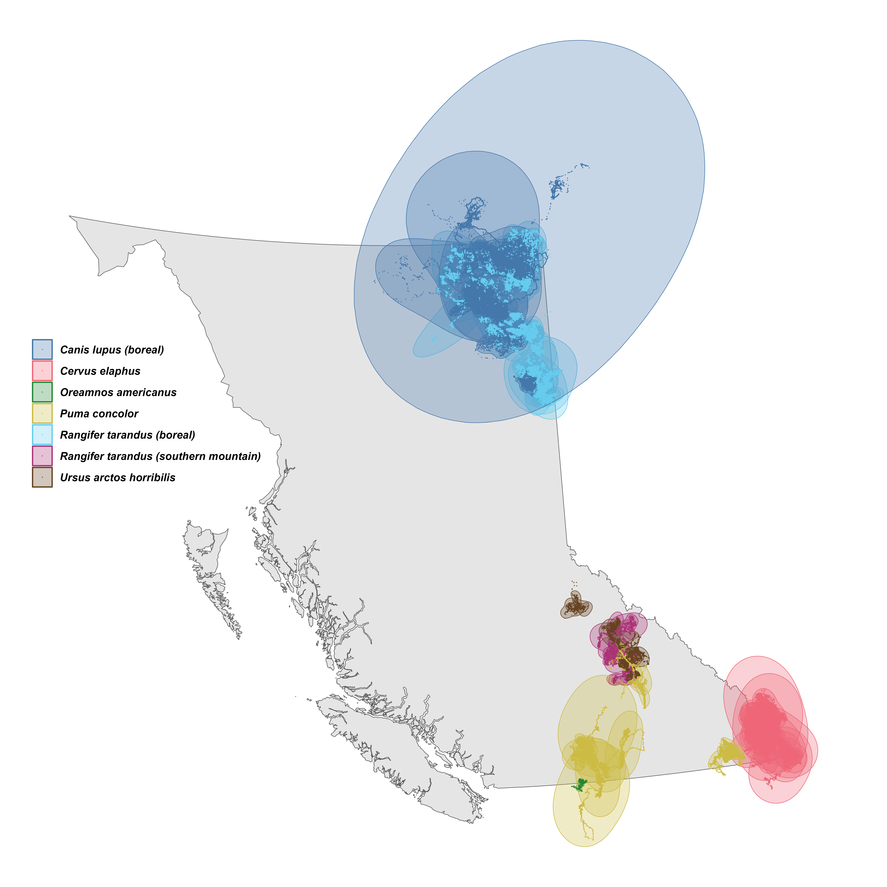

<!-- place table of contents on a new page -->
\newpage

\singlespacing

\tableofcontents

<!-- start main body on a new page -->
\newpage

\doublespacing

```{r setup, include=FALSE}
# set chunk defaults: don't print code, images text width and centered
knitr::opts_chunk$set(echo = FALSE, out.width = '\\textwidth',
                      fig.align = 'center', cache = TRUE, warning = FALSE,
                      message = FALSE)
```

```{r packages, warning=FALSE, message=FALSE}
library('dplyr') # for data wrangling
library('purrr') # for data wrangling
library('tidyr') # for data wrangling
library('ctmm')  # for movement models
```

```{r, echo=FALSE}
abstract <- ""
```

<!-- elements of the title page -->

\noindent \textbf{Article type}: Major article

\noindent \textbf{Words in abstract}: `r stringi::stri_count_words(abstract)`

\noindent \textbf{Words in main text}: `r suppressMessages(wordcountaddin::word_count())`

\noindent \textbf{Figures}: 2

\noindent \textbf{Tables}: 1

\noindent \textbf{References}: 33 (updated on 2024-06-13) <!-- counted by using nature csl -->

\noindent \textbf{Appendices}: 3

\noindent \textbf{Key words:} energetics, environmental stochasticity, home range, range size, `ctmm`, simulations

<!-- Authors' emails:
Stefano Mezzini: stefano.mezzini@ubc.ca
Chris H. Fleming: christen.fleming@ucf.edu
E. Patrícia Medici: medici@ipe.org.br
Michael J. Noonan: michael.noonan@ubc.ca
--> 


# Abstract {-}

\noindent `r abstract`

# To do {-}

\clearpage

# Introduction

Animals' energetic costs depend strongly on ambient temperature [@brown_toward_2004]. Cold temperatures increase the metabolic costs of movement [@taylor_energetics_1982] and homeothermy [@melin_effect_2023], which can constrain an animal's ability to move [@schwerdt_ecological_2024], its fitness [@walker_global_2019], and, ultimately, its odds of survival [@berger_climate_2018]. Hot temperatures tend to lower energetic needs [@taylor_energetics_1982], but they also cause animals to overheat, which lowers their ability to move [@powers_hovering_2017; @alston_temperature_2020; @dyer_travel_2023]. Fluctuations in ambient temperature, and particularly extreme cold events, lead to the evolution of eurythermy and endothermy [@portner_climate_2004].

Mammals reduce the adverse effects of extreme temperatures through both physiological and behavioral adaptations [@jessen_temperature_2001; @mota-rojas_physiological_2021]. Long-term exposure to consistent ranges of temperatures allow species to evolve for higher efficiency within specific temperature ranges [@levins_evolution_1974], but physiological adaptations are limited by a species' experienced temperatures, so such adaptations are less effective during periods of rapid change [@huey_predicting_2012] or extreme changes [@sherwood_adaptability_2010]. In contrast, mammals can respond to changes in temperature much more rapidly and efficiently by altering their movement rates and space use [@alston_temperature_2020; @dyer_travel_2023; @attias_effects_2018; @alston_temperature_2020; @giroux_activity_2023; @verzuh_behavioural_2023].

During the last century, changes in climate in British Columbia (BC), Canada, have resulted in widespread warming, milder and shorter winters, hotter and longer summers [@bunnell_global_2011; @deb_modelling_2020; @woo-durand_increasing_2020], which, combined, result in a greater risk of extremely high temperatures [@eberle_technical_2022]. These changes are expected continue over the next 100 years and compound their effects on mammals' fitness, movement behavior, and habitat selection as they cope with growing heat stress [@deb_modelling_2020; @woo-durand_increasing_2020] and anthopogenic pressure [@sih_evolution_2011; @weststrate_how_2024].

This paper provides a BC-focused analysis on the effects of proximate weather and long-term climate on the movement of terrestrial mammal species. Using over two decades of telemetry data and proximal hourly weather data, we estimate how animals altered their movement frequency, movement speed, and habitat selection in response to air temperature. We then pair these responses with climate change projections to forecast changes mammals movement in the current century under different climate change scenarios [@riahi_shared_2017]. The analyses include data from six species (*Canis lupus*, *Cervus elaphus*, *Oreamnos americanus*, *Puma concolor*, boreal and southern mountain *Rangifer tarandus*, and *Ursus arctos horribilis*; see Table \@ref(tab:data-table)) across a large spatial range of British Columbia (Fig. \@ref(fig:bc-map)). We discuss the consequences of changes in mammalian movement in relationship to energetics, food encounter rates, and the incidences of human-wildlife.

```{r bc-map, fig.cap="GPS telemetry data and 95% autocorrelated kernel density utilization distributions for the six species in this study."}

```

```{r data-table}
readRDS('../models/movement-models-2024-06-06.rds') %>%
  transmute(Dataset = if_else(grepl('Puma', dataset_name),
                                'Puma concolor', dataset_name) %>%
              stringr::str_replace_all('_', ' ') %>%
              stringr::str_replace_all(' boreal', ' (boreal)') %>%
              stringr::str_replace_all(' southern mountain',
                                       ' (southern mountain)'),
            animal,
            tel = purrr::map(tel, data.frame)) %>%
  unnest(tel) %>%
  group_by(animal) %>%
  mutate(dt = timestamp - lag(timestamp)) %>%
  group_by(Dataset) %>%
  summarize(Start = min(as.Date(timestamp)),
            End = max(as.Date(timestamp)),
            dt = as.numeric(median(dt, na.rm = TRUE))) %>%
  mutate(dt = round('hours' %#% dt, 2)) %>%
  rename(`Median sampling interval (hours)` = dt) %>%
  knitr::kable(format = 'pipe', caption = 'Start and end of the GPS telemetries along with the median sampling interval for each of the six species in this study.') %>%
  kableExtra::column_spec(1, italic = TRUE) %>%
  kableExtra::kable_styling(font_size = 10)
```


# Methods

## GPS telemetry data

Elk (*Cervus elaphus*) data from @ciuti_human_2012 were downloaded from Movebank [study name: Elk in southwestern Alberta, see @kays_movebank_2022], while boreal caribou (*Rangifer tarandus*) and wolf (*Canis lupus*) telemetries were acquired via a public BC Oil and Gas Research and Innovation Society repository ([https://www.bcogris.ca/projects/boreal-caribou-telemetry-data](https://www.bcogris.ca/projects/boreal-caribou-telemetry-data)), and the mountain goat (*Oreamnos americanus*) locations were provided by BC Parks. All other tracking data were obtained from private collaborators. Outlier GPS locations were removed following diagnostic analyses of the distance from the median location as well as straight-line displacement, turning angle, and time interval between consecutive points. Particular attention was paid to points with large turning angles ($\gtrapprox 170^\circ$) and high straight-line displacement, especially if antecedent and subsequent points indicated stationary behavior. The script used to clean the data and all custom functions used are available on GitHub ([https://github.com/QuantitativeEcologyLab/bc-mammals-temperature](https://github.com/QuantitativeEcologyLab/bc-mammals-temperature)).

## Historical temperature data

Rasters of hourly reanalyzed air temperature data were downloaded from the ERA5 dataset [@hersbach_era5_2023] from the European Center for Medium-range Weather Forecasting server (ECMWF; [www.ecmwf.int](www.ecmwf.int); [https://cds.climate.copernicus.eu](https://cds.climate.copernicus.eu)). Proximal weather conditions were estimated for each location by extracting the values from the corresponding raster cell from the temporally nearest raster using the `extract()` function from the `terra` package [version 1.7-46, @hijmans_terra_2023] for `R`  [@r_core_team_r_2024].

## Estimating mammals' instantaneous speeds

We estimated modeled each animal's movement using continuous-time movement models [@fleming_fine-scale_2014] via the `ctmm` package [version 1.2.0, @fleming_ctmm_2023] for `R`. We then estimated mammals' instantaneouus speeds by applying the `ctmm::speeds()` function on all models with finite speed estimates [416 of 433, see @fleming_fine-scale_2014; @noonan_scale-insensitive_2019]. All 17 telemetries with insufficiently fine sampling were for caribou (15 boreal and 2 southern mountain).

Since `ctmm`'s movement models assume stochastic but non-zero speeds (i.e., a single, stochastic moving state), data-informed speeds needed to be corrected so that the minimum instantaneous speed was 0. We performed this correction by subtracting the data-independent, background minimum speed while assuming speeds were $\chi^2$-distributed (which arises from assuming the X and Y components of the speed vectors are Gaussian). ***NOT SURE IF THIS IS CORRECT*** The function used is available on GitHub ([https://github.com/QuantitativeEcologyLab/bc-mammals-temperature/blob/main/functions/detrend_speeds.R](https://github.com/QuantitativeEcologyLab/bc-mammals-temperature/blob/main/functions/detrend_speeds.R)). To avoid artifacts due to excessively small, non-zero speeds, we determined whether an animal was moving or not by applying the `stats::kmeans()` function with 2 centers (Appendix A).

## Estimating the effects of temperature on mammals' movement

We estimated the effects of temperature on mammals' state (moving or not) and speed (given that it was moving) using two Hierarchical Generalized Additive Models [HGAMs, see @pedersen_hierarchical_2019] via the `mgcv` package for `R` [version 1.9-1, @wood_generalized_2017]. The first HGAM had a binomial family of distribution and estimated the probability of a mammal moving as a function of time of day, day of year, and temperature, with separate smooths (but common smoothness parameter) for each species [model S in Figure 4 of @pedersen_hierarchical_2019]. In addition, the model also included a random effect for each animal, a tensor interaction product of time of day and day of year to account for changes in day length, and a tensor interaction product of time of day and temperature to account for changes in daily activity levels with temperature, for each species. Due to the substantial latitudinal separation between boreal and southern mountain caribou, we considered the two gropus as separate species for the sake of modeling. The model accounted for the cyclicity of time of day and day of year using cyclic cubic splines, which provide continuity in the smooth term by ensuring the function and its slope (first derivative) and curvature (second derivative) are continuous between consecutive cycles. The second HGAM had the same structure, but it used a Gamma family of distributions to estimate the speed of an animal, given that it was moving. Together, the two HGAMs inform us on an animal's long-term speed (i.e., distance traveled per unit time), since it is the product of probability that the animal is moving and its average speed when moving. Additional details are provided in Appendix A.

We estimated the effects of temperature on each species' selection for percent forest cover, elevation, and distance from fresh water using an HGAM with a Poisson family of distributions [Appendix B, also see @aarts_estimating_2008; @alston_mitigating_2022]. While we recognize there are other important drivers of habitat selection, we decided to only use these three proxies to ensure results were relatively comparable between species and to make province-wide predictions simpler.

## Predicting changes in animal movement during the current century

***HERE***

Rasters of projected monthly average temperature in BC during the next 80 years were obtained via the `climatenaR` package [version 1.0, @burnett_climatenar_2023] for `R`. Since the climate projections did not provide a measure of variation in temperature within each month due to weather, we estimated within-month variance by fitting a Generalized Additive Model with a Gamma family of distributions to the square-root precision ($\sqrt{\rho}$) in temperature for each month using the ERA5 data for BC during 1998-2024. The model included... (Appendix C).

***model currently uses weights = sqrt(n); fitting a new one with uniform weights***

# Results

### Effects of temperature on mammals' movement

Both movement frequency and speed when moving decreased with temperature for all species (Fig. \@ref(fig:temp-marginal)), but the there were some differences among species in the intensity of the effect (Figs. \@ref(fig:p-move) and \@ref(fig:speed)).

```{r temp-marginal, fig.cap="Estimated mean (black) and species-specifit (colored) effect of temperature on movement frequency (A) and speed when moving (B)."}
layout(t(1:2))
plot(1)
plot(1)
# knitr::include_graphics('../figures/p-moving-all.png')
```

***move the figures with seasonal and daily effects to Appendix A***

```{r p-move, fig.cap="Estimated probability of moving as a function of tempeature (A), time of day (B), and day of year (C)."}
knitr::include_graphics('../figures/p-moving-all.png')
```

```{r speed, fig.cap="Estimated speed as a function of tempeature (A), time of day (B), and day of year (C)."}
knitr::include_graphics('../figures/speed-all.png')
```


### Effects of temperature on mammals' habitat selection

***should predict for the area the animals are in only***

### Predicted changes in movement during the current century

***should predict for the area the animals are in only***

# Discussion

<!-- - how results answer central question -->

### Effects of temperature on mammals' movement


### Effects of temperature on mammals' habitat selection


<!-- - what it tells us about the broader field -->

* energetics
* encounter rates (lower encounter rates with food [@hou_cold_2020])
* HWI

<!-- - address any questions presented in the discussion -->


\clearpage <!-- to prevent figures from floating to the references -->

\newpage <!-- place references on a separate page -->

# References {-}

\hangparas{1em}{1} <!-- paragraphs hanging by width equal to font height -->
