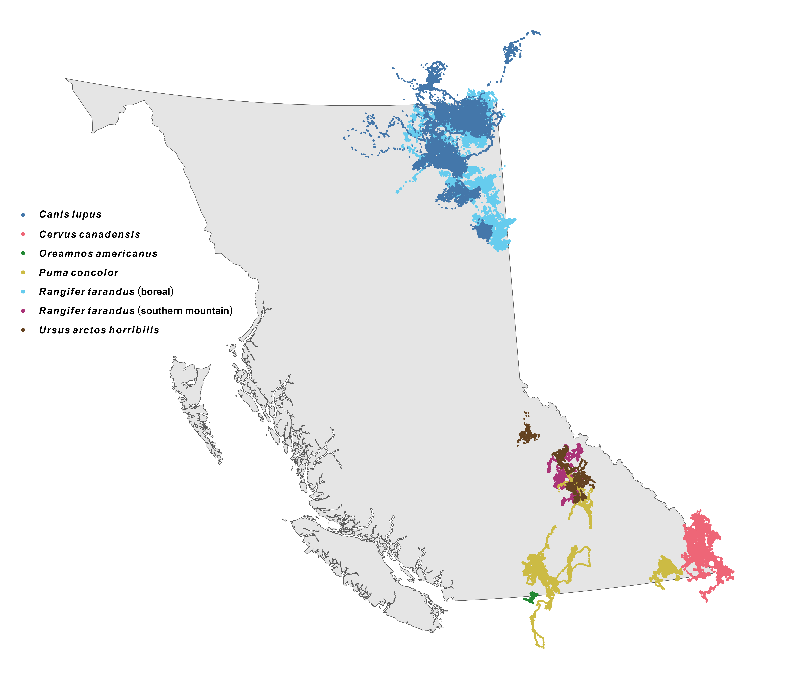

```{r setup, include=FALSE}
# set chunk defaults: don't print code, images text width and centered
knitr::opts_chunk$set(echo = FALSE, out.width = '\\textwidth',
                      fig.align = 'center', cache = TRUE, warning = FALSE,
                      message = FALSE)
```

<!--
available text sizes:
Huge > huge > LARGE > Large > large > normalsize > small > footnotesize > scriptsize > tiny
-->

<!--
six-sentence abstract:

1. introduce the topic
2. state the problem
3. summarize why the question hasn't been answered/what the consequences are
4. explain how you answered the question
5. explain the central findings
6. explain the importance of your findings and their consequences
-->

```{r, echo=FALSE}
abstract <- "Recent widespread warming has caused many terrestrial mammals to change when, how, and where they move, with cascading effects on fitness, habitat selection, and community structure. Previous studies have quantified the effects of temperature on mammalian movement behaviour, but few have quantified the effects of future climate change. Consequently, it is still unclear how and where mammals will move in the 21^st^ century. We address this gap by using Continuous-Time Movement Models and Hierarchical Generalized Additive Models to quantify the effects of temperature on the probability of moving, the speed when moving, and the habitat selection of six species throughout British Columbia, Canada. We show that temperature is a strong determinant of when, how, and where mammals move, and that climate change will impact mammals' movement rates and habitat selection throughout the 21^st^ century. We found no common effects of temperature on the species’ movement rates, so we suggest that species' estimated responses be interpreted jointly when making inferences about how climate change will impact ecological communities. In contrast, habitat selection strength decreased for all species within their current ranges, suggesting that all six species will shift their range in the coming decades. As climate change exposes mammals to novel environmental conditions, predicting changes in animal behavior and community structure will become crucial for effective and proactive conservation. We thus conclude by providing suggestions for conservation and future research while calling for a more holistic and collaborative framework."
if(FALSE){
  stringi::stri_count_words(abstract)
}
```

\clearpage

\noindent \textbf{Article type}: Research article

\noindent \textbf{Words in abstract}: `r stringi::stri_count_words(abstract)`

\noindent \textbf{Words in main text}: `r suppressMessages(wordcountaddin::word_count())`

\noindent \textbf{Figures}: 7

\noindent \textbf{Tables}: 2

\noindent \textbf{References}: 141 (updated on 2025-05-16) <!-- counted by using movement ecology csl -->

\noindent \textbf{Appendices}: 2

<!-- using  "behaviOR" in key words to increase audience -->

\noindent \textbf{Key words:} climate change, temperature, mammals, animal movement, movement behavior, habitat selection

\clearpage

# Abstract {-}

\noindent `r abstract`

<!-- start main body on a new page -->
\newpage

\doublespacing

\linenumbers

```{r packages, warning=FALSE, message=FALSE}
library('dplyr') # for data wrangling
library('purrr') # for data wrangling
library('tidyr') # for data wrangling
library('ctmm')  # for movement models
```

<!--

other refs

* Global vulnerability of marine mammals to global warming: https://doi.org/10.1038/s41598-019-57280-3

-->

\clearpage

# Introduction

<!-- movement is a convenient way to respond to change, but movement depends on temperature -->

\noindent For most animals, movement is a rapid and low-cost response to a variety of stimuli [@nathan_movement_2008]. Animals move to maximize resource availability [e.g., food, water, shelter, see: @charnov_optimal_1976; @kacelnik_ideal_1992], optimize habitat use [@winter_forecasting_2024], and escape predation [@peterson_pursuit_2021; @bartashevich_collective_2024; @tan_antipredator_2024]. However, ambient temperature affects mammals' movement rates by altering the energetic cost of movement [@mcnab_body_1970; @taylor_energetics_1982; @brown_toward_2004; @fuller_towards_2016; @jahn_variations_2022], the ease of movement [e.g., snow depth and density, see @montgomery_movement_2019; @leclerc_determinants_2021; @melin_effect_2023], and the risk of overheating [@hetem_responses_2014; @dyer_travel_2023]. Animals may search for a short-term buffer from extreme heat or cold via thermal refugia [@hannah_fine-grain_2014; @elmore_implications_2017; @attias_effects_2018; @arechavala-lopez_common_2019; @gulland_review_2022], which may even be preferred over forage abundance [e.g., @hall_microrefuges_2016]. Additionally, temperature also affects movement indirectly through other drivers of movement behaviour, such as trophic interactions [@hegel_interacting_2010]. Changes in temperature thus affects how animals move [e.g., movement frequency and speed -- their movement behaviour: @nathan_movement_2008; @dyer_travel_2023] and where they move to [i.e., their habitat selection: @merkle_large_2016; @alston_temperature_2020; @giroux_activity_2023].

Temperature also affects the consequences of animal movement, such as encounter rates with resources [@mezzini_how_2025], other animals [@martinez-garcia_how_2020], and humans [@weststrate_how_2024], and these changes are exacerbated at extreme temperatures [@wilson_stenotherms_2001; @berger_climate_2018; @giroux_activity_2023]. But what counts as "extreme" varies across species: thermal specialists are more sensitive to small changes outside their typical range [e.g., @giroux_activity_2023], while thermal generalists can adapt more easily to change [@dupont_beyond_2024]. However, generalists' greater adaptability is tested when they are subject to changes that are more severe [@mccain_assessing_2019], affect many factors [e.g., temperature, phenology, and resource availability: @polazzo_measuring_2024], or are too rapid to respond within the span of a lifetime or a few generations [@levins_evolution_1974; @fuller_towards_2016; @xu_plasticity_2021].

<!-- we do not know how temperature will change -->

In the last 200 years, many ecosystems experienced widespread warming that resulted in milder and shorter winters, hotter and longer summers, and a greater risk of extremely high temperatures and severe forest fires [@ipcc_climate_2023; @zurowski_summer_2023]. Over the next 100 years, these changes are expected to worsen and continue to impact mammals' fitness, movement behaviour, and habitat selection as animals cope with growing heat stress [@deb_modelling_2020; @woo-durand_increasing_2020] and more frequent and intense extreme events [@bunnell_global_2011], along with increasing anthropogenic pressure [@sih_evolution_2011; @sawyer_identifying_2009; @weststrate_how_2024]. Consequently, it remains unclear how or whether species will be able to respond to climate change in the current century [@deb_modelling_2020; @woo-durand_increasing_2020; @verzuh_behavioural_2023], especially when populations fail to adapt to changes [@sawyer_migratory_2019; @botero_evolutionary_2015] or are physiologically incapable to do so [@sherwood_adaptability_2010; @williams_range_2018]. Uncertainty in future conditions and their consequences on ecosystems present a need for a comprehensive understanding of (1) the direct effects of temperature on animal movement behaviour and (2) the implications this will have on populations and species' adaptability and resiliency, community structure, and biodiversity at large. Recent work has documented the effects of climate change on mammals' ranges [@leclerc_determinants_2021], movement behaviour [@melin_effect_2023], thermoregulation [@mota-rojas_physiological_2021], and trait-based responses [@mccain_assessing_2019], but it is still unclear how mammals will adapt their small-scale movement and habitat selection to changes in temperature during the 21^st^ century [@ipcc_climate_2023; but see @hetem_responses_2014; @winter_forecasting_2024].

<!-- why is understanding the present and predicting into the future necessary -->

Understanding the direct and indirect impacts of temperature on mammalian movement is essential for decision makers to be able to prepare for and respond to change in a proactive manner [e.g., @sawyer_identifying_2009; @mccain_assessing_2019]. The Canadian province of British Columbia is currently experiencing rapid widespread warming [@dierauer_climate_2021; @turner_its_2009], phenological shifts [e.g., @tysor_countergradient_2025; @basu_phenological_2024], and more frequent and intense extreme events [e.g., @zhang_increased_2023], including forest fires [@zurowski_summer_2023]. As we approach the deadline for the "30 by 30" conservation initiative, a global effort to conserve 30% of the world's lands and oceans by 2030 [Section H, Targets 2 and 3 of @convention_on_biological_diversity_154_2022], decision makers must understand which areas will be of greatest value for maximizing the project's effectiveness. Predicting how climate change will affect how, when, and where animals will move is necessary for identifying which landscapes are most valuable now as well as in the future. Failing to understand how changes in temperature will affect mammalian movement behaviour and habitat selection will hinder our ability to respond to the current climate crisis and make decisions that are viable in the long term.

<!-- introduce the study -->

This paper provides an analysis of the effects of air temperature on the movement of six terrestrial mammal species in British Columbia (BC), Canada (wolves: *Canis lupus*, elk: *Cervus canadensis*, mountain goats: *Oreamnos americanus*, pumas: *Puma concolor*, boreal and southern mountain caribou: *Rangifer tarandus*, and grizly bears: *Ursus arctos horribilis*; Table \@ref(tab:data-table)). Using over 25 years of telemetry data thoughout a large spatial range of British Columbia and hourly air temperature data, we estimate how mammals altered their probability of movement, speed when moving, and habitat selection in response to temperature. We then pair the estimated responses with climate change projections to forecast the species' movement during the 21^st^ century under different climate-change scenarios [referred to as Shared Socioeconomic Pathways, SSPs -- see @riahi_shared_2017]. We disentangle the direct and indirect effects of temperature on the movement behaviour of terrestrial mammals and discuss the consequences of these changes at the individual, population, and landscape levels.

```{r bc-map, fig.cap="GPS telemetry data for the six species in this study.", out.width='0.75\\linewidth'}

```

\footnotesize

```{r, eval=FALSE}
# a quick check for the table below
readRDS('../data/movement-models-speed-weights-2024-06-10.rds') %>%
  group_by(dataset_name, animal) %>%
  summarize(n = n_distinct(animal),
            any_na_speed = any(is.na(speed_est)),
            all_na_speed = all(is.na(speed_est))) %>%
  group_by(dataset_name) %>%
  summarise(n_missing_any = sum(any_na_speed),
            n_missing_all = sum(all_na_speed))
```

```{r data-table}
dt_data <-
  readRDS('../models/movement-models-2024-06-06.rds') %>%
  transmute(
    Species = case_when(
      dataset_name == 'Canis_lupus_boreal' ~ '\\emph{Canis lupus}',
      dataset_name == 'Rangifer_tarandus_boreal' ~ '\\emph{Rangifer tarandus} (boreal)',
      dataset_name == 'Rangifer_tarandus_southern_mountain' ~ '\\emph{Rangifer tarandus} (s. mountain)',
      dataset_name == 'Puma_concolor_2' ~ '\\emph{Puma concolor}',
      dataset_name == 'Puma_concolor_4' ~ '\\emph{Puma concolor}',
      dataset_name == 'Elk in southwestern Alberta' ~ '\\emph{Cervus canadensis}',
      dataset_name == 'Oreamnos_americanus' ~ '\\emph{Oreamnos americanus}',
      dataset_name == 'Ursus_arctos_horribilis' ~ '\\emph{Ursus arctos horribilis}'),
    animal, # keep animal column for grouping later
    tel = map(tel, data.frame),
    na_speed = map_lgl(movement_model,
                       \(.m) suppressWarnings(speed(.m)$DOF == 0))) %>%
  unnest(tel) %>%
  group_by(Species, animal) %>%
  summarize(Start = min(as.Date(timestamp)),
            End = max(as.Date(timestamp)),
            dt = median(timestamp - lag(timestamp), na.rm = TRUE),
            animal = unique(animal),
            na_speed = unique(na_speed),
            .groups = 'drop') %>%
  group_by(Species) %>%
  summarize(Start = min(Start),
            End = max(End),
            dt = as.numeric(median(dt, na.rm = TRUE)),
            Animals = n_distinct(animal),
            n_missing = sum(! na_speed),
            .groups = 'drop') %>%
  mutate(dt = round('hours' %#% dt, 2)) %>% # convert from seconds to hours
  rename('\U0394t (hours)' = dt,
         'Has speed' = n_missing)

knitr::kable(dt_data, format = 'markdown', caption = 'Start and end of the GPS telemetries along with the median sampling interval ($\\Delta t$; stratified by individual), number of animals (Animals), and number of animals with resolved speed (Has speed) for each of the species in this study.', escape = FALSE, longtable = FALSE, booktabs = TRUE)
```

\normalsize

# Methods

## Datasets used

This study leverages four main datasets: (1) a multi-species collection of GPS telemetry data (Fig. \@ref(fig:bc-map)); (2) historical hourly reanalyzed air temperature from the ERA5 dataset from the European Center for Medium-range Weather Forecasting; (3) resource rasters of percent forest cover, elevation, and distance from water; and (4) climate change projections under four Shared Socioeconomic Pathways [SSPs, see @riahi_shared_2017]. We detail the data sources and analyses in the sections below.<!--, and more details are available in appendices A (estimating how temperature affects movement frequency and speed when moving), B (fitting Hierarchical Resource Selection Functions), and C (simulating hourly temperature data to 2100 using the four SSPs).-->

### GPS telemetry data

```{r, eval=FALSE}
tels <- readRDS('data/tracking-data/all-tracking-data-cleaned-2024-02-22-13-49.rds') %>%
  tidyr::unnest(tel)

# all outliers
sum(tels$outlier)
round(mean(tels$outlier) * 100, 2)

# new outliers
sum(tels$outlier & !tels$original_outliers)
round(mean(tels$outlier & !tels$original_outliers) * 100, 2)
```


\noindent Elk (*Cervus canadensis*) data from @ciuti_human_2012 were downloaded from Movebank [study name: Elk in southwestern Alberta, see @kays_movebank_2022], while boreal caribou (*Rangifer tarandus*) and wolf (*Canis lupus*) telemetries were acquired via a public BC Oil and Gas Research and Innovation Society repository ([https://www.bcogris.ca/projects/boreal-caribou-telemetry-data](https://www.bcogris.ca/projects/boreal-caribou-telemetry-data)). ***MISSING INFO ON OTHER TELEMETRY DATA.*** From the full set of telemetry data, a total of 2396 GPS locations (0.16%, including collar calibration data) were removed using diagnostic plots of (1) distance from the median location, (2) straight-line displacement between locations, (3) turning angle, and (4) time interval between consecutive points. Particular attention was paid to points with large turning angles ($\gtrapprox 170^\circ$) and excessively high straight-line displacement, especially if antecedent and subsequent points indicated stationary behaviour. See Appendix A for additional information.

### Historical and projected temperature data

\noindent Rasters of hourly reanalyzed air temperature data were downloaded from the ERA5 dataset [@hersbach_era5_2023] from the European Center for Medium-range Weather Forecasting server (ECMWF; [www.ecmwf.int](www.ecmwf.int); [https://cds.climate.copernicus.eu](https://cds.climate.copernicus.eu)). Proximal temperature was estimated for each location by extracting the value from the corresponding raster cell from the temporally nearest raster using the `extract()` function from the `terra` package [version 1.7-46, @hijmans_terra_2023] for `R` [@r_core_team_r_2024].

We obtained rasters of projected monthly average temperature at a 0.08$^\circ$ resolution in BC from 2020 to 2100 under the different SSPs via the `climatenaR` package [version 1.0, @burnett_climatenar_2023] for `R`. Since the climate projections only provided monthly means and ranges but no measures of variance or distributional assumptions, we used the hourly ERA5 data for BC from 1998 to 2023 [extremes included, see @hersbach_era5_2023] to calculate within-month variance in temperature, which we defined as the variance within a given pixel, month, and year. We then modeled the estimated variance using a GAM for location and scale [GAMLS, see: @rigby_generalized_2005; @stasinopoulos_generalized_2007; section 7.9 in @wood_generalized_2017]. The linear predictor for the location (i.e., the mean) included smooth terms of the within-pixel monthly mean temperature (within each year), month (as a cyclic smooth), a two-dimensional smooth of space, and a tensor interaction product term of space and month. The linear predictor for the scale term (which governs the mean-variance relationship) included smooth terms of the monthly mean, month, and space. We did not include a smooth of year to avoid unrealistic projections when extrapolating beyond the range of historical data.<!-- Additional details are available in Appendix C.-->

```{r, eval=FALSE, echo=FALSE}
m_gammals <- gam(list(
  # linear predictor for the mean parameter
  monthly_var ~
    s(monthly_mean, bs = 'cr', k = 10) +
    s(month, bs = 'cc', k = 10) + # using a cyclic cubic spline basis
    s(long, lat, bs = 'ds', k = 500) +
    ti(long, lat, month, bs = c('ds', 'cc'), d = c(2, 1), k = c(100, 10)),
  # linear predictor for the scale parameter
  ~ s(monthly_mean, bs = 'cr', k = 10) +
    s(month, bs = 'cc', k = 10) +
    s(long, lat, bs = 'ds', k = 100)),
  family = gammals(),
  data = d,
  method = 'REML',
  knots = list(month = c(0.5, 12.5)))
```

We simulated hourly variation in future weather by assuming hourly temperature followed a normal distribution with mean specified by the monthly `climatenaR` climate projections and variance as specified by the Gamma GAMLS. We then predicted changes in movement behaviour and habitat selection as a function of the simulated temperature using the HGAMs and HRSFs. For each month within each year from 2020 to 2100, we simulated hourly weather by including temperatures from the 0.1 to the 0.9 quantile by increments of 0.1, and we weighted each quantile proportionally to the (normalized) Gaussian probability density for each quantile<!-- (Appendix C)-->.

### Resource rasters

\noindent We estimated percent forest cover and distance from water using the rasters created by @tuanmu_global_2014. We calculated total forest cover by summing the temporally static rasters of evergreen/deciduous needle-leaf trees, evergreen broadleaf trees, deciduous broadleaf trees, and mixed/other trees (raster classes 1-4, respectively). We converted the raster of percent cover of open water (class 12) to a binary raster of pixels with water (cover > 0%) or without water (cover = 0%) and then calculated each pixel's distance from the nearest pixel with water using the `distance()` function from the `terra` package. Finally, we obtained two digital elevation models using the `get_elev_raster()` function from the `elevatr` package [version 0.99.0, @hollister_elevatr_2023]: We used a raster with a zoom of 6 (0.009$^\circ$) for model fitting and one with a zoom of 3 (0.08$^\circ$) for downloading climate change projections via `climatenaR`. All final rasters and code are available on GitHub at [https://github.com/QuantitativeEcologyLab/bc-mammals-temperature](https://github.com/QuantitativeEcologyLab/bc-mammals-temperature).

## Estimating mammals' instantaneous speeds

\noindent We modeled each animal's movement using continuous-time movement models [@fleming_fine-scale_2014] via the `ctmm` package [version 1.2.0, @fleming_ctmm_2023] for `R`. We then estimated mammals' instantaneous speeds by applying the `ctmm::speeds()` function on all models with finite speed estimates [415 of 433, see @fleming_fine-scale_2014; @noonan_scale-insensitive_2019]. The 18 animals with insufficiently fine sampling were for one mountain goat, 15 boreal caribou, and 2 southern mountain caribou (Table \@ref(tab:data-table)).

Since `ctmm``s movement models assume stochastic but non-zero speeds (i.e., a single, stochastic moving state), data-informed speeds needed to be corrected so that the minimum instantaneous speed could be 0. We performed this correction by subtracting each model's mean speed while assuming speeds were $\chi^2$-distributed. The function we used is available on GitHub at [https://github.com/QuantitativeEcologyLab/bc-mammals-temperature/blob/main/functions/detrend_speeds.R](https://github.com/QuantitativeEcologyLab/bc-mammals-temperature/blob/main/functions/detrend_speeds.R). To avoid artifacts due to excessively small, non-zero speeds, we determined whether an animal was moving or not using the inflection point of each species' histogram of detrended speed estimates, as $k$-nearest neighbors did not discriminate between states well (Fig. B3).

## Estimating the effects of temperature on mammals' movement

\noindent The following sections detail the statistical framework and modelling we used to estimate the effect on temperature on mammals' movement. To assess the importance of including temperature as an explicit covariate (rather than including its effects with time of day and day of year), we fit models with and without smooth effects of temperature and compared the fits of the two sets of models. We provide the relevant Directed Acyclical Graphs in the Appendix (Figs. B1-B2).

### Disentangling direct and indirect effects

\noindent In this study, we separate the effects of temperature on mammalian movement into indirect and direct effects. We call "indirect" all effects that can be intervened on by altering an animal's habitat [its geographic space *sensu* @matthiopoulos_defining_2022], and we refer to all other effects as "direct". For example, an increase in temperature may push an animal to prefer higher forest cover in search of shade, and conservationists can thus mitigate these indirect effects of temperature on movement behaviour by increasing the availability of forested areas, since the effect of temperature on movement is conditional on forest cover availability. In contrast, the animal may avoid moving if temperatures are above 35$^\circ$C, irrespective of its geographic and environmental space [*sensu* @matthiopoulos_defining_2022], so it is not possible to mitigate the effects of temperature on movement behaviour (other than changing temperature directly). We provide the relevant Directed Acyclical Graphs in the Appendix (Figs. B1-B2).

### Effects of temperature on movement rates

\noindent We estimated the effects of temperature ($^\circ$C) on mammals' movement state (moving or not) and speed when moving using two Hierarchical Generalized Additive Models [HGAMs, see @pedersen_hierarchical_2019 and the code chunk below] with the `mgcv` package for `R` [version 1.9-1, @wood_generalized_2017]. The first HGAM estimated the probability that an animal was moving, $P(M)$, with a binomial family of distributions and logit link function. The response variable `moving` was coded as 1 if moving and 0 if not. The second HGAM estimated an animal's speed when moving (`speed`) with a gamma family of distributions and log link function. The HGAMs included random intercepts for each animal (`s(animal, bs = 're')`), fixed-effect intercepts for each species (`species`), and species-level `by` smooths (`s(..., by = species)`), which allowed each species' term to be estimated independent of other species [see model I in Figure 4 of @pedersen_hierarchical_2019]. The `by` smooths accounted for trends in time of day (in Pacific Daylight Time; `tod_pdt`), day of year (`doy`), and temperature (`temp_c`). Additionally, the models had three tensor product interaction terms (`ti()`) `by` each species: (1) day of year and time of day, (2) temperature and time of day, and (3) temperature and day of year. These three terms accounted for: (1) seasonal changes in day length, (2) hourly changes in the response to temperature (e.g., changes in nocturnality), and (3) seasonal changes in the response to temperature (e.g., changes in coats and migration timing). Finally, smooth terms of log-transformed hours between GPS locations (`dt`) accounted for irregular sampling rates. A global term of `log(dt)` accounted for the overall effect of sampling interval, while a factor-smooth interaction term (`s(log(dt), species, bs = 'fs')`) allowed for species-level deviations from the global term while assuming a common smoothness parameter across species [see model GS in Figure 4 of @pedersen_hierarchical_2019]. The HGAMs accounted for the cyclicity of time of day and day of year using cyclic cubic splines [`bs = 'cc'`$;$ see p. 202 of @wood_generalized_2017]. Together, the binomial HGAM and the gamma HGAM inform us on an animal's long-term average speed, since it is the product of the probability of moving and its average speed when moving. We fit the models with fast Restricted Maximum Likelihood (`'fREML'`) and discretized covariates (`discrete = TRUE`) to optimize computational efficiency with no appreciable losses to model performance [@wood_generalized_2015; @wood_generalized_2017-1; @li_faster_2020]. Additional details are provided in Appendix B.

\singlespacing

\scriptsize

```{r hgams, eval=FALSE, echo=TRUE}
m_moving <- bam(
  moving ~
    s(animal, bs = 're') +
    species + #' necessary since `by` terms do not include intercept terms
    s(tod_pdt, by = species, k = 5, bs = 'cc') +
    s(doy, by = species, k = 5, bs = 'cc') +
    s(temp_c, by = species, k = 5, bs = 'tp') +
    ti(doy, tod_pdt, by = species, k = 5, bs = c('cc', 'cc')) +
    ti(temp_c, tod_pdt, by = species, k = 5, bs = c('tp', 'cc')) +
    ti(temp_c, doy, by = species, k = 5, bs = c('tp', 'cc')) +
    s(log(dt), k = 3) +
    s(log(dt), species, k = 3, bs = 'fs'),
  data = d,
  method = 'fREML', # fast REML
  discrete = TRUE, # discretize the covariates for faster computation
  knots = list(tod_pdt = c(0, 1), doy = c(0.5, 366.5))) #' for `bs = 'cc'`
  
m_speed <- bam(
  speed_est ~
    s(animal, bs = 're') +
    species +
    s(tod_pdt, by = species, k = 5, bs = 'cc') +
    s(doy, by = species, k = 5, bs = 'cc') +
    s(temp_c, by = species, k = 5, bs = 'tp') +
    ti(doy, tod_pdt, by = species, k = 5, bs = c('cc', 'cc')) +
    ti(temp_c, tod_pdt, by = species, k = 5, bs = c('tp', 'cc')) +
    ti(temp_c, doy, by = species, k = 5, bs = c('tp', 'cc')) +
    s(log(dt), k = 3) +
    s(log(dt), species, k = 3, bs = 'fs'),
  family = Gamma(link = 'log'),
  data = d_2, #' data filtered for only moving
  method = 'fREML',
  discrete = TRUE,
  knots = list(tod_pdt = c(0, 1), doy = c(0.5, 366.5)))
```

\normalsize

\doublespacing

<!-- \clearpage -->

### Effects of temperature on habitat selection

\noindent We estimated the effects of temperature on each species' selection for percent forest cover (`forest_perc`), elevation (`elevation_m`), and distance from water (`dist_water_m`) by fitting a Hierarchical Resource Selection Function for each species using an HGAM with a Poisson family of distributions and log link function [Appendix B, also see @aarts_estimating_2008]. We accounted for the spatiotemporal autocorrelation in the telemetry locations by weighting each point based on the telemetry's Autocorrelated Kernel Density Estimate [@fleming_new_2017; @noonan_comprehensive_2019] to produce estimates of second- and third-order habitat selection [*sensu* @johnson_comparison_1980]. While we recognize there are other important drivers of habitat selection (e.g., forest age, forest type, prey availability), we decided to only use these three proxies to produce results that are comparable between species and to make province-wide predictions simpler. Each species' model had the same structure:

\singlespacing

\scriptsize

```{r rsf, eval=FALSE, echo=TRUE}
rsf <- bam(
  detected ~ # 1 for telemetry locations, 0 for quadrature points
    # species-level average resource preference
    s(forest_perc, k = 6, bs = 'tp') +
    s(elevation_m, k = elev_k, bs = 'tp') +
    s(dist_water_m, k = 6, bs = 'tp') +
    # animal-level deviations from the species-level average
    s(animal, bs = 're') +
    s(forest_perc, animal, k = 6, bs = 'fs', xt = list(bc = 'cr')) +
    s(elevation_m, animal, k = 6, bs = 'fs', xt = list(bc = 'cr')) +
    s(dist_water_m, animal, k = 6, bs = 'fs', xt = list(bc = 'cr')) +
    # changes in preference with temperature
    ti(forest_perc, temp_c, k = 6, bs = 'tp') +
    ti(elevation_m, temp_c, k = 6, bs = 'tp') +
    ti(dist_water_m, temp_c, k = 6, bs = 'tp') +
    # include marginals of temperature to remove sampling biases
    s(temp_c, k = 4, bs = 'tp') +
    s(temp_c, animal, k = 4, bs = 'fs', xt = list(bc = 'cr')),
  family = poisson(link = 'log'),
  data = d, # species-specific dataset
  weights = weight, # based on AKDE
  method = 'fREML',
  discrete = TRUE)
```

\normalsize

\doublespacing

Smooth effects of percent forest cover, elevation, and distance to water accounted for the species-level average selection strength for each resource. A random effect for each individual animal (`s(animal, bs = 're')`) corrected for uneven sampling across individuals, while factor smooth interaction terms (`bs = 'fs'`) accounted for individual-level resource selection (i.e., individual-level deviations from the species-level average). Tensor interaction product terms (`ti()`) of the three resources and temperature estimated the change in resource selection at different temperatures. Finally, we included marginal smooth terms of temperature to account for species- and individual-level sampling biases over temperature (e.g., sampling more during warm periods). Detections were weighted proportionally to their degree of independence from other temporally proximate detections [`weights = weight` -- see Appendix B and @alston_mitigating_2022], while quadrature points had a weight of 1. Quadrature points were obtained using all raster cells in the 99.9% AKDE percentile. The number of quadrature locations greatly outnumbered the number of observed locations (Fig. B13), especially after accounting for weighting based on the degree of autocorrelation and the number of home range crossings (Fig. B14).

```{r, eval=FALSE}
library('mgcv')
library('purrr')
x <- list.files('H:/GitHub/bc-mammals-temperature/models/', 'rsf-', include.dirs = FALSE, full.names = T)
x <- x[grepl('2024-10', x)]
map_int(x, \(f) readRDS(f)$iter)
```

# Results

\noindent Data were relatively scarce for temperatures lower than $-20^\circ$C or above $20^\circ$C (Fig. B4). Species differed in overall mean probabilities of movement (range: 0.05 -- 0.3), mean speed when moving (range: 0.42 -- 2.7 km/day), and mean distance traveled (range: 0.04 -- 0.6 km/day; Table \@ref(tab:gam-intercepts)). Grizzly bears tended to move least often (probability of moving $P(M) \approx 0.05$), while wolves and pumas moved most often ($P(M) \gtrapprox 0.23$). When moving, mountain goats and southern mountain caribou moved the slowest ($\mathbb E(S|M) \approx 0.4$ m/s), while wolves had the highest mean speed when moving ($\mathbb E(S|M) \approx 2.7$ m/s). Consequently, wolves traveled, on average, 50 km/day -- 2.5 to 16.7 times further than other mammals.

\scriptsize

```{r gam-intercepts}
setwd('~/GitHub/bc-mammals-temperature')
library('mgcv')
library('dplyr')
library('ctmm') #' for `%#%`
source('analysis/figures/default-ggplot-theme.R')

get_int <- function(.m) {
  newd <- mutate(.m$model[1:7, - 1], species = SPECIES, temp_c = 0, dt = 1)
  predict(.m, type = 'response', newdata = newd,
          terms = c('(Intercept)', 'species',
                    's(temp_c)', paste0('s(temp_c):species', SPECIES),
                    's(log(dt))', 's(log(dt),species)'))
}

intercepts <- tibble(Species = SPECIES,
                     'P(M)' = get_int(readRDS('models/binomial-gam-without-temperature.rds')),
                     'P(M|T)' = get_int(readRDS('models/binomial-gam.rds')),
                     'E(S)' = 'km/h' %#% get_int(readRDS('models/gamma-gam-without-temperature.rds')),
                     'E(S|T)' = 'km/h' %#% get_int(readRDS('models/gamma-gam.rds')),
                     'E(D)' = `P(M)` * `E(S)`,
                     'E(D|T)' = `P(M|T)` * `E(S|T)`) %>%
  mutate(Species = case_when(
    Species == 'Rangifer tarandus (s. mountain)' ~ 'R. tarandus (sm)',
    Species == 'Ursus arctos horribilis' ~ 'U. arctos horr.',
    Species == 'Puma concolor' ~ 'Puma concolor',
    Species == 'Cervus canadensis' ~ 'C. canadensis',
    Species == 'Rangifer tarandus (boreal)' ~ 'R. tarandus (b)',
    Species == 'Canis lupus' ~ 'Canis lupus',
    Species == 'Oreamnos americanus' ~ 'O. americanus')) %>%
  mutate(Species = paste0('\\emph{', Species, '}') %>%
           gsub(')}', ')', .) %>%
           gsub(' \\(', '} \\(', .))

if(FALSE) {
  hist(intercepts$`P(M)`)
  hist(intercepts$`E(S)`)
  round(range(max(intercepts$`E(D)`) / intercepts$`E(D)`[- which.max(intercepts$`E(D)`)]), 1)
  
  intercepts %>%
    transmute(Species,
              p = round(`P(M|T)` - `P(M)`, 2),
              s = round(`E(S|T)` - `E(S)`, 2),
              d = round(`E(D|T)` - `E(D)`, 2))
  
  intercepts %>%
    arrange(desc(`E(D)`)) %>%
    mutate(displ_wolf = `E(D)`[grepl('Canis lupus', Species)] / `E(D)`,
           displ_wolf_t = `E(D|T)`[grepl('Canis lupus', Species)] / `E(D|T)`)
}

intercepts %>%
  arrange(Species) %>%
  rename_with(\(.x) paste0('$', .x, '$'), ! Species) %>%
  rename_with(\(.x) gsub('\\|', '\\\\vert ', .x)) %>%
  rename_with(\(.x) gsub('P', '\\\\hat{P}', .x)) %>%
  rename_with(\(.x) gsub('E', '\\\\hat{\\\\mathbb E}', .x)) %>%
  # # add units (added in caption)
  # rename('$\\widehat{\\mathbb E(S)}$, (m/s)' = `$\\widehat{\\mathbb E(S)}$`,
  #        '$\\widehat{\\mathbb E(D)}$, (m/s)' = `$\\widehat{\\mathbb E(D)}$`,
  #        '$\\widehat{\\mathbb E(S\\vert T)}$, (m/s)' = `$\\widehat{\\mathbb E(S\\vert T)}$`,
  #        '$\\widehat{\\mathbb E(D\\vert T)}$, (m/s)' = `$\\widehat{\\mathbb E(D\\vert T)}$`) %>%
  knitr::kable(format = 'markdown', digits = 2, caption = paste0("Mean probability of movement (P(M)), speed when moving ($\\mathbb E(S)$, m/s), and distance travelled ($\\mathbb E(D)$, m/s) as estimated by models without and with temperature ($\\mathbb E(... | T)$), after post-stratifting to a 1-hour sampling rate and a temperature of T = 0\U00B0", "C."))
```

\normalsize

Near 0$^\circ$C, wolves preferred dense forest cover ($\gtrapprox$ 50%) high elevations, and distances from water < 10 km; elk preferred intermediate forest cover, elevations between 1 and 2 km, and distances from water of 5-15 km; mountain goats preferred sparse (< 50%) forest cover, elevations between 1 and 2 km; pumas preferred high forest cover, an elevation of ~ 1 km, and distances from water < 10 km; boreal caribou selected for intermediate to high forest cover, elevations near 500 m, and distances from water < 10 km; southern mountain caribou selected for dense forest cover, elevations near 2 km, and distances from water < 5 km; and grizzly bears selected for sparse forest cover (25-50%), elevation near 1 km, and distances from water < 2 km.

There was relatively strong agreement between models with and without temperature (Figs. B5 and S13), but including temperature always resulted in better fits. All analyses of deviance showed that temperature significantly affected movement behavior (all p-values $< 2.2\times10^{-16}$; all $\Delta$AIC $\ge$ 342; see Table B1 and the analyses of deviance in Appendix B). The only exception to this was the mountain goat HRSF, where the addition of temperature resulted in a simpler model (lower model degrees of freedom) that fit the data better (lower deviance), and hence no test was necessary to show that the inclusion of temperature produced a better fit.

## Effects of temperature on movement rates

```{r, eval=FALSE}
library(mgcv)
# to  get deviance explained
summary(readRDS('models/binomial-gam.rds'), re.test = FALSE)$dev.expl
summary(readRDS('models/gamma-gam.rds'), re.test = FALSE)$dev.expl
```

\noindent The effects of temperature on movement rates varied in both direction and magnitude across species, even after accounting for differences in daily and seasonal activity (e.g., sleeping, migration, hibernation; see Figs. B6-B8). Smooth interaction terms were well-behaved and indicated clear shifts in activity over time of day and day of year for all species. The models explained reasonably high proportions of the deviance (10.7% for the binomial model and 79.3% for the Gamma model) and had good in-sample prediction (Fig. B9). All species adapted their daily and seasonal movement behaviour to changes in temperature (Fig. \@ref(fig:dist)). For example, wolves, elk, pumas, and boreal caribou reduced their mid-day and summer movement rates when temperatures were above 20$^\circ$C. However, uncertainties around the estimated effects were often higher at extreme temperatures due to data scarcity. All species' estimated probability of moving decreased with sampling intervals approximately above 1 hour, and most species' estimated speed when moving decreased monotonically with sampling interval, although the estimated trends were highly uncertain for some species (Fig. B10).

```{r dist, fig.cap="\\textbf{Temperature is a strong determinant of how far and when mammals travel.} The fill indicates the estimated effects of temperature on the relative change in distance travelled (probability of moving times mean speed when moving) over time of day on June $1^{\\text{st}}$ (\\textbf{A}) and day of year at 12:00 PDT (\\textbf{B}). Predictions in the surface plots extend to 10% of the range away from each datum. The color bar is on the $\\log_2$ scale to help visualize patterns in doubling, and values are capped to $2^{\\pm 2}$ for ease of readability."}
# not specifying dt, or doy for A and time for B because change is relative
knitr::include_graphics('../figures/distance.png')
```

## Effects of temperature on habitat selection

Species' relative selection strength (RSS) was generally strongest for elevation and weakest for forest cover, but species' RSS for resources depended on temperature. Changes in RSS with temperature were also strongest for elevation and generally weakest distance from water, but there were no common trends across all species for any of the three resources. All species, with the exception of pumas, exhibited a clear temperature-dependent shift in their preference for forest cover. At higher temperatures, wolves, mountain goats, and grizzly bears became less selective for forest cover, while elk and caribou shifted towards more intermediate forest cover without much of a change in preference width. All species shifted elevationally with temperature, although boreal caribou did not exhibit as strong of a change. As temperatures rose, elk, mountain goats, and pumas increased in elevation, while boreal wolves, southern mountain caribou, and grizzly bears decreased in elevation. Most species generally remained within 5 km of water, and temperature did not affect their selection strength as much as for the other two resources. Again, estimated RSS values were generally most uncertain at extreme temperatures (Fig. B13).

```{r hrsfs, fig.cap="\\textbf{Temeperature strongly affects mammals' habitat selection.} Estimated relative selection strength (RSS) for forest cover (\\%), elevation (km), and distance from water (km) as a function of temperature. The grey contours indicate the extent of each speices' observed locations. RSS values were re-centered and capped to $2^{\\pm 2}$ to improve readability."}
knitr::include_graphics('../figures/hrsf-surface-plots.png')
```

## Predicted changes in movement during the 21^st^ century

\noindent Species varied in both the direction and magnitude of predicted change in distance traveled, but worse climate-change scenarios always corresponded to greater absolute changes in behaviour (Figs. \@ref(fig:t-dist), S11, and S12). Under the best-case scenario, absolute changes by 2100 were small (approximately 0% to 4%), while under the worst-case scenario absolute changes ranged from ~2% (grizzly bear) to ~25% (pumas), although the models did not explicitly account for changes in hibernation phenology. Throughout BC (Fig. \@ref(fig:s-dist)), all species showed little to no absolute change under the best-case scenario (approximately 0-4% relative to 2025, on average), and approximately 2-25% average absolute change under the worst-case scenario, but the predicted changes varied spatially due to heterogeneity in climate change. Again, absolute changes were smallest under the best-case scenario and greatest under the worst-case scenario for all species.

```{r, eval=FALSE, echo=FALSE}
# local predictions
readRDS('../data/cc-hgam-projections.rds') %>%
  group_by(species) %>%
  filter(grepl('Best', scenario), year > 2095) %>%
  mutate(d_median = d_median / d_ref) %>%
  summarise(mean = mean(d_median)) %>%
  mutate(mean = abs(mean - 1) * 100) %>%
  arrange(mean)

readRDS('../data/cc-hgam-projections.rds') %>%
  group_by(species) %>%
  filter(grepl('Worst', scenario), year > 2095) %>%
  mutate(d_median = d_median / d_ref) %>%
  summarise(mean = mean(d_median)) %>%
  mutate(mean = abs(mean - 1) * 100) %>%
  arrange(mean)

# BC predictions
readRDS('../data/cc-hgam-bc-projections-albers.rds') %>%
  group_by(lab) %>%
  filter(grepl('Best', scenario)) %>%
  summarise(mean = mean(d)) %>%
  mutate(mean = abs(mean - 1) * 100) %>%
  arrange(mean)

readRDS('../data/cc-hgam-projections.rds') %>%
  group_by(species) %>%
  filter(grepl('Worst', scenario), year > 2095) %>%
  mutate(d_median = d_median / d_ref) %>%
  summarise(mean = mean(d_median)) %>%
  mutate(mean = abs(mean - 1) * 100) %>%
  arrange(mean)
```

```{r t-dist, fig.cap="\\textbf{The direction and magnitude of changes in movement rates due to climate change varies among species, but worse climate-change scenarios result in the greatest change.} Lines indicate the median projected change in distance travelled (probability of moving times speed when moving) due to changes in temperature within the species' current extent. Shaded areas indicate the 90% prediction interval within the range. Changes are relative to the predicted mean distances travelled in 2025 across the four Shared Socioeconomic Pathways (SSPs). The projections only account for changes movement behaviour (i.e., movement frequency and speed) and ignore changes in physiology or movement costs."}
knitr::include_graphics('../figures/distance-travelled-local-cc-predictions.png')
```

```{r s-dist, fig.cap="\\textbf{Climate change will impact each species' movement rates differently.} The color scale indicates the predicted changes in distance traveled in 2100, relative to each location's average distance in 2025 across all four scenarios, such that 1 indicates no change, values < 1 indicate a decrease, and values > 1 indicate an increase. For ease of readability, the color bar is on the $\\log_2$ scale to help visualize patterns in doubling, and values are capped to 0.67 and 1.5 ($\\approx 2^{\\pm 0.585}$; original data ranged 0.72 to 1.29). The predictions only account for the predicted temperature throughout the province and ignore environmental factors such as terrain slope, soil type, and forest cover."}
knitr::include_graphics('../figures/bc-displ-2100.png')
```

All species exhibited a decrease in RSS within their current range, irrespective of climate change scenario. Changes were often were only between -1% and -3% under the best-case scenario but they ranged from -8% to -14% under the worst-case scenario (\@ref(fig:t-hrsfs)). As with distance traveled, the change in RSS in 2100 varied throughout BC for all species (Fig. \@ref(fig:s-hrsfs)). All species were predicted to exhibit a decrease in RSS throughout most of BC, with the exception of boreal caribou, which had a predicted increase in approximately 67% of the province, including their current range. The increase was in great part due to the estimated increase in selection for high-elevation areas that are well outside the population's current range.

```{r, eval=FALSE}
# find species that decrease in RSS in less than half of BC
library('dplyr')
readRDS('data/cc-rss-bc-projections-albers.rds') %>%
  group_by(lab, scenario) %>%
  summarize(p_decrease = mean(lambda < 1)) %>%
  filter(p_decrease < 0.5) %>%
  mutate(p_increase = 1 - p_decrease)
```

```{r t-hrsfs, fig.cap="\\textbf{All species are expected to exhibit a decrease in relative selection strength (RSS) for their current range, irrespective of RSS quantile or climate change scenario, but decreases are stronger in the worse-case scenario.} Lines indicate the projected change in RSS for the bottom 5\\%, median, and top 5\\% RSS values within the species' current extent. Changes are relative to the mean RSS for each quantile in 2025 across the four Shared Socioeconomic Pathways (SSPs)."}
knitr::include_graphics('../figures/rss-local-cc-predictions-quantiles.png')
```

```{r s-hrsfs, fig.cap="\\textbf{Climate change will impact each species' habitat relative selection strength (RSS) differently.} The color scale indicates the predicted changes in RSS in 2100, relative to each location's average RSS in 2025 across all four scenarios, such that 1 indicates no change, values < 1 indicate a decrease, and values > 1 indicate an increase. For ease of readability, the color bar is on the $\\log_2$ scale to help visualize patterns in doubling, and values are capped to 0.67 and 1.5 ($\\approx 2^{\\pm 0.585}$; original data ranged 0.26 to 117). The increase in boreal caribou's RSS for high elevations at warmer temperatures was highly uncertain and often not credible at the 95\\% level."}
knitr::include_graphics('../figures/bc-rss-2100.png')
```

# Discussion

\noindent We have demonstrated that temperature is an important determinant of whether, how, and where mammals move, even while accounting for seasonality (e.g, changes in photoperiod, hormones, and resources). Disentangling temperature from other drivers is important for predicting how changes in climate will affect mammalian movement when other drivers remain approximately constant. However, predicting mammals' responses to climate change becomes increasingly complex as habitats warm and animals are exposed to increasingly frequent conditions that are both extreme and novel. Predicting mammals' responses at the data-scarce fringes of the surface plots in Figs. \@ref(fig:dist) and \@ref(fig:hrsfs) comes with substantial uncertainty, particularly given that the responses are nonlinear. At unusually warm temperatures, mammals (and other homeotherms) overheat [@alston_temperature_2020; @dyer_travel_2023], so their movement behaviour and that of their competitors, predators, and/or prey can often be substantially different from the behaviour at typical temperatures. As extreme temperature events become more frequent and prolonged [@yao_emergence_2022; @ipcc_climate_2023], mammals will be increasingly forced towards atypical behaviours that may alter community structures and behaviours, both during such events and afterwards [@zhang_increased_2023; @logares_black_2012; @anderson_black-swan_2017]. For instance, changes in climate and phenology impact the life history and behaviour of many hibernating mammals [@wells_life_2022], and hot weather can also affects mammals' sleep quality [@mortlock_sleep_2024] and likelihood to enter torpor [@fjelldal_nightly_2021]. Such changes may alter the frequency and intensity of human-wildlife conflict, especially with the addition of growing pressures from human development and presence [@sih_evolution_2011; @johnson_human_2018; @weststrate_how_2024]. At the same time, warmer winters may reduce mammals' energetic expenditure [@berger_climate_2018; @schmidt_interplay_2020], increase ease of movement as snow cover and depth decrease [@leclerc_determinants_2021; @melin_effect_2023], increase their chances of finding food or being predated upon [@hou_cold_2020; @gilbert_behavioral_2017; @pedersen_quantifying_2021; @slatyer_ecological_2022; @sullender_defining_2023], and affect the timing and duration of migrations [@sawyer_identifying_2009; @leclerc_determinants_2021; @xu_plasticity_2021]. These changes will likely have complex consequences for population and ecosystem structures and dynamics as prey, predators, and competitors experience altered seasonal cycles and increasingly common climate "weirding" [@bunnell_global_2011].

Our ability to respond to current and future changes in climate is contingent on our ability to prepare for and predict change. However, predicting animal behaviour becomes increasingly complicated as the conditions animals are exposed to deviate from current, typical conditions, especially when responses are nonlinear and data are sparse. Consequently, we do not present our results as a definitive guide to how mammals in BC will respond to climate change. Instead, we hope they serve as a starting point to (1) demonstrate that mammals' movement rates and habitat selection depend on temperature and (2) how one can estimate mammals' changes in movement behaviour due to climate change. Additionally, communicating uncertainty in one's estimates is crucial in assessing risk probabilistically [@aven_implementing_2002; @ayre_bayesian_2012; @kluppelberg_bayesian_2014]. Recent events in global politics, including global conflicts [@mcnutt_scientists_2022; @tollefson_what_2022] and the rapid rise in generative machine learning [more commonly: "AI", see @roumeliotis_chatgpt_2023; @van_noorden_chatgpt_2023; @deepseek-ai_deepseek-r1_2025] and its prohibitive energy and water demands [@li_making_2023] and carbon footprint [@luccioni_estimating_2024], have placed doubt on the feasibility of reaching climate change goals that seemed achievable in the past decade [@united_nations_environment_programme_emissions_2024]. Mitigating climate change and its consequences will require extensive and widespread collaborative effort [@huang_achieving_2021]. Similarly, protecting a third of the world's ecosystems [Section H, Targets 2 and 3 of @convention_on_biological_diversity_154_2022] appears less tangible as global political and environmental conditions change rapidly and unpredictably [@sih_evolution_2011; @simmons_tough_2021; @guenette_implications_2022; @sovacool_next_2023]. Achieving the "30 by 30" goal will require active partnership with local Peoples, especially Indigenous Peoples [@wong_towards_2020; @lamb_braiding_2023]. Understanding the consequences of climate change on mammals' movement behaviour and spatial distribution is a first step towards anticipating and proactively responding to future changes in human-induced rapid environmental change [@sih_evolution_2011; @williams_range_2018]. In the following sections, we discuss the implications of our results in more detail. We then expand on consequences for conservation during the 21^st^ century and considerations for future studies.

## Effects of temperature on movement rates

\noindent The lack of common effects of temperature across all species' movement rates indicates that preparing for future changes will require a variety of physiological and behavioral adaptations as ecological communities respond in complex and interconnected ways. Although our models do not account for explicit physiological or phenological changes, the tensor product terms in Fig. \@ref(fig:dist) suggest that warmer temperatures cause many species to alter their daily and seasonal activity patterns (most visible in pumas and grizzly bears). For example, when temperatures were above 0$^\circ$C, pumas moved most at night, but when temperatures were below 0$^\circ$C they tended to move more throughout the day. Throughout the year, they adapted their tolerance to temperature and moved less when it was relatively hot (for a given time of year), especially in spring and summer. The strong reduction in the mid-day movement rates of wolves, elk, pumas, and boreal caribou when summer temperatures were above 20$^\circ$C suggests that the increasingly common and intense heat waves across British Columbia will have community-wide impacts on movement rates, encounter rates, and potentially community structure [@martinez-garcia_how_2020]. More work is necessary on quantifying interspecific responses to temperature, including the effects of temperature on predation rates [but see: @cunningham_opportunity_2021; @glass_trade-off_2021; @brivio_seeking_2024]. The increase in intensity and frequency of extreme heat events [@bunnell_global_2011; @yao_emergence_2022] will likely also impact the occurrence and timing of hibernation [@wells_life_2022] and migration or seasonal range expansions [@carbeck_adaptation_2022; @morley_spatiotemporal_2021; @malpeli_ungulate_2022]. However, not all species may be able to adapt at the current rate of climate change [@williams_range_2018; @hetem_responses_2014], especially since landscape changes will likely depend not only on the direct effect of temperature but also on cascading changes in the availability and unpredictability of resources [@mclellan_effect_2015; @pigeon_drivers_2016; @mezzini_how_2025].

## Effects of temperature on habitat selection

As with the effects of temperature on movement rates, the lack of common effects of temperature across all species indicates that efficient and proactive habitat conservation will require taxonomic nuance. In particular, our HRSFs did not account for any explicit physiological responses to temperature that may impact movement, such as changes in the phenology of plants, ice, or mammalian physiology or behaviour (e.g., moulting, migration), other than as direct responses to temperature. Consequently, the behavioural changes we present should be interpreted carefully. While some seasonal cycles do not depend directly on temperature and may thus not be impacted directly by climate change [such as those driven by photoperiod, see @liu_effects_2022], the predictions we present also rely on the assumption that mammals will not adapt these seasonal cycles to temperature-dependent cues, such as weather [@xu_frost_2019] or forage availability [@middleton_green-wave_2018], which may not be correct. Additionally, it is important to stress the distinction between habitat selection and quality. While animals tend to select for high-quality habitats [@kacelnik_ideal_1992; @wright_survival_2024], high selection strength can also be a consequence of an ecological trap [@zuniga-palacios_what_2021; @swearer_overview_2021].

## Predicted changes in movement during the 21^st^ century

Achieving the goals laid out by the "30 by 30" conservation initiative [Section H, Targets 2 and 3 of @convention_on_biological_diversity_154_2022] will require careful planning but often also rapid action. In the case of Canada, only 13.7% of its terrestrial areas and inland waters were protected at the end of 2023 [@environment_and_climate_change_canada_canadian_2024; @minister_of_environment_and_climate_change_act_2024]. Additionally, efficient and effective conservation will require collaboration with Indigenous and local communities to ensure Treaties are respected in the process [e.g., @falardeau_biophysical_2022; @lamb_braiding_2023; @wong_towards_2020; @turner_its_2009] while also actively preparing for future change [@desjardins_looking_2020; @hessami_indigenizing_2021]. The large range in predicted changes by 2100 (both across species and within species' current ranges) and high spatial heterogeneity in Fig. \@ref(fig:s-hrsfs) highlight the need for careful planning that incorporates not only reliable estimates of change but also pragmatic and communicable measures of uncertainty and variability around such estimates. The width of the prediction intervals in Fig. \@ref(fig:t-dist) suggest that spatial and intra-individual variation should be accounted for when deciding the location and size of protected areas. Accurate estimates of the effects of changes in temperature on mammals' movement require a holistic view of the direct effects of temperature on mammals' movement directly as well as its effects on other drivers of movement, such as forage and prey availability [@mezzini_how_2025], encounter rates [@hou_cold_2020; @martinez-garcia_how_2020], population dynamics [@smith_densitydependent_2023], competitive pressure [@torrez-herrera_monkeys_2020], and predation risk [@kohl_prey_2019]. This complexity results in the great variation among the responses of different species (and individuals), especially as populations a rapid cascade of change [@botero_evolutionary_2015] and animals face increasing pressures from human activity, including habitat fragmentation, habitat loss, and greater human presence in wild spaces [@sih_evolution_2011; @tucker_moving_2018; @sawyer_identifying_2009; @weststrate_how_2024; @rosenthal_impact_2022; @rice_conspicuous_2022]. As selection strength for current ranges changes (and likely decreases), some animals may disperse, relocate to a new habitat, or remain within the current range despite the reduced fitness and increased extinction risk [@logares_black_2012; @anderson_black-swan_2017; @duncan_predicting_2012].

## Considerations for future studies

Our work highlights three central considerations for future research: (1) telemetry sampling rates should be designed primarily in relation to the movement timescales of the species of interest [@noonan_scale-insensitive_2019; @nathan_big-data_2022; @pease_ecological_2024], (2) the number of individuals tracked and the length of each telemetry should depend not just on population size but also environmental stability, and (3) predicting changes in movement behaviour becomes highly complex when responses are nonlinear, especially when changes depend on many interacting factors [@polazzo_measuring_2024] and one is interested in predicting responses in extreme conditions for which data are scarce [@steixner-kumar_strategies_2020]. We address each consideration in the following three paragraphs.

While the `ctmm` models produced scale-independent estimates of speed [i.e., model interpretation is independent of sampling interval: @noonan_scale-insensitive_2019], the accuracy, size, and stability of speed estimates still depended on the GPS sampling frequency. This is because coarsely-sampled movement data contains information on large-scale movements (e.g., range crossings, migrations) but not fine-scale movements [e.g., first-order habitat selection *sensu* @johnson_comparison_1980; also see @nathan_big-data_2022]. Using the boreal caribou as an example, the 13-hour sampling interval allows us to reasonably estimate the caribou's movement path at a temporal scale of approximately 13 hours (or greater), but we cannot produce reasonable movement trajectories at a much finer (e.g., hourly) scale. Consequently, we suggest being cautious when comparing estimated movement behaviours across species, even though all predictions have been corrected to the hourly timescale by predicting for 1-hour time intervals (i.e., `dt_hours = 1`). Thus, sampling schedules should be fine enough to reconstruct animals' movement at a sufficiently fine scale. Good estimates of an animal's speed and its movement path require telemetry locations to be taken more often than the animal's directional persistence [@noonan_scale-insensitive_2019], so that, on average, the dataset contains multiple locations in between changes in direction. What constitutes a change in direction depends on what movement scale one is investigating. Small-scale movements and first-order spatial selection will require more frequent sampling than migratory movement or second- and third-order spatial selection. While `ctmm` movement models are scale-invariant in that any model can be scaled to larger or smaller areas and timescales, the model estimates are not independent of the scale of the sampling frequency.

When landscapes are relatively predictable across years, a larger number of sampled individuals is likely preferable over longer, multi-year telemetries. This allows one to quantify the variance across individuals, including the range of conditions and environments that individual animals are in. A good estimate of inter-individual variance provides better coefficient estimates along with more appropriate measures of uncertainty. However, when conditions across years are relatively stochastic, multi-year telemetries allow one to better estimate inter-annual variation without conflating it with inter-individual differences. In either case, carefully-designed sampling schedules and (Bayesian) hierarchical models can provide good estimates of the effects of interested along with appropriate measures of uncertainty [@mcelreath_statistical_2020; @kluppelberg_bayesian_2014].

Quantifying and communicating uncertainty become particularly important as we predict for conditions for which we have little to no data, such as during extreme events. Additionally, estimating nonlinear trends is particularly difficult near the edges of the data (e.g., extremely high temperatures), especially when data is scarce. Consequently, the estimated responses at the fringes of the surfaces in figures \@ref(fig:dist) and \@ref(fig:hrsfs) are more likely likely to be poorly estimated, particularly in the case of HRSFs, but increasing data density throughout the resource-temperature surfaces can ameliorate the issue. Preparing for future changes requires some degree of inevitable risk, so it is imperative that models be statistically sound and interpretable, and that results are communicated transparently and clearly to decision makers and the public alike.

<!-- - address any questions presented in the introduction -->

\clearpage <!-- to prevent figures from floating to the references -->

\newpage <!-- place references on a separate page -->

# References {-}

\hangparas{1em}{1} <!-- paragraphs hanging by width equal to font height -->
