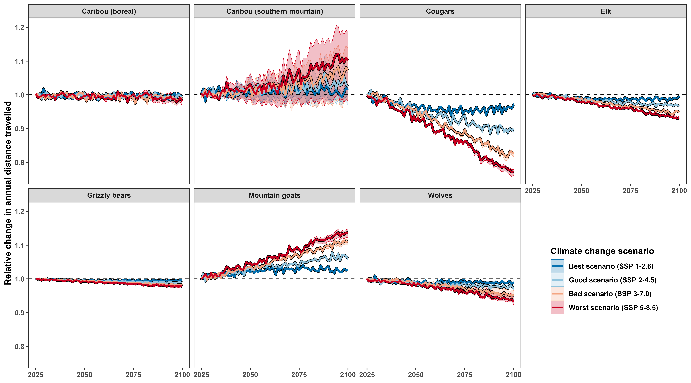

```{r setup, include=FALSE}
# set chunk defaults: don't print code, images text width and centered
knitr::opts_chunk$set(echo = FALSE, out.width = '\\textwidth',
                      fig.align = 'center', cache = TRUE, warning = FALSE,
                      message = FALSE)
```

<!--
available text sizes:
Huge > huge > LARGE > Large > large > normalsize > small > footnotesize > scriptsize > tiny
-->

<!--
six-sentence abstract:

1. introduce the topic
2. state the problem
3. summarize why the question hasn't been answered/what the consequences are
4. explain how you answered the question
5. explain the central findings
6. explain the importance of your findings and their consequences
-->

```{r, echo=FALSE}
abstract <- "Recent widespread warming has caused many terrestrial mammals to change when, how, and where they move, with cascading effects on individuals' fitness and habitat selection at the population, community, and ecosystem levels. Previous research has quantified the effects of temperature on mammalian movement behavior, but few have quantified the effects of future climate change on fine-scale movement and habitat selection. We address this gap by using Continuous-Time Movement Models and Hierarchical Generalized Additive Models to quantify the effects of temperature on mammal's probability of movement, speed, and habitat selection. We then leverage the estimated effects to predict when, how, and where mammals will move in BC throughout the 21^st^ century. We conclude with implications for energetics, encounter rates, habitat conservation, and human-wildlife conflicts. ***MISSING RESULTS AND CONCLUSIONS***"
```

\clearpage

\noindent \textbf{Article type}: Research article

\noindent \textbf{Words in abstract}: `r stringi::stri_count_words(abstract)`

\noindent \textbf{Words in main text}: `r suppressMessages(wordcountaddin::word_count())`

\noindent \textbf{Figures}: 7

\noindent \textbf{Tables}: 3

\noindent \textbf{References}: 73 (updated on 2025-01-16) <!-- counted by using nature csl -->

\noindent \textbf{Appendices}: 3

\noindent \textbf{Key words:} climate change, temperature, mammals, animal movement, habitat selection

\clearpage

# Abstract {-}

\noindent `r abstract`

<!-- place table of contents on a new page -->
\newpage

\singlespacing

\tableofcontents

<!-- start main body on a new page -->
\newpage

\doublespacing

\linenumbers

```{r packages, warning=FALSE, message=FALSE}
library('dplyr') # for data wrangling
library('purrr') # for data wrangling
library('tidyr') # for data wrangling
library('ctmm')  # for movement models
```

<!--

other refs

* A review of climate change effects on marine mammals in United States waters: Past predictions, observed impacts, current research and conservation imperatives https://doi.org/10.1016/j.ecochg.2022.100054
* Global vulnerability of marine mammals to global warming: https://doi.org/10.1038/s41598-019-57280-3

-->

\clearpage

# Introduction

<!-- movement is a convenient way to respond to change -->

\noindent For most animals, movement is a rapid, low-cost, and low-risk response to a variety of stimuli [@nathan_movement_2008], including escaping predation [@peterson_pursuit_2021; @bartashevich_collective_2024; @tan_antipredator_2024], searching for resources [@charnov_optimal_1976; @mezzini_how_2024], and habitat selection [@kacelnik_ideal_1992; @winter_forecasting_2024]. However, movement efficiency depends on ambient temperature, since it impacts the energetic cost of movement [@taylor_energetics_1982; @brown_toward_2004; @jahn_variations_2022], the ease of movement [e.g., snow depth and density, see @montgomery_movement_2019; @leclerc_determinants_2021; @melin_effect_2023], and the risk of overheating [@hetem_responses_2014; @dyer_travel_2023]. Additionally, temperature also affects movement indirectly by affecting other drivers of movement behavior, including physiology [@abram_behavioural_2017], fitness [@schmidt_interplay_2020; @berger_climate_2018], trophic interactions [@hegel_interacting_2010], and the availability and value of resources [e.g., water and heat, see: @elmore_implications_2017; @attias_effects_2018].

<!-- changes in temperature cause changes in movement -->

Changes in temperature affect not only whether and how fast animals move but also how they move [i.e., speed and tortuosity; their movement behavior: @nathan_movement_2008; @dyer_travel_2023] and where they move to [habitat selection: @merkle_large_2016; @alston_temperature_2020; @giroux_activity_2023]. Thus, temperature affects not only an animal's energetic expenditure but also many other consequences of movement, including encounter rates with resources [@mezzini_how_2024], other animals [@martinez-garcia_how_2020], and the occurrence of human-wildlife conflict [@weststrate_how_2024]. These changes are exacerbated at extreme temperatures, as animals often alter their movement behaviors substantially when temperatures are excessively cold or hot [@wilson_stenotherms_2001; @berger_climate_2018; @arechavala-lopez_common_2019; @giroux_activity_2023]. But what counts as "extreme" varies across species: thermal specialists are more sensitive to small changes above or below their ideal range [@giroux_activity_2023], while temperature generalists can adapt more easily to change [@dupont_beyond_2024]. However, this grater adaptability is tested when generalists are subject to changes that are more severe [@mccain_assessing_2019], affecting many factors [e.g., temperature, phenology, and resource availability: @polazzo_measuring_2024], or too rapid to adapt to within the span of a lifetime or a few generations [@levins_evolution_1974; @fuller_towards_2016; @xu_plasticity_2021]. Thus, it remains unclear how or whether species will be able to respond to climate change in the current century [@deb_modelling_2020; @woo-durand_increasing_2020; @verzuh_behavioural_2023], especially when populations do not react to changes in environmental conditions [@sawyer_migratory_2019] or are physiologically incapable [@sherwood_adaptability_2010; @williams_range_2018].

<!-- we do not know how temperature will change -->

This uncertainty in both future conditions and their consequences on ecosystems and populations presents a need for a comprehensive understanding of the effects of temperature on the movement of animal populations as well as the consequences this will have on landscapes, biodiversity, and their adaptability and resiliency. Recent work has documented climate-change-related changes mammals' ranges [@leclerc_determinants_2021], movement behavior [@melin_effect_2023]; thermoregulation [@mota-rojas_physiological_2021], and trait-based responses [@mccain_assessing_2019], but it is still unclear how mammals will adapt their small-scale movement and habitat selection to future changes in temperature [@intergovernmental_panel_on_climate_change_climate_2023; but see @hetem_responses_2014; @winter_forecasting_2024]. In the last 200 years, many ecosystems experienced widespread warming that resulted in milder and shorter winters, hotter and longer summers, and a greater risk of extremely high temperatures and severe forest fires [@intergovernmental_panel_on_climate_change_climate_2023; @zurowski_summer_2023]. Over the next 100 years, these changes will worsen and continue to impact mammals' fitness, movement behavior, and habitat selection as they cope with growing heat stress [@deb_modelling_2020; @woo-durand_increasing_2020] and frequency and intensity of extreme events [@bunnell_global_2011] along with growing anthopogenic pressure [@sih_evolution_2011; @sawyer_identifying_2009; @weststrate_how_2024].

<!-- why is understanding the present and predicting into the future necessary -->

Understanding the direct and indirect impacts of temperature on mammalian movement is essential for decision makers to be able to prepare and respond to change in a proactive manner [e.g., @sawyer_identifying_2009; @mccain_assessing_2019]. The Canadian province of British Columbia is currently experiencing rapid widespread warming, phenological shifts, and more frequent and intense extreme events, including forest fires [@zurowski_summer_2023]. In light of the "30 by 30" conservation initiative, a global effort to conserve 30% of the world's lands and oceans by 2030 [Section H, Targets 2 and 3 of @convention_on_biological_diversity_154_2022], we stress that decision makers must understand which areas will be of greatest value for maximizing the project's effectiveness. Predicting how climate change will affect how, when, and where animals will move is necessary for identifying which landscapes are most valuable now as well as in the future. Failing to understand how changes in temperature will affect mammalian movement behavior and habitat selection will hinder our ability to respond to the current climate crisis and make decisions that are viable in the long term.

<!-- introduce the study -->

This paper provides an analysis of the effects of spatiotemporally proximal temperature on the movement of six terrestrial mammal species in British Columbia (BC), Canada (*Canis lupus*, *Cervus canadensis*, *Oreamnos americanus*, *Puma concolor*, boreal and southern mountain *Rangifer tarandus*, and *Ursus arctos horribilis*; Table \@ref(tab:data-table)). Using over two decades of telemetry data over a large spatial range of British Columbia (Fig. \@ref(fig:bc-map)) and hourly air temperature data, we estimate how mammals altered their movement frequency, movement speed, and habitat selection in response to temperature. We then pair the estimated responses with climate change projections to forecast changes in mammalian movement in the current century under different climate-change scenarios [Shared Socioeconomic Pathways, see @riahi_shared_2017]. We discuss the consequences of these changes in movement behavior with regards to energetics, encounter rates, habitat conservation, and human-wildlife conflicts while disentangling the direct and indirect effects of temperature on the movement behavior of terrestrial mammals.

```{r bc-map, fig.cap="GPS telemetry data for the six species in this study."}
knitr::include_graphics('../figures/tels-map.png')
```

\footnotesize

```{r, eval=FALSE}
# a quick check for the table below
readRDS('../data/movement-models-speed-weights-2024-06-10.rds') %>%
  group_by(dataset_name, animal) %>%
  summarize(n = n_distinct(animal),
            any_na_speed = any(is.na(speed_est)),
            all_na_speed = all(is.na(speed_est))) %>%
  group_by(dataset_name) %>%
  summarise(n_missing_any = sum(any_na_speed),
            n_missing_all = sum(all_na_speed))
```

```{r data-table}
dt_data <-
  readRDS('../models/movement-models-2024-06-06.rds') %>%
  transmute(
    Species = case_when(
      dataset_name == 'Canis_lupus_boreal' ~ '\\emph{Canis lupus}',
      dataset_name == 'Rangifer_tarandus_boreal' ~ '\\emph{Rangifer tarandus} (boreal)',
      dataset_name == 'Rangifer_tarandus_southern_mountain' ~ '\\emph{Rangifer tarandus} (s. mountain)',
      dataset_name == 'Puma_concolor_2' ~ '\\emph{Puma concolor}',
      dataset_name == 'Puma_concolor_4' ~ '\\emph{Puma concolor}',
      dataset_name == 'Elk in southwestern Alberta' ~ '\\emph{Cervus canadensis}',
      dataset_name == 'Oreamnos_americanus' ~ '\\emph{Oreamnos americanus}',
      dataset_name == 'Ursus_arctos_horribilis' ~ '\\emph{Ursus arctos horribilis}'),
    animal, # keep animal column for grouping later
    tel = map(tel, data.frame),
    na_speed = map_lgl(movement_model,
                       \(.m) suppressWarnings(speed(.m)$DOF == 0))) %>%
  unnest(tel) %>%
  group_by(Species, animal) %>%
  summarize(Start = min(as.Date(timestamp)),
            End = max(as.Date(timestamp)),
            dt = median(timestamp - lag(timestamp), na.rm = TRUE),
            animal = unique(animal),
            na_speed = unique(na_speed),
            .groups = 'drop') %>%
  group_by(Species) %>%
  summarize(Start = min(Start),
            End = max(End),
            dt = as.numeric(median(dt, na.rm = TRUE)),
            Animals = n_distinct(animal),
            n_missing = sum(na_speed),
            .groups = 'drop') %>%
  mutate(dt = round('hours' %#% dt, 2)) %>% # convert from seconds to hours
  rename('\U0394t (hours)' = dt,
         'NA speed' = n_missing)

knitr::kable(dt_data, format = 'markdown', caption = 'Start and end of the GPS telemetries along with the median sampling interval ($\\Delta t$; stratified by individual), number of animals (Animals), and number of animals with unresolved speed (NA speed) for each of the species in this study.', escape = FALSE)
```

\normalsize

# Methods

## Datasets

This manuscript leverages four main datasets: (1) a collection of GPS telemetry data; (2) historical hourly reanalyzed air temperature from the ERA5 dataset from the European Center for Medium-range Weather Forecasting; (3) resource rasters of percent forest cover, elevation, and distance from water; and (4) climate change projections under four Shared Socioeconomic Pathways [SSPs, see @riahi_shared_2017]. We detail the data sources and analyses in the sections below, and more details are available in appendices A (estimating how temperature affects movement frequency and speed when moving), B (fitting Hierarchical Resource Selection Functions), and C (simulating hourly temperature data to 2100 using the four SSPs).

### GPS telemetry data

\noindent Elk (*Cervus canadensis*) data from @ciuti_human_2012 were downloaded from Movebank [study name: Elk in southwestern Alberta, see @kays_movebank_2022], while boreal caribou (*Rangifer tarandus*) and wolf (*Canis lupus*) telemetries were acquired via a public BC Oil and Gas Research and Innovation Society repository ([https://www.bcogris.ca/projects/boreal-caribou-telemetry-data](https://www.bcogris.ca/projects/boreal-caribou-telemetry-data)). Clearly erroneous GPS locations were removed using diagnostic plots of (1) distance from the median location, (2) straight-line displacement between locations, (3) turning angle, and (4) time interval between consecutive points. Particular attention was paid to points with large turning angles ($\gtrapprox 170^\circ$) and excessively high straight-line displacement, especially if antecedent and subsequent points indicated stationary behavior. The script used to clean the data and all associated custom functions are available on GitHub at [https://github.com/QuantitativeEcologyLab/bc-mammals-temperature](https://github.com/QuantitativeEcologyLab/bc-mammals-temperature).

### Historical and projected temperature data

\noindent Rasters of hourly reanalyzed air temperature data were downloaded from the ERA5 dataset [@hersbach_era5_2023] from the European Center for Medium-range Weather Forecasting server (ECMWF; [www.ecmwf.int](www.ecmwf.int); [https://cds.climate.copernicus.eu](https://cds.climate.copernicus.eu)). Proximal temperature was estimated for each location by extracting the value from the corresponding raster cell from the temporally nearest raster using the `extract()` function from the `terra` package [version 1.7-46, @hijmans_terra_2023] for `R` [@r_core_team_r_2024].

We obtained rasters of projected monthly average temperature at a 0.08$^\circ$ resolution in BC from 2020 to 2100 under the different SSPs via the `climatenaR` package [version 1.0, @burnett_climatenar_2023] for `R`. Since the climate projections only provided monthly means and ranges but no measures of variance or distributional assumptions, we used the hourly ERA5 data for BC from 1998 to 2023 [extremes included, see @hersbach_era5_2023] to calculate within-month variance in temperature, which we defined as the variance within a given pixel, month, and year. We then modeled the estimated variance using a GAM for location and scale [GAMLS, see: @rigby_generalized_2005; @stasinopoulos_generalized_2007; section 7.9 in @wood_generalized_2017]. The linear predictor for the location (i.e., the mean) included smooth terms of the within-pixel monthly mean temperature (within each year), month (as a cyclic smooth), a two-dimensional smooth of space, and a tensor interaction product term of space and month. The linear predictor for the scale term (which governs the mean-variance relationship) included smooth terms of the monthly mean, month, and space. We did not include a smooth of year to avoid unrealistic projections when extrapolating beyond the range of historical data. Additional details are available in Appendix C.

```{r, eval=FALSE, echo=FALSE}
m_gammals <- gam(list(
  # linear predictor for the mean parameter
  monthly_var ~
    s(monthly_mean, bs = 'cr', k = 10) +
    s(month, bs = 'cc', k = 10) + # using a cyclic cubic spline basis
    s(long, lat, bs = 'ds', k = 500) +
    ti(long, lat, month, bs = c('ds', 'cc'), d = c(2, 1), k = c(100, 10)),
  # linear predictor for the scale parameter
  ~ s(monthly_mean, bs = 'cr', k = 10) +
    s(month, bs = 'cc', k = 10) +
    s(long, lat, bs = 'ds', k = 100)),
  family = gammals(),
  data = d,
  method = 'REML',
  knots = list(month = c(0.5, 12.5)))
```

We simulated hourly variation in weather by assuming temperature followed a normal distribution with mean specified by the monthly `climatenaR` climate projections and variance as specified by the Gamma GAMLS. We then predicted changes in movement behavior and habitat selection as a function of the simulated temperature using the HGAMs and HRSFs. For each month within each year from 2020 to 2100, we simulated hourly weather by including temperatures from the 0.1 to the 0.9 quantile by increments of 0.1, and we weighted each quantile proportionally to the (normalized) Gaussian probability density for each quantile (Appendix C).

### Resource rasters

\noindent We estimated percent forest cover and distance from water using the rasters created by @tuanmu_global_2014. We calculated total forest cover by summing the temporally static rasters of evergreen/deciduous needleleaf trees, evergreen broadleaf trees, deciduous broadleaf trees, and mixed/other trees (raster classes 1-4, respectively). We converted the raster of percent cover of open water (class 12) to a binary raster of pixels with water (cover > 0%) or without water (cover = 0%) and then calculated each pixel's distance from the nearest pixel with water using the `distance()` function from the `terra` package. Finally, we obtaied two digital elevation models using the `get_elev_raster()` function from the `elevatr` package [version 0.99.0, @hollister_elevatr_2023]: We used a raster with a zoom of 6 (0.009$^\circ$) for model fitting and one with a zoom of 3 (0.08$^\circ$) for downloading climate change projections via `climatenaR`. All final rasters and code are available on GitHub at [https://github.com/QuantitativeEcologyLab/bc-mammals-temperature](https://github.com/QuantitativeEcologyLab/bc-mammals-temperature).

## Estimating mammals' instantaneous speeds

\noindent We modeled each animal's movement using continuous-time movement models [@fleming_fine-scale_2014] via the `ctmm` package [version 1.2.0, @fleming_ctmm_2023] for `R`. We then estimated mammals' instantaneous speeds by applying the `ctmm::speeds()` function on all models with finite speed estimates [415 of 433, see @fleming_fine-scale_2014; @noonan_scale-insensitive_2019]. The 18 telemetries with insufficiently fine sampling were for one mountain goat, 15 boreal caribou, and 2 southern mountain caribou (Table \@ref(tab:data-table)).

Since `ctmm`'s movement models assume stochastic but non-zero speeds (i.e., a single, stochastic moving state), data-informed speeds needed to be corrected so that the minimum instantaneous speed could be 0. We performed this correction by subtracting each model's mean speed while assuming speeds were $\chi^2$-distributed.<!-- The degrees of freedom and Frequentist confidence intervals were adjusted accordingly.--> The function we used is available on GitHub at [https://github.com/QuantitativeEcologyLab/bc-mammals-temperature/blob/main/functions/detrend_speeds.R](https://github.com/QuantitativeEcologyLab/bc-mammals-temperature/blob/main/functions/detrend_speeds.R). To avoid artifacts due to excessively small, non-zero speeds, we determined whether an animal was moving or not using the inflection point of each species' histogram of detrended speed estimates (Appendix A).

## Estimating the effects of temperature on mammals' movement

\noindent The following sections detail the statistical framework and modelling we used to estimate the effect on temperature on mammals' movement. To assess the importance of including temperature as an explicit covariate (rather than including its effects with time of day and day of year), we fit models with and without smooth effects of temperature and compared the deviance explained, model predictions, and AIC values of the two sets of models.

### Disentangling direct and indirect effects

\noindent In this manuscript, we separate the effects of temperature on mammalian movement into indirect and direct effects. We call "indirect" all effects that can be intervened on by altering an animal's habitat [its geographic space *sensu* @matthiopoulos_defining_2022], and we refer to all other effects as "direct". For example, an increase in temperature may push an animal to prefer higher forest cover in search of shade, and conservationists can thus mitigate these indirect effects of temperature on movement behavior by increasing the availability of forested areas, since the effect of temperature on movement is conditional on forest cover availability. In contrast, the animal may avoid moving if temperatures are above 35$^\circ$C, irrespective of its geographic and environmental space [*sensu* @matthiopoulos_defining_2022], so it is not possible to mitigate the effects of temperature on movement behavior (other than changing temperature directly). We provide Directed Acyclical Graphs in Appendix A (modeling the effects of temperature on movement rates), and Appendix B (modeling the effects of temperature on habitat selection).

### Movement frequency and speed

\noindent We estimated the effects of temperature on mammals' movement state (moving or not) and speed (when moving) using two Hierarchical Generalized Additive Models [HGAMs, see @pedersen_hierarchical_2019 and the code chunk below] with the `mgcv` package for `R` [version 1.9-1, @wood_generalized_2017]. The first HGAM estimated the probability that an animal was moving with a binomial family of distributions and logit link function. The second HGAM estimated an animal's speed (when moving) with a gamma family of distributions and log link function. The HGAMs included random intercepts for each animal (`s(..., bs = 're')`), fixed-effect intercepts for each species, and species-level `by` smooths for time of day, day of year, and temperature [`s(..., by = species)`, see model I in Figure 4 of @pedersen_hierarchical_2019]. Additionally, the models had three tensor product interaction terms (`ti()`) for each species: (1) day of year and time of day, (2) temperature and time of day, and (3) temperature and day of year. These three terms accounted for: (1) seasonal changes in day length, (2) hourly changes in the response to temperature (e.g., changes in nocturnality), and (3) seasonal changes in the response to temperature (e.g., changes in coats and migration timing). The HGAMs accounted for the cyclicity of time of day and day of year using cyclic cubic splines [`bs = 'cc'`, @wood_generalized_2017]. Together, the binomial HGAM and the gamma HGAM inform us on an animal's long-term average speed, since it is the product of the probability of moving and its average speed when moving. We fit the models with fast REML (`'fREML'`) and discretized covariates (`discrete = TRUE`) to optimize computational efficiency with no appreciable losses to model performance [@wood_generalized_2015; @wood_generalized_2017-1; @li_faster_2020]. Additional details are provided in Appendix A.

<!-- \clearpage -->

\singlespacing

\small

```{r hgams, eval=FALSE, echo=TRUE}
m_moving <- bam(
  moving ~
    s(animal, bs = 're') +
    species + #' necessary since `by` terms do not include intercept terms
    s(tod_pdt, by = species, k = 5, bs = 'cc') +
    s(doy, by = species, k = 5, bs = 'cc') +
    s(temp_c, by = species, k = 5, bs = 'tp') +
    ti(doy, tod_pdt, by = species, k = 5, bs = c('cc', 'cc')) +
    ti(temp_c, tod_pdt, by = species, k = 5, bs = c('tp', 'cc')) +
    ti(temp_c, doy, by = species, k = 5, bs = c('tp', 'cc')) +
    s(log(dt), k = 3) +
    s(log(dt), species, k = 3, bs = 'fs'),
  data = d,
  method = 'fREML', # fast REML
  discrete = TRUE, # discretize the covariates for faster computation
  knots = list(tod_pdt = c(0, 1), doy = c(0.5, 366.5))) #' for `bs = 'cc'`
  
m_speed <- bam(
  speed_est ~
    s(animal, bs = 're') +
    species +
    s(tod_pdt, by = species, k = 5, bs = 'cc') +
    s(doy, by = species, k = 5, bs = 'cc') +
    s(temp_c, by = species, k = 5, bs = 'tp') +
    ti(doy, tod_pdt, by = species, k = 5, bs = c('cc', 'cc')) +
    ti(temp_c, tod_pdt, by = species, k = 5, bs = c('tp', 'cc')) +
    ti(temp_c, doy, by = species, k = 5, bs = c('tp', 'cc')) +
    s(log(dt), k = 3) +
    s(log(dt), species, k = 3, bs = 'fs'),
  family = Gamma(link = 'log'),
  data = d_2, #' data filtered for only moving
  method = 'fREML',
  discrete = TRUE,
  knots = list(tod_pdt = c(0, 1), doy = c(0.5, 366.5)))
```

\clearpage

\normalsize

\doublespacing

### Habitat selection

\noindent We estimated the effects of temperature on each species' selection for percent forest cover, elevation, and distance from water by fitting a Hierarchical Resource Selection Function for each species using an HGAM with a Poisson family of distributions and log link function [Appendix B, also see @aarts_estimating_2008]. We accounted for the spatiotemporal autocorrelation in the telemetry locations by weighting each point based on the telemetry's Autocorrelated Kernel Density Estimate [@fleming_new_2017; @noonan_comprehensive_2019] to produce estimates of second- and third-order habitat selection [*sensu* @johnson_comparison_1980]. While we recognize there are other important drivers of habitat selection (e.g., forest age, forest type, prey availability), we decided to only use these three proxies to produce results that are comparable between species and to make province-wide predictions simpler. Each species' model had the same structure:

\singlespacing

\small

```{r rsf, eval=FALSE, echo=TRUE}
rsf <- bam(
  detected ~ # 1 for telemetry locations, 0 for quadrature data
    # species-level average resource preference
    s(forest_perc, k = 6, bs = 'tp') +
    s(elevation_m, k = elev_k, bs = 'tp') +
    s(dist_water_m, k = 6, bs = 'tp') +
    # animal-level deviations from the species-level average
    s(animal, bs = 're') +
    s(forest_perc, animal, k = 6, bs = 'fs', xt = list(bc = 'cr')) +
    s(elevation_m, animal, k = 6, bs = 'fs', xt = list(bc = 'cr')) +
    s(dist_water_m, animal, k = 6, bs = 'fs', xt = list(bc = 'cr')) +
    # changes in preference with temperature
    ti(forest_perc, temperature_C, k = 6, bs = 'tp') +
    ti(elevation_m, temperature_C, k = 6, bs = 'tp') +
    ti(dist_water_m, temperature_C, k = 6, bs = 'tp') +
    # include marginals of temperature to remove sampling biases
    s(temperature_C, k = 4, bs = 'tp') +
    s(temperature_C, animal, k = 4, bs = 'fs', xt = list(bc = 'cr')),
  family = poisson(link = 'log'),
  data = d,
  weights = weight, # based on AKDE
  method = 'fREML',
  discrete = TRUE)
```

\normalsize

\doublespacing

Smooth effects of percent forest cover, elevation, and distance to water accounted for the species-level average selection strength for each resource. A random effect for each individual animal corrected for uneven sampling across individuals, while factor smooth interaction terms (`bs = 'fs'`) accounted for individual-level resource selection (i.e., individual-level deviations from the species-level average). Tensor interaction product terms (`ti()`) of the three resources and temperature estimated the change in resource selection at different temperatures. Finally, we included marginal smooth terms of temperature to account for species- and individual-level sampling biases over temperature (e.g., sampling more during warm periods). Detections were weighted proportionally to their degree of independence from other temporally proximate detections [`weights = weight` -- see Appendix B and @alston_mitigating_2022], while quadrature points had a weight of 1.

```{r, eval=FALSE}
library('mgcv')
library('purrr')
x <- list.files('H:/GitHub/bc-mammals-temperature/models/', 'rsf-', include.dirs = FALSE, full.names = T)
x <- x[grepl('2024-10', x)]
map_int(x, \(f) readRDS(f)$iter)
```

# Results

\noindent Species differed in mean probabilities of movement (range: 0.05 -- 0.27), mean speed when moving (range: 0.42 -- 2.67 km/day), and mean distance travelled (range: 0.04 -- 0.62 km/day) even after post-stratifying to a sampling interval of one hour (Tab. \@ref(tab:gam-intercepts)). The inclusion of temperature in the model did not affect any of the three measures substantially when post-stratifying to $0^\circ$C. Grizzly bears tended to move least often ($P(M = 1) \approx 0.05$), while wolves and pumas moved most often ($P(M = 1) \ge 0.23$), and wolves had the highest mean speed when moving. Consequently, wolves traveled 3.0 to 15.6 times further per day than other mammals, on average.

* CHANGED FOREST RASTER TO USE ALL TREE TYPES (2025-01-17)
* NEED TO REMAKE HRSF FIGURES

***THIS IS FALSE***We did not find any consistent selections for or against forest cover, but all species exhibited stronger selection preferences for elevation and distance from water than for forest cover, and there was no consistent preference for forest cover across temperatures. In contrast, all species showed a strong preference for specific altitudes: wolves, pumas, and boreal caribou generally preferred elevations < 1 km above sea level, while elk, mountain goats, southern mountain caribou, and grizzly bears generally preferred elevations between 1 and 2 km above sea level. All species except for elk and grizzly bears preferred being as close to water as possible, 

Overall, we did not detect any strong selections for or against forest cover, and this lack of preference was generally true irrespective of temperature. In contrast, we selection strength for forest cover did not vary strongly with temperature, 

preferred resources

**CHECK TABLE 2: UPDATE AFTER REMOVING SCEK014 AND SCEK014b (2024-11-19 9:50)**

***UPDATE TABLES BASED ON NEW HRSFS***

\footnotesize

```{r gam-intercepts}
setwd('~/GitHub/bc-mammals-temperature')
library('mgcv')
library('dplyr')
library('ctmm') #' for `%#%`
source('analysis/figures/default-ggplot-theme.R')

get_int <- function(.m) {
  newd <- mutate(.m$model[1:7, - 1], species = SPECIES, temp_c = 0, dt = 1)
  predict(.m, type = 'response', newdata = newd,
          terms = c('(Intercept)', 'species',
                    's(temp_c)', paste0('s(temp_c):species', SPECIES),
                    's(log(dt))', 's(log(dt),species)'))
}

intercepts <- tibble(Species = SPECIES,
                     'P(M)' = get_int(readRDS('models/binomial-gam-without-temperature.rds')),
                     'P(M|T)' = get_int(readRDS('models/binomial-gam.rds')),
                     'E(S|M=1)' = 'km/h' %#% get_int(readRDS('models/gamma-gam-without-temperature.rds')),
                     'E(S|M=1,T)' = 'km/h' %#% get_int(readRDS('models/gamma-gam.rds')),
                     'E(D)' = `P(M)` * `E(S|M=1)`,
                     'E(D|T)' = `P(M|T)` * `E(S|M=1,T)`) %>%
  mutate(Species = paste0('\\emph{', Species, '}') %>%
           gsub(')}', ')', .) %>%
           gsub(' \\(', '} \\(', .))

if(FALSE) {
  hist(intercepts$`P(M)`)
  hist(intercepts$`E(S|M=1)`)
  round(range(max(intercepts$`E(D)`) /
                intercepts$`E(D)`[- which.max(intercepts$`E(D)`)]),
        1)
  
  intercepts %>%
    transmute(Species,
              p = round(`P(M|T)` - `P(M)`, 2),
              s = round(`E(S|M=1,T)` - `E(S|M=1)`, 2),
              d = round(`E(D|T)` - `E(D)`, 2))
}

intercepts %>%
  arrange(Species) %>%
  mutate(Species = gsub('angifer', '\\.', Species)) %>%
  rename_with(\(.x) paste0('$', .x, '$'), ! Species) %>%
  rename_with(\(.x) gsub('\\|', '\\\\vert ', .x)) %>%
  rename_with(\(.x) gsub('E', '\\\\mathbb E', .x)) %>%
  rename_with(\(.x) gsub('M=1', 'M\\\\!=\\\\!1', .x)) %>%
  knitr::kable(format = 'markdown', digits = 2, caption = paste0("Mean probability of movement (P(M)), speed when moving ($\\mathbb E(S | M = 1)$), and distance travelled ($\\mathbb E(D)$) as estimated by models without and with temperature, after post-stratifting to a 1-hour sampling rate and a temperature of T = 0\U00B0", "C."))
```

\normalsize

For most models, including smooth terms of temperature did not always improve within-sample prediction substantially (change in deviance explained: +0.2% -- + 17.9%), and there was relatively strong agreement between models with and without temperature (Fig. ***SX pred vs pred***), but including temperature resulted in substantially better fits for all models (all $\Delta$AIC $\le$ -326; Table \@ref(tab:temp-comparison)).

```{r temp-comparison}
setwd('..')
library('dplyr')
source('analysis/figures/default-ggplot-theme.R') #' for `SPECIES`

temp_comp <- tibble(
  Model = c('P(moving)', 'Speed', rep('HRSF', 7)),
  Species = c('All', 'All', sort(as.character(SPECIES))),
  DDE = 
    c(10.7 - 10.2, 79.3 - 79.1, 10.0, 4.47, 17.6, 7.83, 5.89, 11.8, 17.9) %>%
    round(1) %>%
    paste0('%'),
  DAIC = c(-5927, -1682, -7200, -4305, -769, -945, -6284, -326, -920) %>%
    round())

colnames(temp_comp)[colnames(temp_comp) == 'DAIC'] <- paste0('\U0394', 'AIC')
colnames(temp_comp)[colnames(temp_comp) == 'DDE'] <- paste0('\U0394', 'DE')

knitr::kable(temp_comp, digits = 1, format = 'markdown', caption = "Changes in deviance expained ($\\Delta$DE) and Akaike Information Criterion ($\\Delta$AIC) from including temperature in the models estimating probability of movement (P(moving)) and speed when moving (Speed), as well as in species-level Hierarchical Resource Selection Functions (HRSF).")
```

## Effects of temperature on movement rates

\noindent The partial effects of temperature varied in both direction and magnitude across species (Fig. ***AX***), even after accounting for differences in daily and seasonal activity (e.g., sleeping, migration, hibernation; see Fig. ***AX***). Smooth interaction terms were well-behaved and indicated clear shifts in daily activity for all species (Fig. ***AX***). The models explained reasonably high proportions of the deviance (11% for the binomial model and 79% for the Gamma model) and had good in-sample prediction (Fig. ***AX***). Both movement frequency and speed when moving decreased with increasing sampling interval, with a strong common effect (Fig. ***AX***). Most species adapted their daily and seasonal movement behavior to changes in temperature (Fig. \@ref(fig:dist)), but the precision of the estimated change depends on the GPS sampling frequency. While `ctmm` models are scale independent [@noonan_scale-insensitive_2019], the accuracy, size, and stability of speed estimates still depends on the GPS sampling frequency. This is because coarser sampling contains information on large scale movements (e.g., range crossings, migrations) but not fine-scale movement (e.g., first-order habitat selection). Using the boreal caribou as an example, the 13-hour sampling interval allows us to reasonably estimate the caribou's movement path at a temporal scale of approximately 13 hours (or greater), but we cannot produce reasonable movement trajectories at a much finer (e.g., hourly) scale. Consequently, the estimated movement behaviors should be compared across species carefully.

```{r dist, fig.cap="\\textbf{Temperature is a strong determinant of how far and when mammals travel.} The fill indicates the estimated effects of temperature on the relative change in distance travelled (probability of moving times mean speed when moving) over time of day (\\textbf{A}) and day of year (\\textbf{B}). Predictions in the surface plots extend to 10% of the range away from each datum. The color bar is on the $\\log_2$ scale to help visualize patterns in doubling, and values are capped to -75\\% and +300\\% for ease of readability."}
knitr::include_graphics('../figures/distance.png')
```

### Predicted changes in movement during the current century

The direction and degree of change in distance travelled varies greatly between species, but worse climate-change scenarios consistently corresponded to greater absolute changes in behavior as well as greater uncertainty in the estimated change (Fig. \@ref(fig:t-dist)). Under the best-case scenario, absolute projected changes by 2100 were small (0% to 2%, except for southern mountain caribou, which had a change of ~5%). Under the worst-case scenario, absolute projected changes were by 2100 ranged from ~1% (boreal caribou) to ~25% (southern moutain caribou) and had the greatest uncertainty in the estimates. Boreal caribou and elk showed relatively little projected changes, especially relative to the degree of inter-annual variability in distance travelled.

```{r, eval=FALSE}
# max absolute change
readRDS('H:/GitHub/bc-mammals-temperature/data/cc-hgam-projections.rds') %>%
  group_by(scenario, species) %>%
  summarize(max_rel = labeller_perc(max(abs(d))),
            .groups = 'drop') %>%
  arrange(species, scenario) %>%
  print(., n = nrow(.))

# range between values at 2100 does not depend strongly on dt
# (without accounting for other variables and trends within species)
readRDS('H:/GitHub/bc-mammals-temperature/data/cc-hgam-projections.rds') %>%
  filter(year == 2100) %>%
  group_by(species) %>%
  summarize(range = labeller_perc(diff(range(d)) + 1)) %>%
  left_join(dt_data %>%
              mutate(species = case_when(
                Dataset == '\\emph{Canis lupus}' ~ 6,
                Dataset == '\\emph{Rangifer tarandus} (boreal)' ~ 5,
                Dataset == '\\emph{Rangifer tarandus} (s. mountain)' ~ 1,
                Dataset == '\\emph{Puma concolor}' ~ 3,
                Dataset == '\\emph{Puma concolor}' ~ 3,
                Dataset == '\\emph{Cervus canadensis}' ~ 4,
                Dataset == '\\emph{Oreamnos americanus}' ~ 7,
                Dataset == '\\emph{Ursus arctos horribilis}' ~ 2),
                species = SPECIES_LABS[species]),
            by = 'species') %>%
  ggplot(aes(`Median Δt (hours)`, range, color = species)) +
  geom_point() +
  scale_color_manual(values = PAL)
```

```{r t-dist, fig.cap="\\textbf{The intensity and direction of changes in movement rates due to climate change varies among species, but worse climate-change scenarios often result in the greatest change and greatest uncertainty.} Lines indicate the projected relative change in mean distance travelled (probability of moving times speed when moving) due to changes in temperature within the species' current extent. Shaded areas indicate the mean 95% Bayesian credible intervals. Changes are relative to the mean distances travelled in 2020 across the four Shared Socioeconomic Pathways (SSPs). The SSPs are listed in order of similarity to current conditions, from SSP 1-2.6 (sustainability, best-case scenario) to 5-8.5 (fossil-fueled development, worst-case scenario). The projections only account for changes movement behavior (i.e., movement frequency and speed) and ignore changes in physiology or movement costs."}

```

***COMMENTS ABOUT SPATIAL VARIATION IN distance travelled***

```{r s-dist}
plot(1, main = '4. spatial projections of distance in 2020 and 2100')
```

## Effects of temperature on habitat selection

```{r hrsfs, fig.cap="\\textbf{Temeperature strongly affects mammals' habitat selection.} Estimated resourse selection strength for forest cover (\\%), elevation (km), and distance from water (km) as a function of temperature. The grey contours indicate the extent of each speices' observed locations."}
knitr::include_graphics('../figures/hrsf-surface-plots.png')
```

### Predicted changes in movement during the current century

```{r t-hrsfs, fig.cap="\\textbf{The intensity and direction of changes in habitat selection due to climate change vary among species, but worse climate-change scenarios consistently result in the greatest change and greatest uncertainty.} Lines indicate the projected change in relative selection strength for forest cover (\\%), elevation (km), and distance from water (km) due to changes in temperature within the species' current extent. Shaded areas indicate the mean 95% Bayesian credible intervals. Changes are relative to the relative selection strength in 2020 across the four Shared Socioeconomic Pathways (SSPs). The SSPs are listed in order of similarity to current conditions, from SSP 1-2.6 (sustainability, best-case scenario) to 5-8.5 (fossil-fueled development, worst-case scenario)."}
plot(1, main = '6. temporal projections of RSFs within current area')
```

```{r s-hrsfs}
plot(1, main = '7. spatial projections of RSFs in 2020 and 2100')
```

# Discussion

We demonstrated that temperature is an important determinant of how and where mammals move, even while accounting for other seasonal drivers of movement (e.g, changes in photoperiod, hormones, and resources). This is important because decoupling temperature from other drivers allows us to predict how changes in climate will affect mammalian movement even if all other drivers remain constant.


* We discuss the consequences of these changes in movement behavior with regards to energetics, encounter rates, habitat conservation, and human-wildlife conflicts.
* as temperatures get warmer, we will be pushing into the unknown portion of the surface plots
* our models don’t include any physiological responses to temperature that may impact movement (e.g., hybernation)
* our models also assume the behaviour we modeled now will persist into the future (e.g., hybernation, migration)
* based on the model, temperature doesn't affect grizzlies' hibernation much, and their distance travelled in winter is very low due to P(moving) being so low:
* if the RSS decreases a lot, individuals may disperse, populations may relocate, or stay where they are and suffer

* RSFs require good data coverage over the resource-temperature space
* future work investigating effects on a single species or evaluating space more accurately should:
+ use fully Bayesian models with appropriate regularizing priors and penalties to avoid excessive predicitons
+ use B splines to specify better penalty spaces
+ have more data with good coverage over the covariate space

* @pease_ecological_2024: the scale at which we measure variables affects their estumated effect
* @hetem_responses_2014:
* rate of climate change is too fast for genetic adaptation to occur in mammals with longevities of decades
* example of suitable habitat prediction to 2050
* proactive conservation: @sawyer_identifying_2009

<!-- - how results answer central question -->

## Effects of temperature on mammals' movement


## Effects of temperature on mammals' habitat selection


<!-- - what it tells us about the broader field -->

## Considerations for future studies

Our work highlights ***X*** central considerations for future research: (1) telemetry sampling rates should bedesigned primarily in relation to the movement timescales of the species of interest and ideally with multiple samples **path?**, (2) the number of individuals tracked and the length of each telemetry should depend on environmental stability, and (3) ***projecting into the fringes****

Sampling schedules should be fine enough to reconstruct animals' movement at a sufficiently fine scale. Good estimates of an animal's speed and its movement path require telemetry locations to be taken more often than the animal's directional persistence [@noonan_scale-insensitive_2019], so that, on average, the dataset contains multiple locations in between changes in direction. What consitutes a change in direction depends on what movement scale one is investigating. Small-scale movements and first-order spatial selection will require more frequent sampling than migratory movement or secornd- and third-order spatial selection. While `ctmm` movement models are scale-invariant in that any model can be scaled to larger or smaller areas and timescales, the model estimates are not independent of the scale of the sampling frequency.

When landscapes are relatively predictable across years, a larger number of sampled individuals is likely preferable over longer, multi-year telemetries. This allows one to quantify the variance across individuals, including the range of conditions and environments that individual animals are in. A good estimate of inter-individual variance provides better coefficient estimates along with more appropriate measures of uncertainty. However, when conditions across years are relatively stochastic, multi-year telemetries allow one to better estimate inter-annual and inter-individual variation. In either case, carefully-designed sampling schedules and (Bayesian) hierarchical models can provide good estimates of the effects of interested along with appropriate measures of uncertainty [@mcelreath_statistical_2016].

* improve projections at the edges of the HRSFs with local and Traditional Knowledge [@kutz_two-eyed_2019]
* changes in temperatures are pushing to areas in the surface plots that have little data and may be poorly estimated. We will need to extrapolate to prepare for future changes, which implies some degree of inevitable risk. The best wat to avoid this is by designing models that are statistically sound and interpretable. The models we present provide an estimate of the changes in behavior, but they are not tailored specifically to any of the species in the dataset. Species-specific models should account for more particular variables (e.g., forest age for caribou) and use dynamic resource rasters (i.e., not use a static estimate of forest cover). Nonetheless, we present important results for understanding how mammals will respond to changes in climate and weather during the next ~75 years. 

## Consequences for conservation

* energetics
* encounter rates (lower encounter rates with food [@hou_cold_2020])
* HWI [@weststrate_how_2024]
z* Machine Learning (Genenative Aritificial Intelligence; GenAI) AI is fueling climate change. We need to proactively prepare to respond to climate change. Pollution is not under the control of the masses, so predicting change will be hard
* high energy and water demands [@li_making_2023] GenAI consumption of water
* high carbon footprint [@luccioni_estimating_2024]
* Pollution is not under control of the masses, so predicting change will be hard

<!-- - address any questions presented in the discussion -->

\clearpage <!-- to prevent figures from floating to the references -->

\newpage <!-- place references on a separate page -->

<!-- additional references:

- boars' sleep quantity, efficiency and quality are reduced on warmer days (https://doi.org/10.1098/rspb.2023.2115)

-->

# References {-}

\hangparas{1em}{1} <!-- paragraphs hanging by width equal to font height -->
