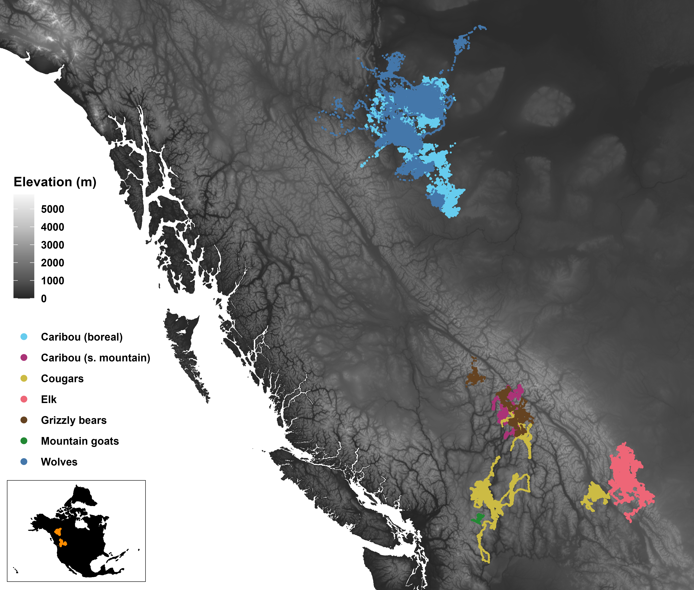

```{r setup, include=FALSE}
# set chunk defaults: don't print code, images text width and centered
knitr::opts_chunk$set(echo = FALSE, out.width = '\\textwidth',
                      fig.align = 'center', cache = TRUE, warning = FALSE,
                      message = FALSE)
```

\newpage

<!--
available text sizes:
Huge > huge > LARGE > Large > large > normalsize > small > footnotesize > scriptsize > tiny
-->

```{r abstract, echo=FALSE}
abstract <- "Widespread warming during the last century has caused many terrestrial mammals to change how and where they move, with cascading effects on fitness and community dynamics. Previous studies have estimated the effects of temperature on mammalian movement behaviour, but few disentangled them from seasonal behaviour cycles. Consequently, it is still uncertain how mammals will adapt their movement behaviour throughout the 21^st^ century. We address this gap by quantifying the effects of temperature on the movement rates and habitat selection of six large-bodied mammalian species (boreal and southern mountain caribou, cougars, elk, grizzly bears, mountain goats, and wolves) throughout western Canada between 1998 and 2023. We show that temperature significantly affected how and where these boreal mammals moved, and we predict that climate change will impact mammals' movement behaviour throughout the 21^st^ century. Projected responses to climate change suggested that rising temperatures will drive southern mountain caribou and mountain goats to move more, while cougars, elk, and wolves will move less. Boreal caribou and grizzly bears showed little change in projected yearly movement rates but clear shifts in phenology. We also predict that rising temperatures will reduce median habitat selection strength for four of the species, although cougars and elk are expected to show increased selection strength for higher altitudes. As mammals increasingly alter their movement rates and select against portions of their current ranges, changes in individuals' movement behaviour will impact encounter rates, including predator-prey dynamics and human-wildlife interactions. Conservation efforts should therefore account for future changes in movement behaviour as well as the consequences such changes may have on communities. Anticipating changes in mammalian movement behaviour will become crucial for effectively and proactively understanding community-level responses and selecting high-quality habitat for long-term conservation."
if(FALSE){
  stringi::stri_count_words(abstract)
}
```

\clearpage

\noindent \textbf{Running Title}: Temperature alters mammal movement behaviour

\noindent \textbf{Article type}: Research article

\noindent \textbf{Words in abstract}: `r stringi::stri_count_words(abstract)`

\noindent \textbf{Words in main text}: `r suppressMessages(wordcountaddin::word_count())`

\noindent \textbf{Figures}: 9

\noindent \textbf{Tables}: 3

\noindent \textbf{References}: 155 (updated on 2025-10-01) <!-- counted using movement ecology csl -->

\noindent \textbf{Appendices}: 2

\noindent \textbf{Key words:} climate change, temperature, mammals, animal movement, movement behaviour, habitat selection, projections

\noindent \textbf{Contact Information:} *Corresponding author’s telephone, and email details*

\ 

\clearpage

# Abstract {-}

\noindent `r abstract`

<!-- start main body on a new page -->
\newpage

\doublespacing

\linenumbers

```{r packages, warning=FALSE, message=FALSE}
library('dplyr') # for data wrangling
library('purrr') # for data wrangling
library('tidyr') # for data wrangling
library('ctmm')  # for movement models
```

# Introduction

<!-- movement is a convenient way for ANIMALS to respond to change, but movement depends on temperature -->

\noindent For most animals, movement is a rapid and low-cost response to a variety of stimuli [@nathan_movement_2008]. Animals move to optimize resource use [e.g., food, water, shelter$;$ @charnov_optimal_1976; @kacelnik_ideal_1992; @merkle_large_2016; @mezzini_how_2025], optimize habitat use [@winter_forecasting_2024], and avoid predators and competitors [@peterson_pursuit_2021; @bartashevich_collective_2024; @tan_antipredator_2024; @torrez-herrera_monkeys_2020]. How and where animals move thus also determines encounter rates with resources [@mezzini_how_2025], humans [@johnson_human_2018; @weststrate_how_2024], predators, prey, and competitors [@martinez-garcia_how_2020; @glass_trade-off_2021; @brivio_seeking_2024]. However, ambient temperature affects animals' movement rates by altering the energetic cost of movement and thermoregulation [@mcnab_body_1970; @taylor_energetics_1982; @brown_toward_2004; @fuller_towards_2016; @jahn_variations_2022], and extreme temperatures can impact animals' movement rates [@dyer_travel_2023], phenology [@carbeck_adaptation_2022; @johnson_human_2018; @mclellan_effect_2015; @pigeon_drivers_2016], and life history [@newediuk_climate_2024], and even cause physiological damage and death [@hetem_responses_2014; @powers_hovering_2017; @ratnayake_forecasting_2019; @schmidt_interplay_2020; @schwerdt_ecological_2024]. Animals may search for a short-term buffer from extreme temperatures by moving to thermal refugia [@hannah_fine-grain_2014; @elmore_implications_2017; @attias_effects_2018; @arechavala-lopez_common_2019; @gulland_review_2022], and shelter may even be preferred over forage abundance [@hall_microrefuges_2016]. However, climate change during the last century [@ipcc_climate_2023] has caused animals to alter how and where they move as they respond to hotter temperatures and increasingly severe and frequent extreme-heat events [@ipcc_climate_2023; @bunnell_global_2011; @thompson_2021_2022].

<!-- mammals  -->

Mammals are particularly susceptible to adverse effects from excessive heat [@sherwood_adaptability_2010]. While extreme cold often leads to reduced movement, provided that individuals can find refuge and take advantage of their body heat [@berger_climate_2018; @hou_cold_2020; @glass_trade-off_2021], extreme heat can often result in more severe physiological damage in a shorter span of time [@jessen_temperature_2001; @sherwood_adaptability_2010; @mota-rojas_physiological_2021; @newediuk_climate_2024]. Mammals' homeothermy can cause them to have difficulty dissipating heat, particularly when ambient temperatures are near or above body temperature. Larger-bodied mammals are more likely to alter their movement behaviour with rising temperatures, since they tend to move long distances [@merkle_large_2016], are particularly sensitive to overheating [@fuller_towards_2016; @alston_temperature_2020; @verzuh_behavioural_2023], and their movement rates are thus strongly limited by excessive heat [@dyer_travel_2023].

Global warming during the last century has resulted in milder and shorter winters, hotter and longer summers, and a greater risk of extreme-heat events [@ipcc_climate_2023], with widespread changes in mammals' phenologies, circadian rhythms, fitness, and life histories [@botero_evolutionary_2015; @le_corre_weather_2016; @wells_life_2022; @newediuk_climate_2024; @mclellan_effect_2015; @pigeon_drivers_2016]. However, behavioural responses to heat vary substantially across species depending on body size, vagility, and activity times [@mccain_body_2014; @williams_range_2018]. For example, warming temperatures have allowed deer (*Odocoileus* spp.) to shift northward, which has led to increased density of wolves (*Canis lupus*) and higher predation on caribou (*Rangifer tarandus caribou*) [@latham_invading_2011; @barber_potential_2018; @dickie_habitat_2024]. Preparing for and responding to future changes will require a detailed understanding of not only how how and where mammals move throughout the thermal landscape but also the cascade of effects that such changes will have at the population and community levels [@cunningham_opportunity_2021].

<!-- responding to future changes -->

As heat stress intensifies throughout the 21^st^ century, mammals will continue to suffer impacts on their fitness, movement rates, and habitat selection [@deb_modelling_2020; @woo-durand_increasing_2020]. It remains unclear how or whether species will be able to respond to climate change in the current century [@deb_modelling_2020; @woo-durand_increasing_2020; @verzuh_behavioural_2023], especially if populations fail to adapt [@sawyer_migratory_2019; @botero_evolutionary_2015] or are physiologically incapable to do so [@sherwood_adaptability_2010; @botero_evolutionary_2015; @williams_range_2018]. Recent work has documented the effects of climate change on mammals' ranges [@leclerc_determinants_2021], thermoregulation [@mota-rojas_physiological_2021], and movement behaviour [@mccain_assessing_2019; @melin_effect_2023; @cunningham_opportunity_2021], but there remains a need for fine-scale estimates of the effects of temperature on mammals' movement behaviour and quantitative predictions of future changes in movement behaviour.

<!-- introduce the study -->

In this paper, we quantify the effects of proximal air temperature on mammalian movement behaviour, namely movement rates and habitat selection of six large-bodied terrestrial mammal species in western Canada (boreal and southern mountain caribou, cougars: *Puma concolor*, elk: *Cervus canadensis*, grizzly bears: *Ursus arctos horribilis*, mountain goats: *Oreamnos americanus*, and wolves; Table \@ref(tab:data-table)). Western Canada is currently experiencing accelerating and widespread but spatially heterogeneous warming [@dierauer_climate_2021; @kienzle_has_2018; @turner_its_2009], phenological shifts [plants: @post_climate_2008; @tysor_countergradient_2025; ice: @basu_phenological_2024; caribou: @le_corre_weather_2016], and more frequent and intense extreme heat events [@zhang_increased_2023]. Decision makers must understand which areas will best sustain and protect biodiversity not only for current conditions but future decades, too. Failing to understand how climate change will affect mammalian movement behaviour will hinder our ability to respond to the current climate crisis and make decisions that are viable in the long term. Furthermore, understanding how temperature affects individual species is the first step towards understanding how temperature impacts the community dynamics [@hegel_interacting_2010; @carbeck_adaptation_2022; @cunningham_opportunity_2021] and phenology [@bunnell_global_2011; @duncan_predicting_2012; @merkle_large_2016; @le_corre_weather_2016; @slatyer_ecological_2022; @gerlich_species_2025], and how these changes will impact mammals in the coming decades [@sobie_climate_2021; @eum_potential_2023; @weststrate_how_2024].

```{r bc-map, fig.cap="GPS telemetry data for the six species in this study (dots) over a digital elevation model for the study area. The inset in the bottom left shows the telemetry data within the north american continent. Both maps use the BC Albers Equal Area Conic projection (EPSG:3005).", out.width='\\linewidth'}

```

\scriptsize

```{r, eval=FALSE}
# a quick check for the table below
readRDS('../data/movement-models-speed-weights-2024-06-10.rds') %>%
  group_by(dataset_name, animal) %>%
  summarize(n = n_distinct(animal),
            any_na_speed = any(is.na(speed_est)),
            all_na_speed = all(is.na(speed_est))) %>%
  group_by(dataset_name) %>%
  summarise(n_missing_any = sum(any_na_speed),
            n_missing_all = sum(all_na_speed))
```

```{r data-table}
setwd('..') # go to main directory
source('analysis/figures/default-ggplot-theme.R')

dt_data <-
  readRDS('models/movement-models-2024-06-06.rds') %>%
  transmute(
    Species = case_when(
      dataset_name == 'Canis_lupus_boreal' ~ 'Wolves',
      dataset_name == 'Rangifer_tarandus_boreal' ~ 'Caribou (boreal)',
      dataset_name == 'Rangifer_tarandus_southern_mountain' ~ 'Caribou (southern mountain)',
      dataset_name == 'Puma_concolor_2' ~ 'Cougars',
      dataset_name == 'Puma_concolor_4' ~ 'Cougars',
      dataset_name == 'Elk in southwestern Alberta' ~ 'Elk',
      dataset_name == 'Oreamnos_americanus' ~ 'Mountain goats',
      dataset_name == 'Ursus_arctos_horribilis' ~ 'Grizzly bears'),
    animal, # keep animal column for grouping later
    tel = map(tel, data.frame),
    na_speed = map_lgl(movement_model,
                       \(.m) suppressWarnings(speed(.m)$DOF == 0))) %>%
  unnest(tel) %>%
  group_by(Species, animal) %>%
  summarize(Start = min(as.Date(timestamp, tz = 'America/Vancouver')),
            End = max(as.Date(timestamp, tz = 'America/Vancouver')),
            n = n(),
            dt = median(timestamp - lag(timestamp), na.rm = TRUE),
            animal = unique(animal),
            na_speed = unique(na_speed),
            .groups = 'drop') %>%
  group_by(Species) %>%
  summarize(Start = min(Start),
            End = max(End),
            n = sum(n),
            dt = as.numeric(median(dt, na.rm = TRUE)),
            Animals = n_distinct(animal),
            n_missing = sum(! na_speed),
            .groups = 'drop') %>%
  mutate(dt = round('hours' %#% dt, 2)) %>% # convert from seconds to hours
  rename(Fixes = n,
         '\U0394t (hours)' = dt,
         'Has speed' = n_missing)

knitr::kable(dt_data, format = 'markdown', format.args = list(big.mark = ','), caption = "Summary statistics of each species' set of GPS data, namely: the start and end of each set of GPS telemetry data, the number of GPS fixes (after data cleaning), the median sampling interval ($\\Delta t$; stratified by animal), the number of animals (Animals), and the number of animals with finite speed estimates (Has speed).", escape = FALSE, longtable = FALSE, booktabs = TRUE)
```

\normalsize

# Methods

## Datasets used

In this study, we estimate how temperature affected mammals' probability of moving, speed when moving, and habitat selection by leveraging three datasets: (1) a multi-species collection of 25 years of GPS telemetry data throughout a large spatial range of western Canada (Fig. \@ref(fig:bc-map)), (2) historical, hourly air temperature data from the ERA5 reanalyzed dataset [@hersbach_era5_2023], and (3) temporally static rasters of percent forest cover, elevation, and distance from water. We then forecast each species' movement behaviour throughout the 21^st^ century using monthly climate change projections under four Shared Socioeconomic Pathways [SSPs$;$ @riahi_shared_2017; @mahony_global_2022]: SSP 1-2.6 ("Sustainability -- Taking the Green Road"; low challenges to mitigation and adaptation), SSP 2-4.5 ("Middle of the Road: medium challenges to mitigation and adaptation), SSP 3-7.0 ("Regional Rivalry -- A Rocky Road"; high challenges to mitigation and adaptation), and SSP 5-8.5 ("Fossil-fueled Development -- Taking the Highway"; high challenges to mitigation, low challenges to adaptation).

We acknowledge that our models of habitat selection ignore many important variables of habitat selection (e.g., forest type, structure, and age; terrain slope and aspect; prey availability; population density). We limited our models to only use three simple and temporally static rasters to produce simple and easily interpretable estimates and forecasts under the assumption of temporally invariant landscapes.

### GPS telemetry data

```{r, eval=FALSE}
tels <- readRDS('data/tracking-data/all-tracking-data-cleaned-2024-02-22-13-49.rds') %>%
  tidyr::unnest(tel)

# all outliers
sum(tels$outlier)
round(mean(tels$outlier) * 100, 2)

# new outliers
sum(tels$outlier & !tels$original_outliers)
round(mean(tels$outlier & !tels$original_outliers) * 100, 2)
```

\noindent Boreal caribou and wolf telemetry data were acquired from a data repository of the British Columbia Oil and Gas Research and Innovation Society (BC ORGIS) that was collected as part of the boreal caribou radio-collaring program of the BC OGRIS Research and Effectiveness Monitoring Board [REMB$;$ @bc_ogris_boreal_2018]. Southern mountain caribou data were obtained from @ford_effects_2023. Cougar data are from @darlington_southern_2025 and @serrouya_ref. Elk data from the work of @ciuti_human_2012 were downloaded from Movebank [@kays_movebank_2022]. Finally, grizzly bear telemetry data are from @grizzly_ref, while mountain goat data are from @goats_ref.

From the full set of telemetry data, we removed 2,396 problematic GPS locations (0.16%, including collar calibration data) after inspecting diagnostic plots of (1) distance from the median location, (2) straight-line displacement between locations, (3) turning angle, and (4) time interval between consecutive points. Particular attention was paid to points with large turning angles ($\gtrapprox 170^\circ$) and excessively high straight-line displacement, especially if antecedent and subsequent points indicated relatively stationary behaviour (Appendix A).

### Historical temperature data and climate change projections

\noindent Rasters of hourly air temperature data were downloaded from the ERA5 database [@hersbach_era5_2023] from the European Center for Medium-range Weather Forecasting server (ECMWF; [www.ecmwf.int](www.ecmwf.int); [https://cds.climate.copernicus.eu](https://cds.climate.copernicus.eu)). Proximal air temperature was estimated for each location by extracting the value from the corresponding raster cell from the temporally nearest raster using the `extract()` function from the `terra` package [v. 1.7-46, @hijmans_terra_2023] for `R` [@r_core_team_r_2024].

To obtain projected average monthly temperatures from 2025 to 2100 at a 0.08$^\circ$ spatial resolution, we used the the `climatenaR` package [v. 1.0, @burnett_climatenar_2023] for `R` and ClimateNA v. 7.4.2 [@wang_locally_2016; @mahony_global_2022]. However, the climate projections only included estimates of future monthly averages, a scale substantially coarser than that of our tracking data (Table \@ref(tab:data-table)). To estimate the distribution of temperatures at an hourly scale within a month, we assumed values to be approximately normally distributed with mean $\mu_T$ and variance $\sigma^2_T$. We estimated $\mu_T$ using the ClimateNA projections, while we estimated $\sigma^2_T$ by modeling the observed variance in historical weather data for western Canada from 1998 to 2023 (inclusive). For each location $\langle x, y \rangle$ and month $m$ of each year (e.g., the observed variance at coordinates $\langle -119.40, 49.94 \rangle$ in April 2005), we calculated the variance in historical temperature data, for a total of $(2024 - 1998) \times 12 = 312$ observations per location. We then modeled $\sigma^2_T$ a Generalized Additive Model (GAM) for Location and Scale [GAMLS, @rigby_generalized_2005; @stasinopoulos_generalized_2007; section 7.9 in @wood_generalized_2017] fitted with the `mgcv` package for `R` [v. 1.9-1, @wood_generalized_2017]. The linear predictor for the location (i.e., the mean) included smooth terms of: each year's estimated within-pixel monthly mean temperature ($\hat \mu_T$), month ($m$), a two-dimensional smooth of spatial coordinates $\langle x, y \rangle$, and a tensor product interaction term of month and space to allow for seasonal terms to vary smoothly over space. The linear predictor for the scale term, which governs the mean-variance relationship [table 3.1 on p. 104 of @wood_generalized_2017], included smooth terms of the monthly mean temperature, month, and space. We did not include smooth terms of year to avoid unrealistic projections when extrapolating beyond past 2023. The complete model for the distribution of projected temperature was thus

\begin{equation}\label{eq:temp-var-model}
\begin{cases}
T \sim \text{Normal}(\mu_T, \sigma^2_T) \\
\mu_T \approx \hat \mu_T \text{ as projected by ClimateNA} \\
\sigma^2_T \sim \text{Gamma}(\mu_{\sigma^2_T}, \nu_{\sigma^2_T}) \\
\mathbb E(\sigma^2_T) = \mu_{\sigma^2_T} \\
\mathbb V(\sigma^2_T) = (\mu_{\sigma^2_T})^2 / \nu_{\sigma^2_T} \\
\log(\mu_{\sigma^2}) = \beta_{L,0} + f_{L,1}(\mu_T) + f_{L,2}(m) + f_{L,3}(x, y) + f_{L,4}(x, y, m) \\
\log(\nu_{\sigma^2}) = \beta_{S,0} + f_{S,1}(\mu_T) + f_{S,2}(m) + f_{S,3}(x, y)
\end{cases},
\end{equation}

\noindent where $\mu_{\sigma^2_T}$ and $\nu_{\sigma^2_T}$ indicate the location and scale parameters of the gamma distribution of $\sigma^2_T$, and together they determine the variance of $\sigma^2_T$, indicated as $\mathbb V(\sigma^2_T)$. Functions $f_{L,j}$ and $f_{S,j}$ indicate the $j^\text{th}$ smooth functions for the location and scale parameters, respectively. To ensure the smooth functions of month, $f_{L,2}(m)$ and $f_{S,2}(m)$, joined smoothly between December and January, the terms use cyclic cubic spline bases. The spatial terms used two-dimensional Duchon splines, a generalization of thin-plate regression splines (p. 221 of @wood_generalized_2017). The smoothness parameters were estimated via REstricted Maximum Likelihood [REML$;$ p. 83 of @wood_generalized_2017]. See the Data Availability Statement for additional information on the code used to fit the model.

We simulated hourly variation in future years by assuming hourly temperature followed a normal distribution with mean specified by the monthly `climatenaR` climate projections and variance as specified by the gamma GAMLS. For each month within each year from 2025 to 2100, we simulated hourly weather by including temperatures from the 0.1 to the 0.9 quantiles by increments of 0.1, and we weighted each quantile proportionally to the normalized Gaussian probability density for each quantile.

### Habitat rasters

\noindent We estimated percent forest cover and distance from water using the temporally static rasters created by @tuanmu_global_2014. We calculated total forest cover by summing the four rasters of evergreen/deciduous needle-leaf trees, evergreen broadleaf trees, deciduous broadleaf trees, and mixed/other trees (raster classes 1-4, respectively). We converted the raster of percent cover of open water (class 12) to a binary raster of pixels with water (cover $\ge 1\% \approx 40,000 \text{m}^2$ for a $\approx 4 \text{km}^2$ pixel) or without water (cover $\le 1\%$) and then calculated each pixel's distance from the nearest pixel with water using the `distance()` function from the `terra` package. We recognize that although this approach may fail to account for small or ephemeral bodies of water, it should still capture large-scale preferences for proximity to water. Finally, we obtained two digital elevation models using the `get_elev_raster()` function from the `elevatr` package [v. 0.99.0, @hollister_elevatr_2023]. We used a raster with a zoom of 6 (a resolution of 0.009$^\circ$) for model fitting and one with a zoom of 3 (a resolution of 0.08$^\circ$) for downloading climate change projections via `climatenaR`. All final rasters and code are available on GitHub (see the Data Availability Statement). For ease of interpretability and comparison with current conditions, we assumed resources would remain constant through to 2100, although we recognize that the spatial distribution of forest cover and open water will change throughout the 21^st^ century.

## Estimating mammals' instantaneous speeds

\noindent We modeled each animal's movement using continuous-time movement models [@fleming_fine-scale_2014] via the `ctmm` package [v. 1.2.0, @fleming_ctmm_2023] for `R`. We then estimated each mammal's instantaneous speed at each observed location by applying the `ctmm::speeds()` function on all models with finite speed estimates [415 of 433$;$ @fleming_fine-scale_2014; @noonan_scale-insensitive_2019]. The remaining 18 movement models had sampling rates that were too coarse, relative to the animals' directional persistence, to reconstruct the animals' movement trajectories [@noonan_scale-insensitive_2019; @nathan_big-data_2022; @denicola_are_2025]. The models were for one mountain goat, 15 boreal caribou, and two southern mountain caribou (Table \@ref(tab:data-table)).

Since $\texttt{ctmm}\text{'s}$ movement models assume a single moving state with stochastic but non-zero speed [@calabrese_ctmm_2016; @noonan_scale-insensitive_2019], we corrected data-informed speeds so that the minimum instantaneous speed could be 0. We performed this correction by subtracting each model's mean speed while assuming speeds were $\chi^2$-distributed. The function we used is available on GitHub (see the Data Availability Statement). To avoid artifacts due to excessively small, non-zero speeds, we determined whether an animal was moving or not using a $k$-means algorithm with 2 clusters for each species' distribution of detrended speeds. When the algorithm clearly failed to discriminate between states, we estimated the split point using the inflection points in histograms of the detrended speeds (Fig. B1).

## Estimating the effects of temperature on mammals' movement behaviour

\noindent Ambient temperature is only one of the many drivers of mammalian movement behaviour (Fig. \@ref(fig:dags)). Many species alter their movement rates (e.g., movement frequency and speed) daily or seasonally in response in factors such as solar time, photoperiod, forage availability, reproductive cycles, and predator avoidance. Similarly, ambient temperature also fluctuates throughout the day and across seasons. Therefore, estimating the effects of temperature on movement rates requires accounting for how mammals' response to temperature changes with time of day and day of year [Fig. \@ref(fig:dags)A$;$ @peron_periodic_2017; @buderman_time-varying_2018; @leclerc_determinants_2021; @xu_plasticity_2021]. Similarly, mammals' selection strength for resources depends on ambient temperature, since higher temperatures can promote a selection for refuge from heat [e.g., thicker forest cover, higher elevation, proximity to water$;$ @attias_effects_2018; @giroux_activity_2023].

To assess the importance of including temperature as an explicit covariate (as opposed to including its effects with time of day and day of year), we fit models with and without smooth effects of temperature and compared the fits of the two sets of models via analyses of deviance (a form of generalized likelihood ratio tests) following the methods of Section 3.3 in @wood_generalized_2017. See Appendix B for additional information.

```{r dags,  message=FALSE, warning=FALSE, fig.cap="Directed Acyclical Graphs (DAGs) assumed for inferring the causal effects of temperature (red) on each species' movement behaviour. (A) Ambient temperature affects mammals' movement rates (i.e. probability of moving, speed when moving, and their product: hourly distance traveled). The effects of temperature on mammals' movement rates depend on circadian rhythm and phenology, since animals may respond to temperatures differently at different times of day and or days of year. Additionally, temperature varies with time of day and day of year. Finally, circadian rhythm changes with seasonal phenology due to changes in photoperiod (e.g., the time of twilight changes throughout the year, affecting crepuscular activity). (B) Similarly, habitat selection depends on the availability and selection of habitat variables (forest cover, elevation, and distance from water), but the selection strengh for each variable is conditional on temperature. For example, an animal may select for more densely-forested areas at extreme temperatures. The resource selection functions for (B) also included marginal smooths of temperature to account for sampling biases across seasons.", fig.height=6, fig.width=15, out.width='\\linewidth'}
library('dplyr')   # for data wrangling
library('ggplot2') # for fancy plots
library('cowplot') # for plots in grids

# movement rates
boxes_a <- tibble(xmin = c(0, 10, 5, 5, 0, 10),
                  xmax = xmin + 4,
                  ymin = c(10, 10, 5, 0, 3, 3),
                  ymax = ymin + 1,
                  bold = c(FALSE, FALSE, TRUE, TRUE, FALSE, FALSE),
                  label = c('Circadian rhythm', 'Phenology', 'Movement rates',
                            'Temperature', 'Time of day', 'Day of year'))

arrows_a <- tibble(id = sort(rep(1:10, 2)),
                   x = c(10, 4, 4, 6, 10, 8, 6, 2, 7, 7, 8, 12, 2, 5, 1, 1, 12, 9, 13, 13),
                   y = c(10.5, 10.5, 10, 6, 10, 6, 1, 10, 1, 5, 1, 10, 3, 0.5, 4, 10, 3, 0.5, 4, 10))

p_a <-
  ggplot() +
  geom_rect(aes(xmin = xmin, xmax = xmax, ymin = ymin, ymax = ymax, lwd = bold),
            boxes_a, color = 'black', fill = 'white') +
  geom_path(aes(x, y, group = id), arrows_a, linewidth = 0.5,
            arrow = arrow(type = 'closed', angle = 15, length = unit(0.2, 'in'))) +
  geom_label(aes(x = (xmin + xmax) / 2, y = (ymin + ymax) / 2,
                 label = label), boxes_a, fill = 'transparent',
             fontface = 'bold', label.size = 0, size = 5) +
  scale_linewidth_manual(values = c(0.5, 1)) +
  theme_void() +
  theme(legend.position = 'none')

# habitat selection
boxes_b <- tibble(xmin = c(5, 0, 5, 10, 5),
                  xmax = xmin + 4,
                  ymin = c(10, 5, 5, 5, 0),
                  ymax = ymin + 1,
                  bold = c(TRUE, FALSE, FALSE, FALSE, TRUE),
                  label = c('Habitat selection', 'Forest cover',
                            'Elevation', 'Distance from water',
                            'Temperature'))

arrows_b <- tibble(id = sort(rep(1:6, 2)),
                   x = c(2, 6, 7, 7, 12, 8, 6, 2, 7, 7, 8, 12),
                   y = c(6, 10, 6, 10, 6, 10, 1, 5, 1, 5, 1, 5))

p_b <-
  ggplot() +
  geom_rect(aes(xmin = xmin, xmax = xmax, ymin = ymin, ymax = ymax, lwd = bold),
            boxes_b, color = 'black', fill = 'white') +
  geom_path(aes(x, y, group = id), arrows_b, linewidth = 0.5,
            arrow = arrow(type = 'closed', angle = 15, length = unit(0.2, 'in'))) +
  geom_label(aes(x = (xmin + xmax) / 2, y = (ymin + ymax) / 2,
                 label = label), boxes_b, fill = 'transparent',
             fontface = 'bold', label.size = 0, size = 5) +
  scale_linewidth_manual(values = c(0.5, 1)) +
  theme_void() +
  theme(legend.position = 'none')

plot_grid(p_a, p_b, labels = 'AUTO', nrow = 1)
```

### Effects of temperature on movement rates

\noindent We estimated the effects of temperature on mammals' instantaneous movement state (moving or not) and speed when moving using two Hierarchical Generalized Additive Models [HGAMs$;$ @pedersen_hierarchical_2019 and Appendix B] with the `mgcv` package for `R`. The first HGAM estimated the probability that an animal was moving, $P(M)$, with a binomial family of distributions and logit link function. The second HGAM estimated an animal's speed when moving with a gamma family of distributions and log link function. We fit the models with fast Restricted Maximum Likelihood (`'fREML'`) and discretized covariates (`discrete = TRUE`) to optimize computational efficiency with no appreciable losses to model performance [Appendix B$;$ @wood_generalized_2015; @wood_generalized_2017-1; @li_faster_2020]. Together, the binomial HGAM and the gamma HGAM inform us on an animal's long-term average speed, since it is the product of the probability of moving and its average speed when moving.

The HGAMs (equations \@ref(eq:p-moving-model) and \@ref(eq:speed-model)) included fixed-effect intercepts for each species ($\beta_\texttt s$), random intercepts for each animal ($Z_\texttt{a}$), and species-level `by` smooths that allowed independent smoothness parameters for each species [model I in Figure 4 of @pedersen_hierarchical_2019]. The `by` smooths accounted for trends in time of day (in Pacific Daylight Time; `tod_pdt`), day of year (`doy`), and temperature (`temp_c`). To account for the cyclicity of time of day and day of year, the smooth terms used cyclic cubic splines [p. 202 of @wood_generalized_2017]. The models also had three tensor product interaction terms `by` each species: (1) day of year and time of day, (2) temperature and time of day, and (3) temperature and day of year. These three terms accounted for smooth changes in: (1) daily behaviour across day of year, (2) the response to temperature over time of day (e.g., changes in nocturnality), and (3) the response to temperature over day of year (e.g., the timing of molting, migration, and hibernation). Finally, two smooth terms of log-transformed sampling interval (`dt`; hours) corrected for biases in speed estimates arising from irregular GPS sampling intervals, since longer intervals result in lower speed estimates [@nathan_big-data_2022; @denicola_are_2025]. A global smooth term of $\log(\texttt{dt})$ accounted for the overall effect of sampling interval, while a factor-smooth interaction term (`bs = 'fs'`) of $\log(\texttt{dt})$ and species accounted for species-level deviations from the global term while assuming a common smoothness parameter across species [model GS in Figure 4 of @pedersen_hierarchical_2019]. Formally, the model for movement state $M$, with $M = 0$ indicating no movement and $M = 1$ indicating movement, was

\begin{equation}\label{eq:p-moving-model}
\begin{cases}
M \sim \text{Bin}(p) \\
\mathbb E(M) = p \\
\mathbb V(M) = p (1-p) \\
\begin{aligned}
\text{logit}(p) = & \beta_\texttt{s} + Z_\texttt{a} + f_{1,\texttt{s}}(\texttt{tod\_pdt}) + f_{2,\texttt s}(\texttt{doy}) + f_{3,\texttt s}(\texttt{temp\_c}) + \\
& f_{4,\texttt s}(\texttt{doy}, \texttt{tod\_pdt}) + f_{5, \texttt s}(\texttt{temp\_c}, \texttt{tod\_pdt}) + f_{6, \texttt s}(\texttt{temp\_c}, \texttt{doy}) + \\
& f_7(\log(\texttt{dt})) + f_{8,\texttt s}(\log(\texttt{dt}))
\end{aligned}
\end{cases},
\end{equation}

\noindent while the model for movement speed when moving (i.e., $M = 1$, indicated with $S$) was

\begin{equation}\label{eq:speed-model}
\begin{cases}
S \sim \text{Gamma}(\mu_S, \nu_S) \\
\mathbb E(S) = \mu_S \\
\mathbb V(S) = \mu_S^2 / \nu_S \\
\begin{aligned}
\text{log}(\mu_S) = & \beta_\texttt{s} + Z_\texttt{a} + f_{1,\texttt{s}}(\texttt{tod\_pdt}) + f_{2,\texttt s}(\texttt{doy}) + f_{3,\texttt s}(\texttt{temp\_c}) + \\
& f_{4,\texttt s}(\texttt{doy}, \texttt{tod\_pdt}) + f_{5, \texttt s}(\texttt{temp\_c}, \texttt{tod\_pdt}) + f_{6, \texttt s}(\texttt{temp\_c}, \texttt{doy}) + \\
& f_7(\log(\texttt{dt})) + f_{8,\texttt s}(\log(\texttt{dt}))
\end{aligned}
\end{cases}.
\end{equation}

\noindent In both models, $\beta_\texttt{s}$ indicates a fixed intercept for species \texttt{s}, $Z_\texttt a$ indicates a Gaussian random effect for animal \texttt{a} (of species \texttt{s}), $f_{j,\texttt{s}}$ indicates the $j^{\text{th}}$ smooth function for species \texttt{s}, and functions with two variables indicate tensor product interaction terms. The model code used to fit the models is available in Appendix B.

### Effects of temperature on habitat selection

\noindent We estimated the effects of temperature on each species' selection for percent forest cover (`forest_perc`), elevation (`elevation_m`, in meters), and distance from water (`dist_water_m`, in meters) by fitting a Hierarchical Resource Selection Function (HRSF) for each species [@mccabe_resource_2021]. We fit each HRSF using an HGAM with a Poisson family of distributions and log link function [Appendix B$;$ @aarts_estimating_2008]. After removing non-resident individuals (Table B1), we accounted for the spatiotemporal autocorrelation in the telemetry locations by weighting each point based on the telemetry's Autocorrelated Kernel Density Estimate [@fleming_new_2017; @noonan_comprehensive_2019; @alston_mitigating_2022] to produce estimates of second-order habitat selection [@johnson_comparison_1980]. Quadrature points were used to approximate the likelihood function of a Poisson point process through Monte-Carlo Markov chain-based integration [@baddeley_spatial_2015; @fithian_finite-sample_2013; @aarts_estimating_2008] and were determined using the raster cells in each animal's 99.9% AKDE percentile, with each raster cell having a weight of 1. The number of quadrature locations greatly outnumbered the number of observed locations (Fig. B12), especially after accounting for the AKDE weights (Fig. B13).

Each species' model had the same structure:

\begin{equation}\label{eq:hrsf}
\begin{cases}
O \sim \text{Pois}(\lambda) \\
\mathbb E(O) = \mathbb V(O) = \lambda \\
\begin{aligned}
\text{log}(\lambda) = & f_{1}(\texttt{forest\_perc}) + f_{2}(\texttt{elevation\_m}) + f_{3}(\texttt{dist\_water\_m}) + \\
& Z_\texttt a + f_{4, \texttt{a}}(\texttt{forest\_perc}) + f_{5, \texttt{a}}(\texttt{elevation\_m}) + f_{6, \texttt{a}}(\texttt{dist\_water\_m}) + \\
& f_{7}(\texttt{forest\_perc}, \texttt{temp\_c}) + f_{8}(\texttt{elevation\_m}, \texttt{temp\_c}) + \\
& f_{9}(\texttt{dist\_water\_m}, \texttt{temp\_c}) + f_{10}(\texttt{temp\_c}) + f_{11,\texttt a}(\texttt{temp\_c}))
\end{aligned}
\end{cases},
\end{equation}

\noindent where $O$ indicates whether an animal was observed ($O = 1$) or not ($O = 0$), and the species-level indices are omitted for readability, but each term in the model can be assumed to be species-specific. Smooth effects of percent forest cover (\texttt{forest\_perc}), elevation (\texttt{elevation\_m}, in meters), and distance to water (\texttt{dist\_water\_m}, in meters) accounted for the species-level selection strength for each resource. A Gaussian random effect for each individual animal ($Z_\texttt a$) corrected for uneven sampling across individuals, while factor-smooth interaction terms for each animal ($f_{j,\texttt a}$) accounted for animal-level resource selection [i.e., individual-level deviations from the species-level estimate$;$ @jeltsch_need_2025]. Tensor product interaction terms of the three resources and temperature (\texttt{temp\_c}) estimated the smooth change in resource selection at different temperatures. Finally, marginal smooth terms of temperature and factor-smooth interaction terms of temperature and animal accounted for species- and individual-level sampling biases at different temperatures (e.g., sampling more during warm periods).

```{r, eval=FALSE}
library('mgcv')
library('purrr')
x <- list.files('H:/GitHub/bc-mammals-temperature/models/', 'rsf-', include.dirs = FALSE, full.names = T)
x <- x[grepl('2024-10', x)]
map_int(x, \(f) readRDS(f)$iter)
```

# Results

\noindent Of the GPS fixes with finite speed estimates, 2.6% had temperatures lower than $-20^\circ$C, while 6.5% had temperatures above $20^\circ$C, and temperature ranges differed across species (Table \@ref(tab:hgam-summary), Fig. B2). Sampling interval affected estimates of probability as well of as speed when moving (Fig. B8). All species' estimated probability of moving and speed when moving decreased with sampling intervals above 1 hour, except for cougars' speed, although the estimated trends were highly uncertain (Fig. B8). Consequently, we present all results while predicting specifically for one-hour sampling intervals. At $0^\circ$C, species differed in estimated mean probabilities of moving ($\hat P(M = 1)$; range: 0.05 -- 0.31), mean speed when moving ($\hat {\mathbb E}(S|M=1)$; range: 0.42 -- 2.67 km/h), and mean overall speed (i.e., $\hat P(M) \times \hat {\mathbb E}(S|M=1)$, range: 0.04 -- 0.61 km/h; Table \@ref(tab:hgam-summary)). Grizzly bears had the lowest movement frequency ($\hat P(M) \approx 0.05$), while wolves and cougars moved most often ($\hat P(M) \ge 0.22$). Mountain goats and southern mountain caribou moved the slowest ($\hat{\mathbb E}(S|M = 1) \approx 0.43$ km/h), while wolves had the highest mean speed when moving ($\hat{\mathbb E}(S|M = 1) \approx 2.67$ km/h). Consequently, at $0^\circ$C, wolves traveled an average of $0.22 \times 2.67~\text{km/h} \approx 0.6$ km/h; 2.5 to 16.7 times further than other species.

\scriptsize

```{r hgam-summary}
setwd('~/GitHub/bc-mammals-temperature')
library('mgcv')
library('dplyr')
library('purrr')
library('ctmm') #' for `%#%`
source('analysis/figures/default-ggplot-theme.R')

d <- readRDS('data/hgam-speed-data.rds')

get_perc <- function(bools) {
  perc <- round(mean(bools) * 100, 1)
  out <- as.character(perc)
  if(grepl('\\.', out)) {
    out <- paste0(out, '')
  } else {
    out <- paste0(out, '.0')
  }
  
  if(perc < 10) out <- paste0(' ', out)
  
  return(out)
}

get_int <- function(.m) {
  newd <- mutate(.m$model[1:7, - 1], species = SPECIES, temp_c = 0, dt = 1)
  predict(.m, type = 'response', newdata = newd,
          terms = c('(Intercept)', 'species',
                    's(temp_c)', paste0('s(temp_c):species', SPECIES),
                    's(log(dt))', 's(log(dt),species)'))
}

intercepts <- tibble(
  Species = SPECIES,
  p = get_int(readRDS('models/binomial-gam.rds')),
  s = 'km/h' %#% get_int(readRDS('models/gamma-gam.rds')),
  d = p * s) %>%
  rename('P(M=1|T)' = p,
         'E(S|M=1,T)' = s,
         'E(D|T)' = d) %>%
  mutate(Species = COMMON_NAMES) %>%
  arrange(Species) %>%
  rename_with(\(.x) paste0('$', .x, '$'), ! Species) %>%
  rename_with(\(.x) gsub('\\|', '\\\\vert ', .x)) %>%
  rename_with(\(.x) gsub('P', '\\\\hat{P}', .x)) %>%
  rename_with(\(.x) gsub('E', '\\\\hat{\\\\mathbb E}', .x))

if(FALSE) {
  # visualize the individual estimates
  layout(1:3)
  hist(intercepts$`P(M=1)`); hist(intercepts$`E(S|M=1)`); hist(intercepts$`E(D)`)
  layout(1)
  
  # find differences when accounting for temperature
  intercepts %>%
    transmute(Species,
              p = round(`P(M=1|T)` - `P(M=1)`, 2),
              s = round(`E(S|M=1,T)` - `E(S|M=1)`, 2),
              d = round(`E(D|T)` - `E(D)`, 2))
  
  # find difference in hourly distance traveled, relative to furthest distance
  intercepts %>%
    arrange(desc(`E(D)`)) %>%
    mutate(displ_wolf = `E(D)`[grepl('Canis lupus', Species)] / `E(D)`,
           displ_wolf_t = `E(D|T)`[grepl('Canis lupus', Species)] / `E(D|T)`)
  
  # find difference in hourly distance traveled, relative to furthest distance
  round(range(max(intercepts$`E(D|T)`) / intercepts$`E(D|T)`[- which.max(intercepts$`E(D|T)`)]), 1)
}

options(knitr.kable.NA = '') # leave NAs blank

# species-level proportions
d %>%
  rename(Species = species) %>%
  group_by(Species) %>%
  summarize('$n$' = n(),
            'T<-20\\textdegree{}C (%)' = get_perc(temp_c < -20),
            'T>+20\\textdegree{}C (%)' = get_perc(temp_c > +20)) %>%
  mutate(Species = COMMON_NAMES[map_int(Species,
                                        \(.s) which(SPECIES == .s))]) %>%
  full_join(intercepts, by = 'Species') %>%
  arrange(Species) %>% # arrange alphabetically by common name
  mutate(Species = if_else(Species == 'Caribou (southern mountain)',
                           'Caribou (s. mountain)', Species)) %>%
  # add overall proportions
  bind_rows(
    d %>%
      summarize(Species = 'Total',
                '$n$' = n(),
                'T<-20\\textdegree{}C (%)' = get_perc(temp_c < -20),
                'T>+20\\textdegree{}C (%)' = get_perc(temp_c > +20))) %>%
  knitr::kable(format = 'markdown', digits = 2, format.args = list(big.mark = ','), caption = "Summary statistics for each species' GPS fixes with finite speed estimates, namely: the number fixes after data cleaning ($n$), the percentage of fixes with temperature ($T$) below $-20^\\circ$C and above $20^\\circ$C, the estimated mean probability of moving ($\\hat P(M=1)$), the mean speed when moving ($\\hat{\\mathbb E}(S|M=1)$; km/h), and the mean hourly distance travelled ($\\hat P(M=1) \\times \\hat{\\mathbb E}(S|M=1) = \\hat{\\mathbb E}(D)$; km/h), for a sampling interval of 1 hour and a temperature of $T = 0^\\circ$C.", align = 'c')
```

\normalsize

Across all species, Relative Selection Strength (RSS) was weakest for forest cover and strongest for elevation. At temperatures near 0$^\circ$C, boreal caribou selected for forest cover between 50% and 75%, elevations near 500 m, and distances from water < 10 km, while southern mountain caribou selected for dense forest cover, elevations near 2 km, and distances from water $\lessapprox$ 5 km. Cougars selected for dense forest cover (> 75%), an elevation of ~ 1 km, and distances from water < 7.5 km. Elk selected for intermediate forest cover ($\approx$ 50%), elevations between 1 and 2 km, and distances from water of 10-15 km. Grizzly bears selected for relatively sparse forest cover (25-50%), elevation between 1 and 2 km, and distances from water < 3 km. Mountain goats selected for sparse forest cover (< 25%), elevations near 1.5 km, and distances from water < 5 km. Finally, wolves selected for forest cover ($\gtrapprox$ 50%), elevations near 1 km, and distances from water < 5 km.There was relatively strong agreement between models with and without temperature (Figs. B3, and B14), but including temperature always resulted in better fits (all p-values $< 2.2\times10^{-16}$; all $\Delta$AIC $\ge$ 342; Appendix B). Accounting for temperature even resulted in a simpler HRSF for mountain goats (lower model degrees of freedom due to simpler random smooth terms) that fit the data better (lower deviance), and hence no test was necessary to show that the inclusion of temperature produced a better fit.

## Effects of temperature on movement rates

```{r, eval=FALSE}
library(mgcv)
# to  get deviance explained
summary(readRDS('models/binomial-gam.rds'), re.test = FALSE)$dev.expl
summary(readRDS('models/gamma-gam.rds'), re.test = FALSE)$dev.expl
```

\noindent Species' changes in movement rates to temperature varied in both direction and magnitude (Figs. \@ref(fig:dist), B4-B6), even after accounting for differences in daily and seasonal activity (e.g., sleeping, migration, hibernation; Figs. B4-B6). Smooth interaction terms were well-behaved and indicated clear shifts in activity over time of day and day of year for all species. The models had good in-sample prediction (Fig. B7) and explained reasonably high proportions of the deviance [79.3% for the gamma model and 10.7% for the binomial model, which is relatively high for a binomial model with binary responses]. All species altered their daily and seasonal movement behaviour to changes in temperature (Fig. \@ref(fig:dist)). The response was most visible in cougars. In late spring (June 1^st^), they moved from evening to early morning if hourly temperatures were below $20^\circ$C, but if temperatures were above 20$^\circ$C they moved mostly between 3:00 and 6:00 AM. Throughout the year, they tended to move more when it was colder, but what they perceived as "colder" was relative to the time of year. Overall, uncertainty around the estimated effects was generally higher at extreme temperatures due to lower data availability (Figs. B4A, B5A, and B6A).

```{r dist, fig.cap="\\textbf{Temperature is a strong driver of how far and when mammals travel.} The fill indicates the effects of temperature on the relative change in hourly distance travelled (probability of moving times mean speed when moving) over time of day on June $1^{\\text{st}}$ (\\textbf{A}) and day of year at 12:00 PDT (\\textbf{B}). Predictions in the surface plots extend to 10% of the range away from each datum. The color bar is on the $\\log_2$ scale to help visualize patterns in doubling, and values are capped to $2^{\\pm 2}$ for ease of readability."}
# not specifying dt and doy for A and time for B because change is relative
knitr::include_graphics('../figures/distance.png')
```

## Effects of temperature on habitat selection

Species' RSS was generally strongest for elevation and weakest for forest cover, but RSS depended significantly on temperature for all species (all p-values $< 2.2\times10^{-16}$; Fig. \@ref(fig:hrsfs)). Changes in RSS with temperature were strongest for elevation and generally weakest for distance from water, but there were no common trends across all species for any of the three resources. All species except cougars exhibited clear temperature-dependent shifts in their preference for forest cover. At higher temperatures, wolves relaxed their preference for forested areas, while mountain goats relaxed their preference for open areas (cover < 50%). As temperatures warmed, elk and boreal caribou shifted towards more forest cover closer to 50%, while southern mountain caribou and grizzly bears selected for areas with 50% forest cover or less. All species shifted elevationally with temperature, but species varied in the magnitude, direction, and complexity of their responses. As temperatures warmed, elk, mountain goats, and cougars moved to higher elevations, while wolves, southern mountain caribou, and grizzly bears moved to lower elevations. Cougars' selection for higher elevation strengthened substantially at temperatures $\gtrapprox 20^\circ$C, while mountain goats and wolves showed strong switches in preferences near $10^\circ$C. Wolves, elk, and southern mountain caribou moved closer to water with temperature, while mountain goats, cougars, and grizzly bears moved somewhat further away from water but remained mainly within 5-10 km of water. As with movement rates, estimated RSS was generally most uncertain at extreme temperatures, for which data were scarcer (Fig. B15).

```{r hrsfs, fig.cap="\\textbf{Mammals' habitat selection depends on ambient temperature.} Estimated relative selection strength (RSS) for forest cover (\\%), elevation (km), and distance from water (km) as a function of temperature. The grey contours indicate the extent of each species' observed data. RSS values were re-centered and capped to between 0.25 and 4 ($2^{\\pm 2}$) to improve readability."}
knitr::include_graphics('../figures/hrsf-surface-plots.png')
```

Fig. \@ref(fig:boreal-rss) presents the predicted habitat selection for boreal caribou and wolves. Overall, both species selected for the same low-elevation area (< 500 m; Fig. \@ref(fig:boreal-rss)A-B), but caribou generally avoided the river system that wolves were often found at, and their selection strength varied with temperature. As wolves' habitat selection strengthened at warmer temperatures, co-occupancy at 20$^\circ$C wes approximately four times more higher than at -20$^\circ$C, independent of changes in the species' movement rates (Fig. \@ref(fig:boreal-rss)C).

<!-- The three habitat variables were often nonlinearly correlated. Mean tree cover was above 75% for elevations below 1.1 km and between 1.7 and 1.8 km, while mean distance to water was generally near 2 km but peaked at 7 km at elevations near 1.4 km. Within the boreal caribou range (Fig. \@ref(fig:boreal-rss)B), locations with an elevation of 0.9-1.1 km had a median forest cover of 100% and a median distance to water of 1.8 km. In contrast, elevations above 1750 m did not have forest cover above 90% and had a median distance to water of 1.5 km. For caribou, selection for the area was stronger at -20$^\circ$C and weaker at warmer temperatures, while, for wolves, selection was stronger at +20$^\circ$C. Both species' HRSFs indicated selection against elevations approximately between 0.5 km and 0.9 km but selection for elevations approximately above 0.9 km. After data cleaning and the removal of non-range-resident animals, the highest observed elevations were 1 km for caribou and 1.733 km for wolves. Quadrature points had maximum elevations of 1.1 km for caribou and 1.3 km for wolves. -->

```{r, eval=FALSE, echo=FALSE}
d_1 <- filter(readRDS('data/tracking-data/rsf-data.rds'), detected == 1)

ggplot(d_1, aes(elevation_m, forest_perc)) +
  geom_hex(bins = 100) +
  geom_smooth() +
  scale_x_continuous(breaks = seq(500, 2000, by = 250)) +
  scale_fill_viridis_c()

ggplot(d_1, aes(elevation_m, dist_water_m)) +
  geom_hex(bins = 100) +
  geom_smooth() +
  geom_hline(yintercept = 2000, color = 'red') +
  geom_hline(yintercept = 7000, color = 'red') +
  scale_x_continuous(breaks = seq(500, 2000, by = 250)) +
  scale_fill_viridis_c()

#' import `resources` from `analysis/figures/temperature-hrsfs-caribou-wolf-habitat.R`
median(filter(resources, elevation_m > 900, elevation_m < 1100)$forest_perc)
median(filter(resources, elevation_m > 900, elevation_m < 1100)$dist_water_m)

max(filter(resources, forest_perc > 90)$elevation_m)
median(filter(resources, elevation_m > 1750)$dist_water_m)

ggplot(resources, aes(elevation_m, forest_perc)) + geom_hex(bins = 20)
ggplot(resources, aes(elevation_m, dist_water_m)) + geom_hex(bins = 20)
ggplot(resources, aes(dist_water_m, forest_perc)) + geom_hex(bins = 20)

e_rast <- rast('data/resource-rasters/bc-buffered-dem-z6.tif') %>%
    crop(st_buffer(st_transform(bounds, crs(.)), 1e5)) %>%
    project(f_rast) %>%
    crop(bounds)

plot(e_rast < 500)
plot(e_rast < 900)
plot(e_rast < 1000)

d %>%
  filter(species %in% c('Rangifer tarandus boreal', 'Canis lupus')) %>%
  summarize(elevation_m = max(elevation_m), .by = c(species, detected))
```

```{r boreal-rss, fig.cap="\\textbf{Temperature affects boreal caribou's and wolves' habitat selection and, consequently, their encounter rates.} Panel (A) shows the rasters of the three habitat variables used in the hierarchical resource selection functions, while panel (B) shows the relative selection strength (RSS) for boreal caribou and wolves, as a function of temperature. RSS values were re-centered and capped to between 0.25 and 4 ($2^{\\pm 2}$) to improve readability. Finally, panel (C) shows the (scaled) product of the RSS values in panel (B) as a proxy for the co-occupancy of the two species."}
knitr::include_graphics('../figures/boreal-caribou-wolf-habitat.png')
```

## Predicted changes in movement behaviour during the 21^st^ century

\noindent Predicted changes in movement rates with future climate change varied across species in both magnitude and direction, but worse SSPs always corresponded to greater absolute changes (Fig. \@ref(fig:t-dist)). Additionally, species that were predicted to move less often did not necessarily have lower speeds when moving, and vice versa (Figs. B9 and B10). Estimated changes in average yearly distance traveled were negligible for boreal caribou and grizzly bears, although both species showed seasonal changes in seasonal movement rates. As temperatures warmed, boreal caribou were predicted to move more in winter, spring, and fall but less in summer (Fig. \@ref(fig:dist)), while grizzly bears were predicted to showed a clear shift towards earlier emergence from hibernation (Fig. B4) and greater movement earlier in the year but less movement in early fall. Southern mountain caribou and mountain goats are projected to travel further by 2100, although the estimates for southern mountain caribou varied greatly over space (Fig. \@ref(fig:s-dist)). Cougars, elk, and wolves were projected to move less by 2100, with cougars showing as much as a 24% decrease in mean yearly distance travelled.

Absolute relative changes in predicted yearly distance travelled were small under the best-case SSP (0-4% change in 2100 relative to 2025). Under the worst-case SSP, absolute changes by 2100 (relative to 2025) ranged from ~2% (grizzly bears) to ~24% (cougars). Projected changes in 2100 varied spatially due to spatial heterogeneity in climate change projections (Fig. \@ref(fig:s-dist)). Again, absolute changes were generally greatest under worse SSPs, but the direction of change at each location also varied across SSPs (most visible in cougars).

```{r, eval=FALSE, echo=FALSE}
library('dplyr')

readRDS('../data/cc-hgam-projections.rds') %>%
  group_by(species) %>%
  filter(grepl('Best', scenario), year > 2095) %>%
  summarise(mean = mean(d_median)) %>%
  mutate(mean = abs(mean - 1) * 100) %>%
  arrange(mean)

readRDS('../data/cc-hgam-projections.rds') %>%
  group_by(species) %>%
  filter(grepl('Worst', scenario), year > 2095) %>%
  summarise(mean = mean(d_median)) %>%
  mutate(mean = abs(mean - 1) * 100) %>%
  arrange(mean)
```

```{r t-dist, fig.cap="\\textbf{Species are predicted to alter their movement rates differently in response to climate change, and worse climate-change scenarios will result in the greatest change.} Bold lines indicate the median change in yearly distance travelled (probability of moving times speed when moving) due to predicted changes in temperature within each species' sutdy area. Shaded areas indicate the $95^\\text{th}$ and $5^\\text{th}$ percentiles. Changes are relative to the mean predicted distance travelled at each location in 2025, averaged across the four Shared Socioeconomic Pathways (SSPs). Values > 1 indicate an increase, while values < 1 indicate a decrease. The projections only account for changes in movement frequency and speed, and they ignore changes in physiology or movement costs."}
knitr::include_graphics('../figures/distance-travelled-local-cc-predictions.png')
```

```{r s-dist, fig.cap="\\textbf{Climate change is predicted to impact each species' movement rates differently, but changes will also vary spatially.} The color of each pixel indicates the predicted changes in distance traveled in 2100 at that pixel, relative to the value in 2025, averaged across all four scenarios. Values < 1 indicate a decrease, and values > 1 indicate an increase. For ease of readability, the color bar is on the $\\log_2$ scale to help visualize patterns in doubling). The predictions only account for the predicted temperature throughout the areas and ignore environmental factors such as terrain slope, soil type, and forest cover. All maps extend to each species' sutdy area (Fig. 1) and are shown in the BC Albers Equal Area Conic projection (EPSG:3005)."}
if(FALSE) range(readRDS('../data/cc-hgam-projections-local-2100.rds')$d)
knitr::include_graphics('../figures/local-distance-2100.png')
```

Median RSS was projected to decrease over time within each species' observed range, but, again, changes were stronger under worse SSPs (Fig. \@ref(fig:t-rss-cc)). Decreases were most pronounced in areas with the lowest RSS and most severe for elk, mountain goats, cougars, and southern mountain caribou. Changes for boreal wolves and caribou were negligible. Elk, cougars, and grizzly bears were predicted to increase their selection strength for top-RSS areas, and elk, mountain goats, cougars, and southern mountain caribou were predicted to further decrease their selection for areas with low RSS. Unsurprisingly, the predicted change in RSS between 2025 and 2100 also varied spatially for all species (Fig. \@ref(fig:s-rss-cc)). Overall, RSS decreased throughout most of each species' current range, although elk, cougars, and bears were predicted to increase their selection for higher-altitude habitats. Still, none of the species were projected to increase RSS throughout their habitat (\@ref(fig:density-hrsfs)).

```{r, eval=FALSE}
library('dplyr')

readRDS('../data/cc-hrsf-projections.rds') %>%
  group_by(lab) %>%
  filter(grepl('Best', scenario), year > 2095) %>%
  summarise(mean = mean(l_median)) %>%
  mutate(mean = (mean - 1) * 100,
         decreased = mean < 0) %>%
  arrange(mean)

readRDS('../data/cc-hrsf-projections.rds') %>%
  group_by(lab) %>%
  filter(grepl('Worst', scenario), year > 2095) %>%
  summarise(mean = mean(l_median)) %>%
  mutate(mean = (mean - 1) * 100,
         decreased = mean < 0) %>%
  arrange(mean)
```

```{r t-rss-cc, fig.cap="\\textbf{Species are predicted to alter their habitat selection differently in response to climate change, and worse climate-change scenarios will result in the greatest change.} Bold lines indicate the change in median RSS due to predicted changes in temperature within each species' sutdy area. Shaded areas indicate the $95^\\text{th}$ and $5^\\text{th}$ percentiles in change in RSS. Values > 1 indicate an increase, while values < 1 indicate a decrease. Changes are relative to each location's mean RSS in 2025, averaged across the four Shared Socioeconomic Pathways (SSPs)."}
knitr::include_graphics('../figures/rss-local-cc-predictions.png')
```

```{r s-rss-cc, fig.cap="\\textbf{Climate change will impact each species' relative selection strength (RSS) differently.} The color scale indicates the predicted changes in RSS in 2100, relative to each location's average RSS in 2025 across all four scenarios (i.e., not relative to other pixels). Values < 1 indicate a decrease and values > 1 indicate an increase. For ease of readability, the color bar is on the $\\log_2$ scale to help visualize patterns in doubling, and values are capped to 0.8 and 1.25 ($\\approx 2^{\\pm 0.322}$; original data ranged 0.71 to 1.93). All maps extend to each species' study area and are shown in the BC Albers Equal Area Conic projection (EPSG:3005)."}
if(FALSE) range(readRDS('../data/cc-hrsf-projections-local-2100.rds')$l)
knitr::include_graphics('../figures/local-rss-2100.png')
```

```{r density-hrsfs, fig.cap="\\textbf{Climate change is predicted to cause species to decrease their selection strength for their current habitats, and worse climate change scenarios will have the greatest impact.} The density plots indicate each species' change in RSS in 2100 for their current habitat (Fig. 8), relative to each location's RSS in 2025. Values < 1 indicate a decrease and values > 1 indicate an increase. For ease of readability, values > 1.3 were changed to 1.3 (original maximum: 1.93)."}

```

# Discussion

\noindent We have demonstrated that temperature is an important driver of how and where large boreal mammals move, and that it affects mammals' seasonal and daily movement behaviour in complex and nonlinear ways. However, predicting mammals' responses to climate change remains a challenge, as habitats are warming rapidly and mammals are exposed to increasingly novel and extreme conditions [@ipcc_climate_2023; @diffenbaugh_changes_2013; @botero_evolutionary_2015]. We leveraged the flexibility and interpretability of HGAMs to estimate mammals' nonlinear responses to temperature without imposing rigid assumptions about the shape of the responses [@simpson_method_2025; @simpson_modelling_2018]. In particular, tensor product interaction terms were crucial for estimating smooth, nonlinear changes in daily and seasonal trends with temperature with data from multiple individuals. By allowing interaction terms to be smooth bivariate functions, we were able to quantify changes in movement behaviour without the need to discretize time into windows (e.g., day/night and seasons). We were thus able to present results using relatively simple and interpretable surface plots (Figs. \@ref(fig:dist) and \@ref(fig:hrsfs)) that conveyed nuanced, continuous-time estimates of change. This framework was essential for estimating how mammals behave at extreme temperatures. In fact, despite the recent increase in frequency of extreme heat events in western Canada, including a severe heat wave in 2021 [@zhang_increased_2023; @thompson_2021_2022; @kienzle_has_2018], such events remain relatively rare, so estimating mammals' nonlinear responses required the flexibility provided by HGAMs [@wood_generalized_2017]. Additionally, the hierarchical approach allowed us to leverage data from multiple individuals in a single model while accounting for differences in behaviour and data availability across individuals [@pedersen_hierarchical_2019; @muff_accounting_2020; @mccabe_resource_2021; @jeltsch_need_2025; @silva_too_2025]. Still, GAMs' flexibility and complexity can be a frustrating limitation if used too generously, so we suggest choosing each smooth term's basis size (`k`) carefully and confirming that estimated responses align with the spieces' ecology. While penalized splines and REML can help avoid unruly smooth terms, the penalty terms can struggle to restrict model complexity when datasets are as large as those presented here [@wood_generalized_2017; @wood_generalized_2017-1], so estimated responses should be aligned with biological relevance rather than statistical significance.

The effects of warming temperatures on movement rates varied across species, seasons, and space due to differences in species' behavior and physiology as well as their habitats' phenology (e.g., the timing of green-up). For boreal caribou, hotter temperatures decreased movement rates summer but increased them otherwise, mirroring previous studies [@stien_congruent_2012; @leclerc_determinants_2021; @lessard_local_2025]. The increase in movement rates with temperature during the cold months is likely partly due to shallower snow depth, which results in greater mobility [@pedersen_quantifying_2021], but warmer temperatures during snowy seasons also increase the risk of rain-on-snow events, which limit forage availability and increase time spent foraging [@stien_congruent_2012; @berger_climate_2018; @mezzini_how_2025]. The reduced movement rates during warmer summers are likely mainly due to more frequent resting and use of thermal refugia, given ungulates' documented risk of hyperthermia [@alston_temperature_2020; @verzuh_behavioural_2023]. Therefore, although we predict that boreal caribou's yearly average movement rates will remain approximately unchanged throughout the 21^st^ century, the projections do not show the changes in seasonal movement phenology. This is an important caveat, since the effects of extreme temperatures are exacerbated by phenological mismatches with seasonal photoperiod [@walker_global_2019], including the timing of molting and reproduction. Earlier growth seasons in boreal and arctic regions have resulted in lower calf birth and survival [@post_climate_2008], while the lengthening of the growth season has allowed moose (*Alces alces*) and deer to encroach on boreal caribou habitat and increase the density of coyotes (*Canis latrans*), cougars, and wolves [@barber_potential_2018; @demars_incorporating_2023], whose movement behaviour also depends on ambient temperature.

Boreal wolves responded to temperature similarly to boreal caribou, and habitat selection strength was not projected to change noticeably by 2100, but wolves were predicted to move less in future decades. In contrast, cougars showed markedly different seasonal responses to temperature, with warmer temperatures always resulting in less travel, which resulted in strong predicted decreases in movement rates over the 21^st^ century. However, spatial heterogeneity in habitat, climate, and cougar behaviour may cause boreal individuals to respond to temperature differently from those in our study. Still, rising temperatures clearly affect more than each individual species' movement behaviour; they have complex effects on entire communities and their trophic structures. @cunningham_opportunity_2021 discuss the importance of adopting a community-level perspective when assessing the effects of climate change on animals' movement behaviour and phenology. For example, as temperatures warm and both boreal caribou and wolves increase their movement rates in fall, winter, and spring, they also increase their encounter rates [@martinez-garcia_how_2020], which will likely increase predation risk when caribou are pregnant or with young calves. Additionally, while both species saw reduced movement rates during hot summer days, boreal wolves' use of anthropogenic linear features (e.g., roads, seismic lines) may allow them to reduce the total thermal costs of movement by moving for shorter periods while increasing the chances of encountering heat-stressed prey [@whittington_caribou_2011; @dickie_faster_2017; @dickie_resource_2022]. Furthermore, caribou that attempt to reduce predation risk from wolves by avoiding wolf habitat may still risk increasing predation pressure from bears, cougars, and coyote [@leblond_caribou_2016; @demars_incorporating_2023; @labadie_global_2023].

Considerations about changes in trophic interactions leads to another important caveat about the results we present. The estimated changes in movement behaviour cannot be fully attributed to physiological responses to temperature alone, since other aspects of habitats' seasonal phenology are (nonlinearly) correlated with temperature. For example, mountain goats' lower movement rates at temperatures near 0$^\circ$C in winter may be in part due to increased movement difficulty, since melting snow and rain-on-snow events increase the energetic costs of movement [@white_population_2025] and encounter rates with predators [@sullender_defining_2023]. However, milder temperatures can also increase plant growth, which allows goats to spend more time foraging within and less time travelling across patches [@charnov_optimal_1976; @white_mountain_2025]. Therefore, figure \@ref(fig:dist) illustrates an estimate of the total effects of temperature on each species' movement rates, but it does not explicitly account for energetic costs. Similarly, species' changes in habitat selection do not explicitly account for any changes in physiological or energetic costs. Additionally, forest cover, elevation, and distance from water are often correlated, so the estimated effects should be interpreted carefully, and they may not be applicable outside the study areas used here. For example, both mountain goats and elk selected for higher elevation as temperatures warmed, but our models did not account for differences in forage availability at different elevations.

Climate change has also had extensive impacts on plant growth and phenology [@cleland_shifting_2007; @denny_performance_2019; @tysor_countergradient_2025] with consequences on herbivores' behaviour and fitness [@post_climate_2008; @aikens_greenscape_2017]. Additionally, plants' limited ability to disperse to and establish in new habitats is often a limiting factor for herbivores' ability to escape hotter temperatures by moving to higher altitudes or latitudes, and the advance of herbivores can further limit plants' ability to establish [@speed_elevational_2012; @diffenbaugh_changes_2013]. Consequently, mammals that move to higher elevations may be forced to spend more time foraging [@mezzini_how_2025], which will increase both their energetic expenditure and encounter rates with predators and competitors [@kohl_prey_2019; @martinez-garcia_how_2020; @torrez-herrera_monkeys_2020; @smith_densitydependent_2023]. If local peaks become unsuitable habitat, and moving to nearby higher peaks requires traveling across low-quality and high-risk habitat (Figure \@ref(fig:s-rss-cc)), habitat fragmentation may prevent movement across ranges [@white_mountain_2025].

Growing evidence suggests that mammals' exposure, sensitivity, and adaptability to climate change will limit their ability to adapt to change [@ameca_y_juarez_natural_2012; @diffenbaugh_changes_2013]. Exposure to warming temperatures is widespread throughout western Canada [@bunnell_global_2011; @kienzle_has_2018; @eum_potential_2023], and changes in temperature and phenology may be too rapid for many species to respond to [@diffenbaugh_changes_2013]. Species' adaptability is further challenged by the difficulty in responding to concurrent, multifarious, and interconnected changes [@diffenbaugh_changes_2013; @polazzo_measuring_2024]. In the future, landscapes may thus become unable to support species and population sizes they supported historically, and species may begin selecting against historical ranges [@williams_range_2018]. Therefore, it is crucial for conservationists to distinguish between a species' ideal environmental space and its best available geographic space [*sensu* @matthiopoulos_defining_2022].

Accelerating multifarious change in species' movement behaviour and energetic costs require conservation measures that are proactive and anticipate future changes. @polazzo_measuring_2024 present a framework for estimating species' responses to multifarious change using GAMs that is particularly useful when estimating species' (nonlinear) responses to interactions between environmental variables (e.g., changes in both temperature and limiting nutrients). By accounting for the effects of multiple variables at once, they demonstrate how a species' response to one variable can depend on other concurrent changes. Estimating responses to multifarious change is crucial in assessing mammals' responses to hotter temperatures, altered phenology, and novel community dynamics.

Protected areas must support populations not only in present conditions but also as species' needs and behaviour change over the decades [@simmons_tough_2021; @livingstone_integrative_2023]. Recent evidence has questioned whether current protected areas will be effective in the long term [@loarie_velocity_2009; @diffenbaugh_changes_2013; @williams_range_2018], and increasingly more experts have been calling for proactive and long-term conservation. By identifying and actively protecting climate change refugia and corridors, we may be able to reduce the effects of climate change on mammalian movement behaviour and community-level responses and ensure that protected areas may be viable for decades to come [@stralberg_toward_2020; @hua_biodiversity_2022; @graham_prioritizing_2019; @michalak_distribution_2018].

Future work should develop models that account for covariates that are specific to the study species and area, such as forest age and disturbance [@demars_incorporating_2023], terrain ruggedness [@white_mountain_2017], anthropogenic linear features [@dickie_faster_2017], and growing human presence in wild spaces [@sih_evolution_2011; @rice_conspicuous_2022], including the growing risk of human-wildlife conflict [@abrahms_climate_2023; @weststrate_how_2024]. In particular, forests in western Canada are highly dynamic over time [@zhang_half-century_2015], and fires size and burn severity have increased in western Canada in recent decades [@whitman_climate-induced_2022; @parisien_abrupt_2023; @wang_canadian_2025]. Thus, while our use of a static raster of forest cover allowed for simpler models and climate change projections, future studies should account for mammals' responses to temporal forest dynamics, including the impacts of fire [@whitman_climate-induced_2022; @parisien_abrupt_2023; @wang_canadian_2025], logging [@lochhead_linking_2022] and other extractive industries [@dickie_faster_2017; @dickie_habitat_2024]. However, the inclusion of temporally dynamic variables will require that any future projections of species' behaviour depend on temporally dynamic estimates of how such variables will change over time with changes in climate and anthropogenic activity.

We have demonstrated that temperature has complex and nonlinear effects on how and where boreal mammals move. Rising temperatures have impacted mammals' daily and seasonal movement cycles, and changes are expected to intensify throughout the 21^st^ century. Quantifying how temperature affects mammalian behavior and fitness is a first step towards developing an understanding of the effects of climate change on landscape dynamics and the effectiveness of protected areas in the future. By leveraging the flexibility and statistical power of Hierarchical Generalized Additive Models, we have provided researchers with malleable and data-driven methods for assessing species' responses to climate change. We hope that future work will develop more species-specific models with the intent of developing a community-level framework for quantifying and predicting how communities will respond to climate change.

# Author contributions {-}

\noindent SM performed the data cleaning, ran the analyses, and wrote the manuscript. CHF wrote code for estimating instantaneous movement speeds. MJN conceived of the project idea and supervised SM throughout the project. All other authors contributed telemetry data and reviewed the interpretation of the results for their species of interest. KH and SD contributed substantially to manuscript review. All authors contributed to reviewing the manuscript.

\clearpage <!-- to prevent figures from floating to the references -->

\newpage <!-- place references on a separate page -->

# References {-}

\hangparas{1em}{1} <!-- paragraphs hanging by width equal to font height -->
