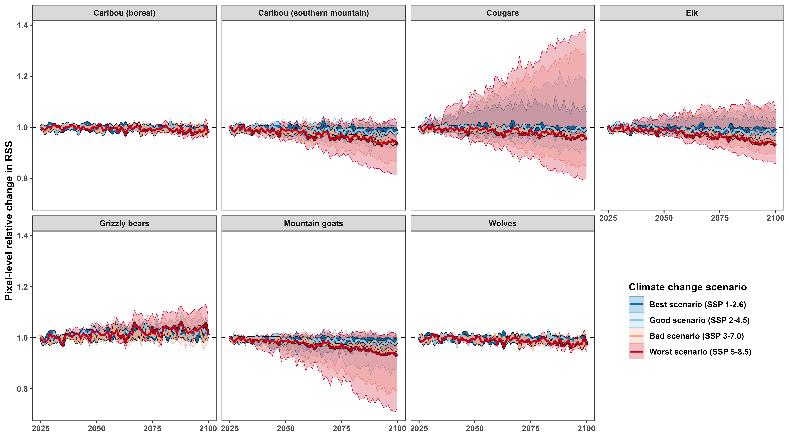

```{r setup, include=FALSE}
# set chunk defaults: don't print code, images text width and centered
knitr::opts_chunk$set(echo = FALSE, out.width = '\\textwidth',
                      fig.align = 'center', cache = TRUE, warning = FALSE,
                      message = FALSE)
```

<!--
available text sizes:
Huge > huge > LARGE > Large > large > normalsize > small > footnotesize > scriptsize > tiny
-->

<!--
six-sentence abstract:

1. introduce the topic
2. state the problem
3. summarize why the question hasn't been answered/what the consequences are
4. explain how you answered the question
5. explain the central findings
6. explain the importance of your findings and their consequences
-->

```{r abstract, echo=FALSE}
abstract <- "Widespread warming during the last century has caused many terrestrial mammals to change how and where they move, with cascading effects on fitness, habitat selection, and community structure. Previous studies have estimated the effects of temperature on mammalian movement behaviour, but many did not disentangle them from seasonal behaviour cycles. Consequently, it is still unclear how mammals will adapt their movement behaviour in the 21^st^ century. We address this gap by using continuous-time movement models and hierarchical generalized additive models to quantify the effects of temperature on the movement rates and habitat selection of six large-bodied mammalian species throughout western Canada between 1998 and 2023. We show that temperature is a strong determinant of how and where mammals move, and we predict that climate change will have significant impacts on mammals' movement rates and habitat selection throughout the 21^st^ century. We found that species did not respond uniformly to rising temperatures, so community-level responses will likely be complex as some species move more and others less. Median habitat selection strength decreased for all species, but some species showed increased selection strength for higher altitudes. Consequently, our results suggest that all six species may shift their range in the coming decades as their selection strength for their current ranges weakens. As climate change exposes mammals to novel environmental conditions, predicting changes in animal behaviour and community structure will become crucial for effectively and proactively understanding mammalian movement behaviour and protecting high-quality habitat. We thus present our work using a flexible approach that can be adapted for different species and spatiotemporal scales, and we conclude by providing suggestions for future research, with particular attention to the study design, statistical modeling, and forecasting."
if(FALSE){
  stringi::stri_count_words(abstract)
}
```

\clearpage

\noindent \textbf{Article type}: Research article

\noindent \textbf{Words in abstract}: `r stringi::stri_count_words(abstract)`

\noindent \textbf{Words in main text}: `r suppressMessages(wordcountaddin::word_count())`

\noindent \textbf{Figures}: 8

\noindent \textbf{Tables}: 3

\noindent \textbf{References}: 142 (updated on 2025-06-11) <!-- counted by using movement ecology csl -->

\noindent \textbf{Appendices}: 2

<!-- using "behaviOR" in key words to increase audience -->

\noindent \textbf{Key words:} climate change, temperature, mammals, animal movement, movement behavior, habitat selection

\ 

\clearpage

# Abstract {-}

\noindent `r abstract`

<!-- start main body on a new page -->
\newpage

\doublespacing

\linenumbers

```{r packages, warning=FALSE, message=FALSE}
library('dplyr') # for data wrangling
library('purrr') # for data wrangling
library('tidyr') # for data wrangling
library('ctmm')  # for movement models
```

# other refs

* @gerlich_species_2025: effects of temperature on fly movement in the arctic
* "Potential changes in climate indices in Alberta under projected global warming of 1.5–5 $^\circ$C" (https://www.sciencedirect.com/science/article/pii/S2214581823000770#fig0015)
* Global vulnerability of marine mammals to global warming: https://doi.org/10.1038/s41598-019-57280-3
* marine turtles shift and lose habitat with temperature: https://www.science.org/doi/10.1126/sciadv.adw4495
* changes in temperature change phelogy and movement behaviour as a consequence @gerlich_species_2025
* @walker_global_2019: Global climate change and invariable photoperiods: {A} mismatch that jeopardizes animal fitness
\clearpage

# Introduction

<!-- movement is a convenient way for ANIMALS to respond to change, but movement depends on temperature -->

\noindent For most animals, movement is a rapid and low-cost response to a variety of stimuli [@nathan_movement_2008]. Animals move to optimize resource use [e.g., food, water, shelter$;$ @charnov_optimal_1976; @kacelnik_ideal_1992; @merkle_large_2016; @mezzini_how_2025], optimize habitat use [@winter_forecasting_2024; @schwerdt_ecological_2024], and avoid predators and competitors [@peterson_pursuit_2021; @bartashevich_collective_2024; @tan_antipredator_2024; @torrez-herrera_monkeys_2020]. However, ambient temperature affects mammals' movement rates by altering the energetic cost of movement [@mcnab_body_1970; @taylor_energetics_1982; @brown_toward_2004; @fuller_towards_2016; @jahn_variations_2022] and the risk of hyperthermia [@hetem_responses_2014; @dyer_travel_2023]. Animals may search for a short-term buffer from extreme heat or cold via thermal refugia [@hannah_fine-grain_2014; @elmore_implications_2017; @attias_effects_2018; @arechavala-lopez_common_2019; @gulland_review_2022], which may even be preferred over forage abundance [@hall_microrefuges_2016]. By altering mammals' movement speed and habitat use [jointly, their movement behaviour: @nathan_movement_2008; @nathan_big-data_2022], ambient temperature also affects the consequences of movement behaviour [@alston_temperature_2020; @giroux_activity_2023], such as encounter rates with resources [@mezzini_how_2025], humans [@weststrate_how_2024], predators, prey, or competitors [@martinez-garcia_how_2020; @glass_trade-off_2021; @brivio_seeking_2024]. Behavioural changes to temperature are exacerbated in extreme cold [@wilson_stenotherms_2001; @berger_climate_2018] and extreme heat [@powers_hovering_2017; @alston_temperature_2020; @giroux_activity_2023; @verzuh_behavioural_2023].

<!-- mammals  -->

Mammals are particularly susceptible to adverse effects from excessive heat [@sherwood_adaptability_2010]. While extreme cold often leads to reduced movement, provided that individuals can find refuge and take advantage of their body heat [@berger_climate_2018; @hou_cold_2020; @glass_trade-off_2021], extreme heat can often result in more severe physiological damage in a shorter span of time [@jessen_temperature_2001; @sherwood_adaptability_2010; @mota-rojas_physiological_2021; @newediuk_climate_2024]. Due to mammals' difficulty at dissipating heat, particularly when ambient temperatures are near or above their body temperature, they are particularly sensitive to extreme heat, especially with increasing body size [@dyer_travel_2023; @verzuh_behavioural_2023]. Furthermore, species that experience narrow temperature ranges (i.e., $`$temperature specialists') tend to be more sensitive to changes [e.g., giant anteaters, *Myrmecophaga tridactyla*: @giroux_activity_2023], while species that experience wide ranges of temperature variation (i.e., $`$temperature genralists') can adapt more easily to change [@levins_evolution_1974; @botero_evolutionary_2015; @dupont_beyond_2024]. Still, generalists' greater adaptability is tested when they are subject to changes that are more severe [@mccain_assessing_2019; @rantanen_arctic_2022], affect many factors at once [e.g., temperature, snow depth, ecosystem phenology, and resource availability: @polazzo_measuring_2024], or are too rapid and severe to respond within a lifetime or a few generations [@levins_evolution_1974; @fuller_towards_2016; @xu_plasticity_2021].

<!-- we do not know how temperature will change -->

In the last century, many ecosystems experienced widespread warming that resulted in milder and shorter winters, hotter and longer summers, and a greater risk of extremely high temperatures [@ipcc_climate_2023]. As heat stress intensifies over the next 100 years, mammals will continue to suffer impacts on their fitness, movement rates, and habitat selection [@deb_modelling_2020; @woo-durand_increasing_2020], which will be exacerbated by more frequent and intense extreme events [@bunnell_global_2011] and anthropogenic habitat loss, modification, and fragmentation [@sih_evolution_2011; @sawyer_identifying_2009; @weststrate_how_2024]. It remains unclear how or whether species will be able to respond to climate change in the current century [@deb_modelling_2020; @woo-durand_increasing_2020; @verzuh_behavioural_2023], especially if populations fail to adapt to changes [@sawyer_migratory_2019; @botero_evolutionary_2015] or are physiologically incapable to do so [@sherwood_adaptability_2010; @williams_range_2018]. Preparing for and responding to future changes require a comprehensive understanding of how temperature will affect how and where mammals move, as well as the implications such changes will have on species' adaptability and overall community structure. Recent work has documented the effects of climate change on mammals' ranges [@leclerc_determinants_2021], movement behaviour [@melin_effect_2023], thermoregulation [@mota-rojas_physiological_2021], and trait-based responses [e.g., body size, activity time, and elevational and latitudinal distribution @mccain_assessing_2019]. However, there remains a need for fine-scale estimates of the effects of temperature on mammals' movement behaviour and quantitative predictions of how their behaviour will respond to climate change in the current century [@ipcc_climate_2023].

<!-- zoom in to western canada -->

Western Canada is currently experiencing rapid widespread warming [@dierauer_climate_2021; @kienzle_has_2018; @turner_its_2009], phenological shifts [@tysor_countergradient_2025; @basu_phenological_2024; @kienzle_has_2018], and more frequent and intense extreme events [@zhang_increased_2023], including forest fires [@zurowski_summer_2023]. As we approach the deadline for the Kunming-Montreal Global Biodiversity Framework (i.e., the "30 by 30" initiative), a global effort to conserve 30% of the world's lands and oceans by 2030 [@convention_on_biological_diversity_154_2022], Canadian decision makers must understand which areas will be of greatest value for maximizing and protecting biodiversity not only for current conditions but future decades, too. Failing to understand how climate change will affect mammalian movement behaviour will hinder our ability to respond to the current climate crisis and make decisions that are viable in the long term. Furthermore, understanding how temperature affects individual species is the first step towards understanding how temperature impacts the community dynamics [@hegel_interacting_2010] and habitat phenology [@bunnell_global_2011; @duncan_predicting_2012; @merkle_large_2016; @slatyer_ecological_2022].

<!-- introduce the study -->

In this paper, we quantify the effects of proximal air temperature on mammalian movement behaviour, namely movement rates and habitat selection of six large-bodied terrestrial mammal species in western Canada (wolves: *Canis lupus*, elk: *Cervus canadensis*, mountain goats: *Oreamnos americanus*, cougars: *Puma concolor*, boreal and southern mountain caribou: *Rangifer tarandus*, and grizzly bears: *Ursus arctos horribilis*; Table \@ref(tab:data-table)). Using over 25 years of telemetry data throughout a large spatial range of western Canada and hourly air temperature data, we estimate how these mammals altered their probability of moving, speed when moving, and habitat selection in response to temperature. We then pair the estimated responses with climate change projections to forecast the species' movement behaviour during the 21^st^ century under different climate-change scenarios [referred to as Shared Socioeconomic Pathways, SSP, @riahi_shared_2017]. We discuss the consequences of these changes in movement behaviour at the individual, population, and community levels. We also provide directions for future research and solutions for overcoming some common data limitations.

```{r bc-map, fig.cap="GPS telemetry data for the six species in this study (dots) over a digital elevation model for the study area.", out.width='0.75\\linewidth'}
knitr::include_graphics('../figures/tels-map-dem.png')
```

\footnotesize

```{r, eval=FALSE}
# a quick check for the table below
readRDS('../data/movement-models-speed-weights-2024-06-10.rds') %>%
  group_by(dataset_name, animal) %>%
  summarize(n = n_distinct(animal),
            any_na_speed = any(is.na(speed_est)),
            all_na_speed = all(is.na(speed_est))) %>%
  group_by(dataset_name) %>%
  summarise(n_missing_any = sum(any_na_speed),
            n_missing_all = sum(all_na_speed))
```

```{r data-table}
dt_data <-
  readRDS('../models/movement-models-2024-06-06.rds') %>%
  transmute(
    Species = case_when(
      dataset_name == 'Canis_lupus_boreal' ~ '\\emph{Canis lupus}',
      dataset_name == 'Rangifer_tarandus_boreal' ~ '\\emph{Rangifer tarandus} (boreal)',
      dataset_name == 'Rangifer_tarandus_southern_mountain' ~ '\\emph{Rangifer tarandus} (s. mountain)',
      dataset_name == 'Puma_concolor_2' ~ '\\emph{Puma concolor}',
      dataset_name == 'Puma_concolor_4' ~ '\\emph{Puma concolor}',
      dataset_name == 'Elk in southwestern Alberta' ~ '\\emph{Cervus canadensis}',
      dataset_name == 'Oreamnos_americanus' ~ '\\emph{Oreamnos americanus}',
      dataset_name == 'Ursus_arctos_horribilis' ~ '\\emph{Ursus arctos horribilis}'),
    animal, # keep animal column for grouping later
    tel = map(tel, data.frame),
    na_speed = map_lgl(movement_model,
                       \(.m) suppressWarnings(speed(.m)$DOF == 0))) %>%
  unnest(tel) %>%
  group_by(Species, animal) %>%
  summarize(Start = min(as.Date(timestamp)),
            End = max(as.Date(timestamp)),
            dt = median(timestamp - lag(timestamp), na.rm = TRUE),
            animal = unique(animal),
            na_speed = unique(na_speed),
            .groups = 'drop') %>%
  group_by(Species) %>%
  summarize(Start = min(Start),
            End = max(End),
            dt = as.numeric(median(dt, na.rm = TRUE)),
            Animals = n_distinct(animal),
            n_missing = sum(! na_speed),
            .groups = 'drop') %>%
  mutate(dt = round('hours' %#% dt, 2)) %>% # convert from seconds to hours
  rename('\U0394t (hours)' = dt,
         'Has speed' = n_missing)

knitr::kable(dt_data, format = 'markdown', caption = "Summary statistics of each species' set of GPS data, including: the start and end of each set of GPS telemetries, the median sampling interval ($\\Delta t$; stratified by animal), number of animals (Animals), and number of animals with finite speed estimates (Has speed).", escape = FALSE, longtable = FALSE, booktabs = TRUE)
```

\normalsize

# Methods

## Datasets used

This study leverages four main datasets: (1) a multi-species collection of GPS telemetry data (Fig. \@ref(fig:bc-map)); (2) historical hourly air temperature from the ERA5 reanalyzed dataset [European Center for Medium-range Weather Forecasting$;$ @hersbach_era5_2023]; (3) temporally static rasters of percent forest cover, elevation, and distance from water; and (4) climate change projections under four Shared Socioeconomic Pathways [SSPs$;$ @riahi_shared_2017]. While we acknowledge there are other important variables (e.g., forest type, structure, and age; terrain slope and aspect), we limited our models to only use three simple variables for the sake of parsimony and comparability across species. See the discussion section for additional detail on the advantages and limitations of using such simple models.

### GPS telemetry data

```{r, eval=FALSE}
tels <- readRDS('data/tracking-data/all-tracking-data-cleaned-2024-02-22-13-49.rds') %>%
  tidyr::unnest(tel)

# all outliers
sum(tels$outlier)
round(mean(tels$outlier) * 100, 2)

# new outliers
sum(tels$outlier & !tels$original_outliers)
round(mean(tels$outlier & !tels$original_outliers) * 100, 2)
```

\noindent Elk (*Cervus canadensis*) data from @ciuti_human_2012 were downloaded from Movebank [study name: Elk in southwestern Alberta, see @kays_movebank_2022]. Boreal caribou (*Rangifer tarandus*) and wolf (*Canis lupus*) telemetries were acquired from a data repository of the British Columbia Oil and Gas Research and Innovation Society (BC ORGIS) that was collected as part of the boreal caribou radio-collaring program of the BC OGRIS Research and Effectiveness Monitoring Board [REMB$;$ @bc_ogris_boreal_2018]. ***MISSING INFO ON OTHER TELEMETRY DATA.*** From the full set of telemetry data, we removed a total of 2396 problematic GPS locations (0.16%, including collar calibration data) after inspecting diagnostic plots of (1) distance from the median location, (2) straight-line displacement between locations, (3) turning angle, and (4) time interval between consecutive points. Particular attention was paid to points with large turning angles ($\gtrapprox 170^\circ$) and excessively high straight-line displacement, especially if antecedent and subsequent points indicated relatively stationary behaviour (Appendix A).

### Historical temperature data and climate change projections

\noindent Rasters of hourly reanalyzed air temperature data were downloaded from the ERA5 database [@hersbach_era5_2023] from the European Center for Medium-range Weather Forecasting server (ECMWF; [www.ecmwf.int](www.ecmwf.int); [https://cds.climate.copernicus.eu](https://cds.climate.copernicus.eu)). Proximal air temperature was estimated for each location by extracting the value from the corresponding raster cell from the temporally nearest raster using the `extract()` function from the `terra` package [v. 1.7-46, @hijmans_terra_2023] for `R` [@r_core_team_r_2024].

We used the the `climatenaR` package [v. 1.0, @burnett_climatenar_2023] for `R` and ClimateNA [v. 7.4.2$;$ @wang_locally_2016; @mahony_global_2022] to obtain projected average monthly temperatures from 2020 to 2100 at a 0.08$^\circ$ spatial resolution. Since the climate projections only provided monthly means and ranges but no measures of variance or distributional assumptions, we used the historical data for western Canada from 1998 to 2023 (extremes included) to estimate the monthly variation in temperature, which we defined as $\sigma^2_T$, the variance at location $\langle x, y \rangle$ in month $m$ for each year (e.g., the variance at coordinates $\langle -119.40, 49.94 \rangle$ in April 2005). We then modeled the estimated variance using a Generalized Additive Model for Location and Scale [GAMLS, @rigby_generalized_2005; @stasinopoulos_generalized_2007; section 7.9 in @wood_generalized_2017] using the `mgcv` package for `R` [v. 1.9-1, @wood_generalized_2017]. The linear predictor for the location (i.e., the mean) included smooth terms of: each year's estimated within-pixel monthly mean temperature ($\hat \mu_T$), month ($m$), a two-dimensional smooth of spatial coordinates $\langle x, y \rangle$, and a tensor product interaction term of month and space to allow for seasonal terms to vary smoothly over space. The linear predictor for the scale term, which governs the mean-variance relationship [table 3.1 on p. 104 of @wood_generalized_2017], included smooth terms of the monthly mean temperature, month, and space. We did not include smooth terms of year to avoid unrealistic projections when extrapolating beyond past 2023. The model was thus

\begin{equation}\label{eq:temp-var-model}
\begin{cases}
\sigma^2_T \sim \text{Gamma}(\mu_{\sigma^2_T}, \nu_{\sigma^2_T}) \\
\mathbb E(\sigma^2_T) = \mu_{\sigma^2_T} \\
\mathbb V(\sigma^2_T) = (\mu_{\sigma^2_T})^2 / \nu_{\sigma^2_T} \\
\log(\mu_{\sigma^2}) = \beta_{L,0} + f_{L,1}(\mu_T) + f_{L,2}(m) + f_{L,3}(x, y) + f_{L,4}(x, y, m) \\
\log(\nu_{\sigma^2}) = \beta_{S,0} + f_{S,1}(\mu_T) + f_{S,2}(m) + f_{S,3}(x, y)
\end{cases},
\end{equation}

\noindent where $\mu_{\sigma^2_T}$ and $\nu_{\sigma^2_T}$ indicate the location and scale parameters of the gamma distribution of $\sigma^2_T$, and together they determine the variance of $\sigma^2_T$, indicated as $\mathbb V(\sigma^2_T)$. Functions $f_{L,j}$ and $f_{S,j}$ indicate the $j^\text{th}$ smooth functions for the location and scale parameters, respectively. To ensure the smooth functions of month, $f_{L,2}(m)$ and $f_{S,2}(m)$, joined smoothly between December and January, the terms use cyclic cubic spline bases. The spatial terms used two-dimensional Duchon splines, a generalization of thin-plate regression splines (p. 221 of @wood_generalized_2017). The smoothness parameters were estimated via REstricted Maximum Likelihood [REML$;$ p. 83 of @wood_generalized_2017]. See the Data Availability Statement for additional information on the code used to fit the model.

We simulated hourly variation in future years by assuming hourly temperature followed a normal distribution with mean specified by the monthly `climatenaR` climate projections and variance as specified by the gamma GAMLS. For each month within each year from 2025 to 2100, we simulated hourly weather by including temperatures from the 0.1 to the 0.9 quantiles by increments of 0.1, and we weighted each quantile proportionally to the (normalized) Gaussian probability density for each quantile.

### Resource rasters

\noindent We estimated percent forest cover and distance from water using the rasters created by @tuanmu_global_2014. We calculated total forest cover by summing the temporally static rasters of evergreen/deciduous needle-leaf trees, evergreen broadleaf trees, deciduous broadleaf trees, and mixed/other trees (raster classes 1-4, respectively). We converted the raster of percent cover of open water (class 12) to a binary raster of pixels with water (cover > 0%) or without water (cover = 0%) and then calculated each pixel's distance from the nearest pixel with water using the `distance()` function from the `terra` package. Finally, we obtained two digital elevation models using the `get_elev_raster()` function from the `elevatr` package [v. 0.99.0, @hollister_elevatr_2023]. We used a raster with a zoom of 6 (a resolution of 0.009$^\circ$) for model fitting and one with a zoom of 3 (a resolution of 0.08$^\circ$) for downloading climate change projections via `climatenaR`. All final rasters and code are available in the GitHub repository associated with this manuscript (see the Data Availability Statement).

## Estimating mammals' instantaneous speeds

\noindent We modeled each animal's movement using continuous-time movement models [@fleming_fine-scale_2014] via the `ctmm` package [v. 1.2.0, @fleming_ctmm_2023] for `R`. We then estimated each mammal's instantaneous speed at each observed location by applying the `ctmm::speeds()` function on all models with finite speed estimates [415 of 433, @fleming_fine-scale_2014; @noonan_scale-insensitive_2019]. The 18 animals with insufficiently fine sampling to support movement models with finite speed were for one mountain goat, 15 boreal caribou, and two southern mountain caribou (Table \@ref(tab:data-table)).

Since $\texttt{ctmm}\text{'s}$ movement models assume a single moving state with stochastic but non-zero speed, we corrected data-informed speeds so that the minimum instantaneous speed could be 0. We performed this correction by subtracting each model's mean speed while assuming speeds were $\chi^2$-distributed. The function we used is available on GitHub (see the Data Availability Statement). To avoid artifacts due to excessively small, non-zero speeds, we determined whether an animal was moving or not using a $k$-means algorithm with 2 clusters for each species' distribution of detrended speeds. When the algorithm clearly failed to discriminate between states, we estimated the split point using the inflection points in histograms of the detrended speeds (Fig. B1).

## Estimating the effects of temperature on mammals' movement behaviour

\noindent Ambient temperature is only one of the many drivers of mammalian movement behaviour (Fig. \@ref(fig:dags)). Many species adapt their movement rates (e.g., movement frequency and speed) daily or seasonally in response in factors such as solar time, photoperiod, forage availability, reproductive cycles, and predator avoidance. Similarly, ambient temperature also fluctuates throughout the day and across seasons. Therefore, estimating the effects of temperature on movement rates requires accounting for how mammals' response to temperature changes with time of day and day of year [Fig. \@ref(fig:dags)A$;$ @peron_periodic_2017; @buderman_time-varying_2018; @leclerc_determinants_2021; @xu_plasticity_2021]. Similarly, mammals' selection strength for resources depends on ambient temperature, since higher temperatures can promote a selection for refuge from heat [e.g., thicker forest cover, higher elevation, proximity to water$;$ @attias_effects_2018; @giroux_activity_2023].

The two following sections detail the statistical framework and models we used to estimate the effect on temperature on the six species' movement behavior. To assess the importance of including temperature as an explicit covariate (as ooposed to including its effects with time of day and day of year), we fit models with and without smooth effects of temperature and compared the fits of the two sets of models via analyses of deviance (a form of generalized likelihood ratio tests) following the methods of Section 3.3 in @wood_generalized_2017. See Appendix B for additional information.

```{r dags,  message=FALSE, warning=FALSE, fig.cap="Directed Acyclical Graphs (DAGs) assumed for inferring the causal effects of temperature on each species' movement behaviour. (A) Ambient temperature affects mammals' movement rates (i.e. probability of moving, speed when moving, and distance traveled), but temperature is influenced by time of day and day of year. Additionally, the effects of temperature on movement rates depend on time of day and season, since animals may respond to temperatures differently at different times of day and or days of year. Finally, the effect of time of day changes seasonally due to changes in photoperiod. (B) Similarly, habitat selection depends on the availability and selection of resources (forest cover, elevation, and distance from water), but the selection strengh for each resource is conditional on temperature. For example, an animal may avoid forested areas unless it is seeking refuge from extreme temperatures.", fig.height=8, fig.width=20, out.width='\\linewidth'}
library('dplyr')   # for data wrangling
library('ggplot2') # for fancy plots
library('cowplot') # for plots in grids

# movement rates
boxes_a <- tibble(xmin = c(0, 10, 5, 5),
                  xmax = xmin + 4,
                  ymin = c(10, 10, 5, 0),
                  ymax = ymin + 1,
                  fill = c('#BBBBBB80', '#BBBBBB80', '#FF8C00AA', '#FF0000CC'),
                  label = c('Time of day', 'Day of year', 'Movement rates',
                            'Temperature'))

arrows_a <- tibble(id = sort(rep(1:6, 2)),
                   x = c(10, 4, 4, 6, 10, 8, 2, 6, 7, 7, 12, 8),
                   y = c(10.5, 10.5, 10, 6, 10, 6, 10, 1, 1, 5, 10, 1))

p_a <-
  ggplot() +
  geom_rect(aes(xmin = xmin, xmax = xmax, ymin = ymin, ymax = ymax),
            boxes_a, fill = boxes_a$fill, color = 'black') +
  geom_path(aes(x, y, group = id), arrows_a, linewidth = 1,
            arrow = arrow(type = 'closed')) +
  geom_label(aes(x = (xmin + xmax) / 2, y = (ymin + ymax) / 2,
                 label = label), boxes_a, fill = 'transparent',
             fontface = 'bold', label.size = 0, size = 5) +
  theme_void() +
  theme(legend.position = 'none')

# habitat selection
boxes_b <- tibble(xmin = c(5, 0, 5, 10, 5),
                  xmax = xmin + 4,
                  ymin = c(10, 5, 5, 5, 0),
                  ymax = ymin + 1,
                  fill = c('#FF8C00AA', rep('#BBBBBB80', 3), '#FF0000CC'),
                  label = c('Habitat selection', 'Forest cover',
                            'Elevation', 'Distance from water',
                            'Temperature'))

arrows_b <- tibble(id = sort(rep(1:6, 2)),
                   x = c(2, 6, 7, 7, 12, 8, 6, 2, 7, 7, 8, 12),
                   y = c(6, 10, 6, 10, 6, 10, 1, 5, 1, 5, 1, 5))

p_b <-
  ggplot() +
  geom_rect(aes(xmin = xmin, xmax = xmax, ymin = ymin, ymax = ymax),
            boxes_b, fill = boxes_b$fill, color = 'black') +
  geom_path(aes(x, y, group = id), arrows_b, linewidth = 1,
            arrow = arrow(type = 'closed')) +
  geom_label(aes(x = (xmin + xmax) / 2, y = (ymin + ymax) / 2,
                 label = label), boxes_b, fill = 'transparent',
             fontface = 'bold', label.size = 0, size = 5) +
  theme_void() +
  theme(legend.position = 'none')

plot_grid(p_a, p_b, labels = 'AUTO', nrow = 1)
```

### Effects of temperature on movement rates

\noindent We estimated the effects of temperature on mammals' instantaneous movement state (moving or not) and speed when moving using two Hierarchical Generalized Additive Models [HGAMs, see @pedersen_hierarchical_2019 and Appendix B] with the `mgcv` package for `R`. The first HGAM estimated the probability that an animal was moving, $P(M)$, with a binomial family of distributions and logit link function. The second HGAM estimated an animal's speed when moving with a gamma family of distributions and log link function. We fit the models with fast Restricted Maximum Likelihood (`'fREML'`) and discretized covariates (`discrete = TRUE`) to optimize computational efficiency with no appreciable losses to model performance [Appendix B$;$ @wood_generalized_2015; @wood_generalized_2017-1; @li_faster_2020]. Together, the binomial HGAM and the gamma HGAM inform us on an animal's long-term average speed, since it is the product of the probability of moving and its average speed when moving.

The HGAMs (equations \@ref(eq:p-moving-model) and \@ref(eq:speed-model)) included fixed-effect intercepts for each species ($\beta_\texttt s$), random intercepts for each animal ($Z_\texttt{a}$), and species-level `by` smooths that allowed independent smoothness parameters for each species [model I in Figure 4 of @pedersen_hierarchical_2019]. The `by` smooths accounted for trends in time of day (in Pacific Daylight Time; `tod_pdt`), day of year (`doy`), and temperature (`temp_c`). To account for the cyclicity of time of day and day of year, the smooth terms used cyclic cubic splines [p. 202 of @wood_generalized_2017]. The models also had three tensor product interaction terms `by` each species: (1) day of year and time of day, (2) temperature and time of day, and (3) temperature and day of year. These three terms accounted for smooth changes in: (1) daily behavior across day of year, (2) the response to temperature over time of day (e.g., changes in nocturnality), and (3) the response to temperature over day of year (e.g., changes in coats and migration timing). Finally, two smooth terms of log-transformed sampling interval (`dt`; hours) corrected for biases in speed estimates arising from irregular GPS sampling intervals, since longer intervals result in lower speed estimates [@nathan_big-data_2022; @denicola_are_2025]. A global smooth term of $\log(\texttt{dt})$ accounted for the overall effect of sampling interval, while a factor-smooth interaction term (`bs = 'fs'`) of $\log(\texttt{dt})$ and species accounted for species-level deviations from the global term while assuming a common smoothness parameter across species [model GS in Figure 4 of @pedersen_hierarchical_2019]. Formally, the model for movement state $M$, with $M = 0$ indicating no movement and $M = 1$ indicating movement, was

\begin{equation}\label{eq:p-moving-model}
\begin{cases}
M \sim \text{Bin}(p) \\
\mathbb E(M) = p \\
\mathbb V(M) = p (1-p) \\
\begin{aligned}
\text{logit}(p) = & \beta_\texttt{s} + Z_\texttt{a} + f_{1,\texttt{s}}(\texttt{tod\_pdt}) + f_{2,\texttt s}(\texttt{doy}) + f_{3,\texttt s}(\texttt{temp\_c}) + \\
& f_{4,\texttt s}(\texttt{doy}, \texttt{tod\_pdt}) + f_{5, \texttt s}(\texttt{temp\_c}, \texttt{tod\_pdt}) + f_{6, \texttt s}(\texttt{temp\_c}, \texttt{doy}) + \\
& f_7(\log(\texttt{dt})) + f_{8,\texttt s}(\log(\texttt{dt}))
\end{aligned}
\end{cases},
\end{equation}

\noindent while the model for movement speed when moving (i.e., $M = 1$, indicated with $S$) was

\begin{equation}\label{eq:speed-model}
\begin{cases}
S \sim \text{Gamma}(\mu_S, \nu_S) \\
\mathbb E(S) = \mu_S \\
\mathbb V(S) = \mu_S^2 / \nu_S \\
\begin{aligned}
\text{log}(\mu_S) = & \beta_\texttt{s} + Z_\texttt{a} + f_{1,\texttt{s}}(\texttt{tod\_pdt}) + f_{2,\texttt s}(\texttt{doy}) + f_{3,\texttt s}(\texttt{temp\_c}) + \\
& f_{4,\texttt s}(\texttt{doy}, \texttt{tod\_pdt}) + f_{5, \texttt s}(\texttt{temp\_c}, \texttt{tod\_pdt}) + f_{6, \texttt s}(\texttt{temp\_c}, \texttt{doy}) + \\
& f_7(\log(\texttt{dt})) + f_{8,\texttt s}(\log(\texttt{dt}))
\end{aligned}
\end{cases}.
\end{equation}

\noindent In both models, $\beta_\texttt{s}$ indicates a fixed intercept for species \texttt{s}, $Z_\texttt a$ indicates a Gaussian random effect for animal \texttt{a} (of species \texttt{s}), $f_{j,\texttt{s}}$ indicates the $j^{\text{th}}$ smooth function for species \texttt{s}, and functions with two variables indicate tensor product interaction terms. The model code used to fit the models is available in Appendix B.

### Effects of temperature on habitat selection

\noindent We estimated the effects of temperature on each species' selection for percent forest cover (`forest_perc`), elevation (`elevation_m`), and distance from water (`dist_water_m`) by fitting a Hierarchical Resource Selection Function (HRSF) for each species. We fit each HRSF using an HGAM with a Poisson family of distributions and log link function [Appendix B$;$ @aarts_estimating_2008]. After removing non-resident individuals (Table B1), we accounted for the spatiotemporal autocorrelation in the telemetry locations by weighting each point based on the telemetry's Autocorrelated Kernel Density Estimate [@fleming_new_2017; @noonan_comprehensive_2019; @alston_mitigating_2022] to produce estimates of second-order habitat selection [@johnson_comparison_1980]. Quadrature points were determined using the raster cells in each animal's 99.9% AKDE percentile and given a weight of 1. The number of quadrature locations greatly outnumbered the number of observed locations (Fig. B12), especially after accounting for the AKDE weights (Fig. B13).

Each species' model had the same structure:

\begin{equation}\label{eq:hrsf}
\begin{cases}
C \sim \text{Pois}(\lambda) \\
\mathbb E(C) = \mathbb V(C) = \lambda \\
\begin{aligned}
\text{log}(\lambda) = & f_{1}(\texttt{forest\_perc}) + f_{2}(\texttt{elevation\_m}) + f_{3}(\texttt{dist\_water\_m}) + \\
& Z_\texttt a + f_{4, \texttt{a}}(\texttt{forest\_perc}) + f_{5, \texttt{a}}(\texttt{elevation\_m}) + f_{6, \texttt{a}}(\texttt{dist\_water\_m}) + \\
& f_{7}(\texttt{forest\_perc}, \texttt{temp\_c}) + f_{8}(\texttt{elevation\_m}, \texttt{temp\_c}) + \\
& f_{9}(\texttt{dist\_water\_m}, \texttt{temp\_c}) + f_{10}(\texttt{temp\_c}) + f_{11,\texttt a}(\texttt{temp\_c}))
\end{aligned}
\end{cases},
\end{equation}

\noindent where $O$ indicates whether an animal was observed ($O = 1$) or not ($O = 0$), and the species-level indices are omitted for readability, but each term in the model can be assumed to be species-specific. Smooth effects of percent forest cover (\texttt{forest\_perc}), elevation (\texttt{elev\_m}), and distance to water (\texttt{dist\_water\_m}) accounted for the species-level selection strength for each resource. A Gaussian random effect for each individual animal ($Z_\texttt a$) corrected for uneven sampling across individuals, while factor-smooth interaction terms for each animal ($f_{j,\texttt a}$) accounted for animal-level resource selection [i.e., individual-level deviations from the species-level estimate$;$ @jeltsch_need_2025]. Tensor product interaction terms of the three resources and temperature (\texttt{temp\_c}) estimated the smooth change in resource selection at different temperatures. Finally, marginal smooth terms of temperature and factor-smooth interaction terms of temperature and animal accounted for species- and individual-level sampling biases at different temperatures (e.g., sampling more during warm periods).

```{r, eval=FALSE}
library('mgcv')
library('purrr')
x <- list.files('H:/GitHub/bc-mammals-temperature/models/', 'rsf-', include.dirs = FALSE, full.names = T)
x <- x[grepl('2024-10', x)]
map_int(x, \(f) readRDS(f)$iter)
```

# Results

\noindent Overall, 2.6% of GPS locations had temperatures lower than $-20^\circ$C, while 6.5% had temperatures above $20^\circ$C, and temperature ranges differed across species (Table \@ref(tab:hgam-summary), Fig. B2). Sampling interval affected estimates of probability as well of as speed when moving (Fig. B8). Consequently, we present all results while predicting specifically for one-hour sampling intervals. At $0^\circ$C, species differed in mean probabilities of moving ($\hat P(M)$; range: 0.05 -- 0.31), mean speed when moving ($\hat {\mathbb E}(S|M=1)$; range: 0.42 -- 2.67 km/h), and mean distance traveled (i.e., $\hat P(M) \times \hat {\mathbb E}(S|M=1)$, range: 0.04 -- 0.61 km/h; Table \@ref(tab:hgam-summary)). Grizzly bears had the lowest movement frequency ($\hat P(M) \approx 0.05$), while wolves and cougars moved most often ($\hat P(M) \ge 0.22$). Mountain goats and southern mountain caribou moved the slowest ($\hat{\mathbb E}(S|M = 1) \approx 0.43$ km/h), while wolves had the highest mean speed when moving ($\hat{\mathbb E}(S|M = 1) \approx 2.67$ km/h). Consequently, at $0^\circ$C, wolves traveled an average of $0.22 \times 2.67~\text{km/h} \approx 0.6$ km/h; 2.5 to 16.7 times further than other species.

\tiny

```{r hgam-summary}
setwd('~/GitHub/bc-mammals-temperature')
library('mgcv')
library('dplyr')
library('ctmm') #' for `%#%`
source('analysis/figures/default-ggplot-theme.R')

d <- readRDS('data/hgam-speed-data.rds')
get_perc <- function(bools) {
  perc <- round(mean(bools) * 100, 1)
  out <- as.character(perc)
  if(grepl('\\.', out)) {
    out <- paste0(out, ' %')
  } else {
    out <- paste0(out, '.0 %')
  }
  
  if(perc < 10) out <- paste0(' ', out)
  
  return(out)
}

get_int <- function(.m) {
  newd <- mutate(.m$model[1:7, - 1], species = SPECIES, temp_c = 0, dt = 1)
  predict(.m, type = 'response', newdata = newd,
          terms = c('(Intercept)', 'species',
                    's(temp_c)', paste0('s(temp_c):species', SPECIES),
                    's(log(dt))', 's(log(dt),species)'))
}

intercepts <- tibble(
  Species = SPECIES,
  'P(M=1)' = get_int(readRDS('models/binomial-gam-without-temperature.rds')),
  'P(M=1|T)' = get_int(readRDS('models/binomial-gam.rds')),
  'E(S)' = 'km/h' %#% get_int(readRDS('models/gamma-gam-without-temperature.rds')),
  'E(S|T)' = 'km/h' %#% get_int(readRDS('models/gamma-gam.rds')),
  'E(D)' = `P(M=1)` * (`E(S)`),
  'E(D|T)' = `P(M=1|T)` * (`E(S|T)`)) %>%
  mutate(Species = case_when(
    Species == 'Rangifer tarandus (s. mountain)' ~ 'R. tarandus; sm',
    Species == 'Ursus arctos horribilis' ~ 'U. arctos h.',
    Species == 'Puma concolor' ~ 'P. concolor',
    Species == 'Cervus canadensis' ~ 'C. canadensis',
    Species == 'Rangifer tarandus (boreal)' ~ 'R. tarandus; b',
    Species == 'Canis lupus' ~ 'Canis lupus',
    Species == 'Oreamnos americanus' ~ 'O. americanus')) %>%
  mutate(Species = paste0('\\emph{', Species, '}') %>%
           gsub(')}', ')', .) %>%
           gsub(' \\(', '} \\(', .))

if(FALSE) {
  # visualize the individual estimates
  layout(1:3)
  hist(intercepts$`P(M=1)`); hist(intercepts$`E(S)`); hist(intercepts$`E(D)`)
  layout(1)
  
  # find differences when accounting for temperature
  intercepts %>%
    transmute(Species,
              p = round(`P(M=1|T)` - `P(M=1)`, 2),
              s = round(`E(S|T)` - `E(S)`, 2),
              d = round(`E(D|T)` - `E(D)`, 2))
  
  # find difference in distance traveled, relative to furtherst distance
  intercepts %>%
    arrange(desc(`E(D)`)) %>%
    mutate(displ_wolf = `E(D)`[grepl('Canis lupus', Species)] / `E(D)`,
           displ_wolf_t = `E(D|T)`[grepl('Canis lupus', Species)] / `E(D|T)`)
  
  # find difference in distance traveled, relative to furtherst distance
  round(range(max(intercepts$`E(D|T)`) / intercepts$`E(D|T)`[- which.max(intercepts$`E(D|T)`)]), 1)
}

options(knitr.kable.NA = '') # leave NAs blank

bind_rows(
  # species-level proportions
  d %>%
    rename(Species = species) %>%
    group_by(Species) %>%
    summarize(`T<-20\\textdegree{}C` = get_perc(temp_c < -20),
              `T>+20\\textdegree{}C` = get_perc(temp_c > +20)),
  # overall proportions
  d %>%
    summarize(Species = 'Total',
              `T<-20\\textdegree{}C` = get_perc(temp_c < -20),
              `T>+20\\textdegree{}C` = get_perc(temp_c > +20))) %>%
  select(! Species) %>%
  bind_cols(intercepts %>%
              arrange(Species) %>%
              rename_with(\(.x) paste0('$', .x, '$'), ! Species) %>%
              rename_with(\(.x) gsub('\\|', '\\\\vert ', .x)) %>%
              rename_with(\(.x) gsub('P', '\\\\hat{P}', .x)) %>%
              rename_with(\(.x) gsub('E', '\\\\hat{\\\\mathbb E}', .x)) %>%
              bind_rows(tibble(Species = 'Total'))) %>%
  relocate(Species, .before = 1) %>%
  rename(`$\\hat{P}$(M = 1)` = `$\\hat{P}(M=1)$`) %>% # to avoid eq going to new line
  knitr::kable(format = 'markdown', digits = 2, caption = paste0("Summary statistics for the observed temperatures and estimated mean movement rates at \U00B0", "C. The second and third columns indicate the percentage of GPS locations (after data cleaning) with temperature ($T$) below -20\U00B0", "C and above 20\U00B0", "C, respectively. The subsequent columns indicate the estimated mean probability of moving ($\\hat P(M=1)$), mean speed when moving ($\\hat{\\mathbb E}(S)$; km/h), and mean distance travelled ($\\hat P(M=1) \\times \\hat{\\mathbb E}(S) = \\hat{\\mathbb E}(D)$; km/h) as estimated by models without and with temperature (i.e., $(... | T)$), for a sampling interval of 1 hour and a temperature of T = 0\U00B0", "C."))
```

\normalsize

Across all species, Relative Selection Strength (RSS) was weakest for forest cover and strongest for elevation. At temperatures near 0$^\circ$C, wolves selected for forest cover ($\gtrapprox$ 50%), elevations near 1 km, and distances from water < 5 km; elk selected for intermediate forest cover ($\approx$ 50%), elevations between 1 and 2 km, and distances from water of 10-15 km; mountain goats selected for sparse forest cover (< 25%), elevations near 1.5 km, and distances from water < 5 km; cougars selected for dense forest cover (> 75%), an elevation of ~ 1 km, and distances from water < 7.5 km; boreal caribou selected for forest cover between 50% and 75%, elevations near 500 m, and distances from water < 10 km; southern mountain caribou selected for dense forest cover, elevations near 2 km, and distances from water $\lessapprox$ 5 km; and grizzly bears selected for relatively sparse forest cover (25-50%), elevation between 1 and 2 km, and distances from water < 3 km.

There was relatively strong agreement between models with and without temperature (Figs. B3, and B14), but including temperature always resulted in better fits (all p-values $< 2.2\times10^{-16}$; all $\Delta$AIC $\ge$ 342; Table B2 and subsequent pages in Appendix B). Accounting for temperature even resulted in a simpler HRSF for mountain goats (lower model degrees of freedom) that fit the data better (lower deviance), and hence no test was necessary to show that the inclusion of temperature produced a better fit.

## Effects of temperature on movement rates

```{r, eval=FALSE}
library(mgcv)
# to  get deviance explained
summary(readRDS('models/binomial-gam.rds'), re.test = FALSE)$dev.expl
summary(readRDS('models/gamma-gam.rds'), re.test = FALSE)$dev.expl
```

\noindent Species' changes in movement rates to temperature varied in both direction and magnitude (Figs. \@ref(fig:dist), B4-B6), even after accounting for differences in daily and seasonal activity (e.g., sleeping, migration, hibernation; Figs. B4-B6). Smooth interaction terms were well-behaved and indicated clear shifts in activity over time of day and day of year for all species. The models had good in-sample prediction (Fig. B7) and explained reasonably high proportions of the deviance [79.3% for the gamma model and 10.7% for the binomial model, which is relatively high for a binomial model with binary responses: see ch. 11 of @mcelreath_statistical_2020]. All species adapted their daily and seasonal movement behaviour to changes in temperature (Fig. \@ref(fig:dist)). The clearest example of this was cougars. In late spring (June 1^st^), they moved from evening to early morning if temperatures were below $20^\circ$C, but if temperatures were above 20$^\circ$C they moved mostly between 3:00 and 6:00 AM. Throughout the year, they tended to move more when it was colder, but what they perceived as "colder" was relative to the time of year. All species' estimated probability of moving and speed when moving decreased with sampling intervals above 1 hour, except for cougars' speed, although the estimated trends were highly uncertain (Fig. B8). Uncertainties around the estimated effects were generally higher at extreme temperatures due to lower data availability (Figs. B4A, B5A, and B6A).

```{r dist, fig.cap="\\textbf{Temperature is a strong determinant of how far and when mammals travel.} The fill indicates the effects of temperature on the relative change in distance travelled (probability of moving times mean speed when moving) over time of day on June $1^{\\text{st}}$ (\\textbf{A}) and day of year at 12:00 PDT (\\textbf{B}). Predictions in the surface plots extend to 10% of the range away from each datum. The color bar is on the $\\log_2$ scale to help visualize patterns in doubling, and values are capped to $2^{\\pm 2}$ for ease of readability."}
# not specifying dt and doy for A and time for B because change is relative
knitr::include_graphics('../figures/distance.png')
```

## Effects of temperature on habitat selection

Species' RSS was generally strongest for elevation and weakest for forest cover, but RSS depended significantly on temperature for all species (all p-values $< 2.2\times10^{-16}$; Fig. \@ref(fig:hrsfs)). Changes in RSS with temperature were strongest for elevation and generally weakest for distance from water, but there were no common trends across all species for any of the three resources. All species, with the exception of cougars, exhibited clear temperature-dependent shifts in their preference for forest cover. At higher temperatures, wolves relaxed their preference for forested areas, while mountain goats relaxed their preference open areas (cover < 50%). As temperatures warmed, elk and boreal caribou shifted towards more forest cover closer to 50%, while southern mountain caribou and grizzly bears selected for areas with 50% forest cover or less. All species shifted elevationally with temperature, although boreal caribou ha a much sharper change in RSS across elevation. Elk, mountain goats, and cougars increased in elevation with temperature, while wolves, southern mountain caribou, and grizzly bears decreased in elevation. Wolves, elk, and southern mountain caribou moved closer to water with temperature, while mountain goats, cougars, and grizzly bears moved somewhat further away from water but remained mainly within 5-10 of water. As with movement rates, estimated RSS was generally most uncertain at extreme temperatures, for which data was scarcer (Fig. B15).

```{r hrsfs, fig.cap="\\textbf{Mammals' habitat selection depends on ambient temperature.} Estimated relative selection strength (RSS) for forest cover (\\%), elevation (km), and distance from water (km) as a function of temperature. The grey contours indicate the extent of each species' observed data. RSS values were re-centered and capped to $2^{\\pm 2}$ to improve readability."}
knitr::include_graphics('../figures/hrsf-surface-plots.png')
```

## Predicted changes in movement behaviour during the 21^st^ century

\noindent Predicted changes in movement rates with future climate change varied across species in both magnitude and direction, but worse SSPs always corresponded to greater absolute changes (Fig. \@ref(fig:t-dist)). Additionally, species that were predicted to move less often did not necessarily have lower speeds when moving, and vice versa (Figs. B9 and B10). Absolute relative changes in distance travelled were small under the best-case SSP (0-4% change in 2100 relative to 2025). Under the worst-case SSP, absolute changes by 2100 (relative to 2025) ranged from ~2% (grizzly bears) to ~24% (cougars). Notably, while the models estimated that grizzly bears would move substantially less (if at all) in late fall and winter (Figs. \@ref(fig:dist), B4), the models did not explicitly account for changes in hibernation phenology. Consequently, the climate change projections do not explicitly account for changes in energetic needs or physiology. Projected changes in 2100 varied spatially due to spatial heterogeneity in climate change projections (Fig. \@ref(fig:s-dist)). Again, absolute changes were generally greatest under worse SSPs, but the direction of change at each location also varied across SSPs (most visible in cougars).

```{r, eval=FALSE, echo=FALSE}
library('dplyr')

readRDS('../data/cc-hgam-projections.rds') %>%
  group_by(species) %>%
  filter(grepl('Best', scenario), year > 2095) %>%
  summarise(mean = mean(d_median)) %>%
  mutate(mean = abs(mean - 1) * 100) %>%
  arrange(mean)

readRDS('../data/cc-hgam-projections.rds') %>%
  group_by(species) %>%
  filter(grepl('Worst', scenario), year > 2095) %>%
  summarise(mean = mean(d_median)) %>%
  mutate(mean = abs(mean - 1) * 100) %>%
  arrange(mean)
```

```{r t-dist, fig.cap="\\textbf{Species will adapt their movement rates differently in response to climate change, but worse climate-change scenarios will result in the greatest change.} Bold lines indicate the median change in distance travelled (probability of moving times speed when moving) due to predicted changes in temperature within each species' observed extent. Shaded areas indicate the $95^\\text{th}$ and $5^\\text{th}$ percentiles. Changes are relative to the mean predicted distance travelled at each location in 2025, averaged across the four Shared Socioeconomic Pathways (SSPs). Values > 1 indicate an increase, while values < 1 indicate a decrease. The projections only account for changes in movement frequency and speed, and they ignore changes in physiology or movement costs."}
knitr::include_graphics('../figures/distance-travelled-local-cc-predictions.png')
```

```{r s-dist, fig.cap="\\textbf{Climate change will impact each species' movement rates differently, but changes will also vary spatially.} The color of each pixel indicates the predicted changes in distance traveled in 2100 at that pixel, relative to the value in 2025, averaged across all four scenarios. Values < 1 indicate a decrease, and values > 1 indicate an increase. For ease of readability, the color bar is on the $\\log_2$ scale to help visualize patterns in doubling). The predictions only account for the predicted temperature throughout the areas and ignore environmental factors such as terrain slope, soil type, and forest density. All maps are shown in the BC Albers Equal Area Conic projection (EPSG:3005)."}
if(FALSE) range(readRDS('../data/cc-hgam-projections-local-2100.rds')$d)
knitr::include_graphics('../figures/local-distance-2100.png')
```

Median RSS was projected to decrease over time within the each species' observed range, but, again, changes were stronger under worse SSPs (Fig. \@ref(fig:t-rss-cc)). Decreases were most pronounced in areas with the lowest RSS and most severe for elk, mountain goats, pumas, and southern mountain caribou. Changes for boreal wolves and caribou were relatively negligible. Elk, cougars, and grizzly bears were predicted to increase their selection strength for top-RSS areas, and elk, mountain goats, cougars, and southern mountain caribou were predicted to further decrease their selection for areas with low RSS. Unsurprisingly, the change in RSS between 2025 and 2100 also varied spatially for all species (Fig. \@ref(fig:s-rss-cc)). Overall, RSS decreased throughout most of each species' current range, although elk, cougars, and bears were predicted to increase their selection for higher-altitude habitats. Still, none of the species were projected to increase RSS throughout their habitat (\@ref(fig:density-hrsfs)).

```{r, eval=FALSE}
library('dplyr')

readRDS('../data/cc-hrsf-projections.rds') %>%
  group_by(lab) %>%
  filter(grepl('Best', scenario), year > 2095) %>%
  summarise(mean = mean(l_median)) %>%
  mutate(mean = (mean - 1) * 100,
         decreased = mean < 0) %>%
  arrange(mean)

readRDS('../data/cc-hrsf-projections.rds') %>%
  group_by(lab) %>%
  filter(grepl('Worst', scenario), year > 2095) %>%
  summarise(mean = mean(l_median)) %>%
  mutate(mean = (mean - 1) * 100,
         decreased = mean < 0) %>%
  arrange(mean)
```

```{r t-rss-cc, fig.cap="\\textbf{Species will adapt their habitat selection differently in response to climate change, but worse climate-change scenarios will result in the greatest change.} Bold lines indicate the change in median RSS due to predicted changes in temperature within each species' observed extent. Shaded areas indicate the $95^\\text{th}$ and $5^\\text{th}$ percentiles in change in RSS. Values > 1 indicate an increase, while values < 1 indicate a decrease. Changes are relative to each location's mean RSS in 2025, averaged across the four Shared Socioeconomic Pathways (SSPs)."}

```

```{r s-rss-cc, fig.cap="\\textbf{Climate change will impact each species' relative selection strength (RSS) differently.} The color scale indicates the predicted changes in RSS in 2100, relative to each location's average RSS in 2025 across all four scenarios (i.e., not relative to other pixels). Values < 1 indicate a decrease and values > 1 indicate an increase. For ease of readability, the color bar is on the $\\log_2$ scale to help visualize patterns in doubling, and values are capped to 0.8 and 1.25 ($\\approx 2^{\\pm 0.322}$; original data ranged 0.71 to 1.93). All maps are shown in the BC Albers Equal Area Conic projection (EPSG:3005)."}
if(FALSE) range(readRDS('../data/cc-hrsf-projections-local-2100.rds')$l)
knitr::include_graphics('../figures/local-rss-2100.png')
```

```{r density-hrsfs, fig.cap="\\textbf{Climate change will cause species to decrease their selection strength for their current habitats, but worse climate change scenarios will have the greatest impact.} The density plots indicate each species' change in RSS in 2100 for their current habitat (Fig. 8), relative to each location's RSS in 2025. Values < 1 indicate a decrease and values > 1 indicate an increase. For ease of readability, values > 1.3 were changed to 1.3 (original maximum: 1.93)."}
knitr::include_graphics('../figures/local-rss-2100-density.png')
```

# Discussion

<!-- - address any questions presented in the introduction -->

\noindent We have demonstrated that temperature is an important determinant of whether, how, and where large mammals move, even while accounting for seasonality (e.g, changes in photoperiod, hormones, and resources). Disentangling temperature from other drivers is important for predicting how changes in climate will affect mammalian movement when other drivers remain approximately constant. However, predicting mammals' responses to climate change becomes increasingly complex as habitats warm and animals are exposed to increasingly frequent conditions that are both extreme and novel.

Predicting mammals' responses at the data-scarce fringes of the surface plots in Figs. \@ref(fig:dist) and \@ref(fig:hrsfs) comes with substantial uncertainty, particularly given that the responses are nonlinear. At warm temperatures, mammals (and other homeotherms) overheat [@alston_temperature_2020; @dyer_travel_2023], so their movement behaviour and that of their competitors, predators, and/or prey can often be substantially different from the behaviour at typical temperatures. As extreme temperature events become more frequent and prolonged throughout the year [@yao_emergence_2022; @ipcc_climate_2023], mammals will be increasingly forced towards atypical behaviours that may alter community structures and behaviours, both during such events and afterwards [@zhang_increased_2023; @logares_black_2012; @anderson_black-swan_2017]. For instance, changes in climate and phenology impact the life history and behaviour of many hibernating mammals [@wells_life_2022], and hot weather can also affects mammals' sleep quality [@mortlock_sleep_2024] and likelihood to enter torpor [@fjelldal_nightly_2021].

Changes in animal movement behaviour may also alter the frequency and intensity of human-wildlife conflict, especially with the addition of growing pressures from human development and presence [@sih_evolution_2011; @johnson_human_2018; @weststrate_how_2024]. At the same time, warmer winters may reduce mammals' energetic expenditure [@berger_climate_2018; @schmidt_interplay_2020], increase ease of movement as snow cover and depth decrease [@leclerc_determinants_2021; @melin_effect_2023], increase their chances of finding food or being preyed on [@hou_cold_2020; @gilbert_behavioral_2017; @pedersen_quantifying_2021; @slatyer_ecological_2022; @sullender_defining_2023], and affect the timing and duration of migrations [@sawyer_identifying_2009; @leclerc_determinants_2021; @xu_plasticity_2021]. These changes will likely have complex consequences for population and ecosystem structures and dynamics as prey, predators, and competitors experience altered seasonal cycles and increasingly common climate "weirding" [@bunnell_global_2011].

Our ability to respond changes in climate is contingent on our ability to prepare for and predict change. However, predicting animal behaviour becomes increasingly complicated as the conditions animals are exposed to deviate from current, typical conditions, especially when responses are nonlinear and data are sparse. Consequently, we do not present our results as a definitive guide to how mammals in western Canada will respond to climate change. Instead, we hope they serve as a starting point to (1) demonstrate that mammals' movement rates and habitat selection depend on temperature and (2) how one can estimate mammals' changes in movement behaviour due to climate change. Additionally, communicating uncertainty in one's estimates is crucial in assessing risk probabilistically, and appropriate measures of uncertainty require careful and robust modeling [@aven_implementing_2002; @ayre_bayesian_2012; @kluppelberg_bayesian_2014].

*Achieving the "30 by 30" goal will require international collaboration [@huang_achieving_2021] as well as active partnership with local Peoples, especially Indigenous Peoples [@wong_towards_2020; @lamb_braiding_2023]. Understanding the consequences of climate change on mammals' movement behaviour is a first step towards proactively responding to how mammals will respond to human-induced rapid environmental change [@sih_evolution_2011; @williams_range_2018]. In the following sections, we discuss the implications of our results in more detail. We then expand on consequences for conservation during the 21^st^ century and considerations for future studies.*

## Effects of temperature on movement rates

\noindent The heterogeneity mammals' responses to temperature suggests that ecological communities will respond to change in complex and interconnected ways. Although our models do not account for explicit physiological or phenological changes, the surfaces in Fig. \@ref(fig:dist) suggest that warmer temperatures cause many species to alter their daily and seasonal activity patterns (most visible in cougars and grizzly bears). For example, when temperatures were above 0$^\circ$C, cougars moved most at night, but when temperatures were below 0$^\circ$C they tended to move more throughout the day. Throughout the year, they adapted their tolerance to temperature and moved less when it was relatively hot (for a given time of year), especially in spring and summer. The strong reduction in the mid-day movement rates of wolves, elk, cougars, and boreal caribou when summer temperatures were above 20$^\circ$C suggests that the increasingly common and intense heat waves across western Canada will have community-wide impacts on movement rates, encounter rates, and potentially community structure [@martinez-garcia_how_2020]. More work is necessary on quantifying interspecific responses to temperature, including the effects of temperature on predation rates [but see: @cunningham_opportunity_2021; @glass_trade-off_2021; @brivio_seeking_2024]. The increase in intensity and frequency of extreme heat events [@bunnell_global_2011; @yao_emergence_2022] will likely also impact the occurrence and timing of hibernation [@wells_life_2022] and migration or seasonal range expansions [@carbeck_adaptation_2022; @morley_spatiotemporal_2021; @malpeli_ungulate_2022]. However, not all species may be able to adapt at the current rate of climate change [@williams_range_2018; @hetem_responses_2014], especially since landscape changes will likely depend not only on the direct effect of temperature but also on cascading changes in the availability and unpredictability of resources [@mclellan_effect_2015; @pigeon_drivers_2016; @mezzini_how_2025].

## Effects of temperature on habitat selection

***Overall, estimated selection strength was weakest for forest cover and strongest for elevation. Elevation is the only raster that doesn't change noticeably over time, so time-varying rasters of the other two would have likely given stronger (and better) estimates.***

As with the effects of temperature on movement rates, the hererogeneity of temperature effects on species' habitat selection indicates that efficient and proactive habitat conservation will require taxonomic nuance. In particular, our HRSFs did not account for any explicit physiological responses to temperature that may impact movement, such as changes in the phenology of plants, fire, ice, or mammalian physiology (e.g., moulting, fat storages) or behaviour (e.g., migration, food caching), other than as direct responses to temperature. Consequently, the behavioural changes we present should be interpreted carefully. While some seasonal cycles do not depend directly on temperature and may thus not be impacted directly by climate change [such as those driven by photoperiod, see @liu_effects_2022], the predictions we present also rely on the assumption that mammals will not adapt these seasonal cycles to temperature-dependent cues, such as weather [@xu_frost_2019] or forage availability [@middleton_green-wave_2018], which may not be correct. Additionally, it is important to stress the distinction between habitat selection and quality. While animals tend to select for high-quality habitats [@kacelnik_ideal_1992; @wright_survival_2024], high selection strength can also be a consequence of an ecological trap [@zuniga-palacios_what_2021; @swearer_overview_2021].

* geographic space *sensu* @matthiopoulos_defining_2022
* environmental space *sensu* @matthiopoulos_defining_2022
* G space is the realization of the theoretical E space

## Predicted changes in movement during the 21^st^ century

Achieving the goals laid out by the "30 by 30" conservation initiative [@convention_on_biological_diversity_154_2022] will require careful planning but often also rapid action. In the case of Canada, only 13.7% of its terrestrial areas and inland waters were protected at the end of 2023 [@environment_and_climate_change_canada_canadian_2024; @minister_of_environment_and_climate_change_act_2024]. Additionally, efficient and effective conservation will require collaboration with Indigenous and local communities to ensure Treaties are respected in the process [@falardeau_biophysical_2022; @lamb_braiding_2023; @wong_towards_2020; @turner_its_2009] while also actively preparing for future change [@desjardins_looking_2020; @hessami_indigenizing_2021].

The diversity in predicted changes in movement behaviour by 2100 (both across species and within species' current ranges) and high spatial heterogeneity in Fig. \@ref(fig:s-rss-cc) highlight the need for careful planning that incorporates not only reliable estimates of change but also pragmatic and communicable measures of uncertainty and variability around such estimates. For example, the width of the prediction intervals in Fig. \@ref(fig:t-dist) suggest that spatial and intra-individual variation should be accounted for when deciding the location and size of protected areas [@jeltsch_need_2025]. Population-level means that ignore such variation can greatly limit the efficacy of conservation projects [@muff_accounting_2020; @mortlock_sleep_2024; @silva_too_2025]. Additionally, accurate estimates of the effects of changes in temperature on mammals' movement require a holistic view of the direct effects of temperature on mammals' movement directly as well as its effects on other drivers of movement, such as forage and prey availability [@mezzini_how_2025], encounter rates [@hou_cold_2020; @martinez-garcia_how_2020], population dynamics [@smith_densitydependent_2023], competitive pressure [@torrez-herrera_monkeys_2020], and predation risk [@kohl_prey_2019]. This complexity results in the great variation among the responses of different species (and individuals), especially as populations undergo a rapid cascade of change [@botero_evolutionary_2015] and animals face increasing pressures from human activity, including habitat fragmentation, habitat loss, and greater human presence in wild spaces [@sih_evolution_2011; @tucker_moving_2018; @sawyer_identifying_2009; @weststrate_how_2024; @rosenthal_impact_2022; @rice_conspicuous_2022]. As selection strength for current ranges changes (and likely decreases), some animals may disperse, relocate to a new habitat, or remain within the current range despite the reduced fitness and increased extinction risk [@logares_black_2012; @anderson_black-swan_2017; @duncan_predicting_2012].

## Species-specific considerations

### *Canis lupus*


### *Cervus canadensis*


### *Oreamnos americanus*


### *Puma concolor*

attraction for disconnected patches of high elevation could lead to fragmentation or traps

### *Rangifer tarandus* (boreal)

Increasing temperatures increased RSS for both elevations near ~500 m as well as > 1,000 m, but such a selection is only possible if: (1) such habitats exist in the animals' range, and (2) crossing the 500 m to > 1,000 m regions is safe and attractive

### *Rangifer tarandus* (s. mountain)

HRSFs do not account for migratory behaviour due to reproduction or predation risk

### *Ursus arctos horribilis*


## Considerations for future studies

Our work highlights three central considerations for future research: (1) telemetry sampling rates should be designed primarily in relation to the movement timescales of the species of interest [@noonan_scale-insensitive_2019; @nathan_big-data_2022; @pease_ecological_2024], (2) the number of individuals tracked and the duration of each telemetry should depend not just on population size but also the rate of environmental change, and (3) predicting changes in movement behaviour becomes highly complex when responses are nonlinear, especially when changes depend on many interacting factors [@polazzo_measuring_2024] and one is interested in predicting responses in extreme conditions for which data are scarce [@steixner-kumar_strategies_2020].

While the `ctmm` movement models produced scale-independent estimates of speed [i.e., model interpretation is independent of sampling interval: @noonan_scale-insensitive_2019], the accuracy, size, and stability of speed estimates still depended on the GPS sampling frequency. This dependency is because coarsely-sampled movement data contains information on large-scale movements (range crossings, migrations) but not fine-scale movements, including first-order habitat selection [@johnson_comparison_1980]. Using the boreal caribou as an example, the 13-hour sampling interval allows us to reasonably estimate the caribou's movement path at a temporal scale of approximately 13 hours (or greater), but we cannot produce reasonable movement trajectories at a much finer (e.g., hourly) scale. @nathan_big-data_2022 provides additional examples of how the frequency of location data affects the results that can be inferred by modeling movement behaviour. Consequently, we suggest being cautious when comparing estimated movement behaviours across species, even though all predictions have been corrected to the hourly timescale by predicting for 1-hour time intervals (i.e., `dt_hours = 1`). Ideally, sampling schedules should be fine enough to reconstruct animals' movement movement paths. Good estimates of an animal's speed and trajectory require telemetry locations to be taken more often than the animal's directional persistence [@noonan_scale-insensitive_2019], so that, on average, the dataset contains multiple locations in between changes in direction. What constitutes a change in direction depends on what movement scale one is investigating. Small-scale movements and first-order spatial selection will require more frequent sampling than migratory movement or second-order and third-order spatial selection. While `ctmm` movement models are scale-invariant in that any model can be scaled to larger or smaller areas and timescales, the model estimates are not independent of the scale of the sampling frequency.

When landscapes are relatively predictable across years, a larger number of sampled individuals is likely preferable over the duration of each tracking period. The greater number of tracked animals allows one to quantify the variance across individuals, including the range of conditions and environments that individual animals are in. A good estimate of inter-individual variance provides better coefficient estimates along with more appropriate measures of uncertainty. However, when conditions across years are stochastic, multi-year telemetries allow one to better estimate inter-annual variation without conflating it with inter-individual differences. Given the widespread, rapid, and accelerating changes across many habitats (particulartly at high elevations and at high latitudes), we suggest researchers focus on long-term telemetry datasets to quantify the effects of intra-annal variability while increasing the ranges of temperatures each individual is observed in. Longer observational periods can also improve the chances of observing different community dynamics, such as shifts in predator-prey dinamics.

Temperature affects many aspects of mammalian physiology and behaviour, including energetics, sleep, and movement behaviour. Climatic changes during the last two centuries have exposed many mammals to novel and increasingly extreme environmental conditions that have led to visible changes that impact not only individuals but also ecological and human communities. However, quantifying the effects of climate change is often complex, especially as conditions become increasingly different and extreme events become increasingly common. Accurately quantifying the nonlinear effects of temperature on when, how, and where mammals move requires careful data collection and model design. We have presented a multi-species analysis of the effects of temperature on mammalian movement rates and habitat selection in hopes that other researchers can leverage this framework and models to expand our understanding of how temperature affects the movement behaviour of other species, including smaller mammals, more elusive species, and non-mammal animals. Understanding of how temperature affects each species in a community will allow us to begin making community-level inferences of how temperature will affect intra-specific interactions from a movement behaviour perspective [@nathan_movement_2008; @martinez-garcia_how_2020; @nathan_big-data_2022]. While adopting such a perspective is surely not simple, it would result in more complete estimates of the effects of climate change on community ecology, particularly when species are exposed to rapid change in many important variables. Future work should explore the effects of temperature on movement behaviour while accounting for finer-scale and species specific variables that were not accounted for in this study. Examples of these include temporally dynamic measures of forest type and age, canopy density, competitive pressures, forage availability, and predator avoidance, or environmental stochasticity. However, many of these data not available, so we also suggest that more work be done on quantifying such measures using spatiotemporally dynamic models and sufficiently fine resolutions. 

# Author contributions

SM performed the data cleaning, ran the analyses, and wrote the majority of the manuscript. CHF wrote code for estimating instantaneous movement speeds. MJN conceived of the project idea and supervised SM throughout the project. All other authors contributed telemetry data and contributed to the interpretation of the results for their species of interest. All authors contributed to reviewing the manuscript.

\clearpage <!-- to prevent figures from floating to the references -->

\newpage <!-- place references on a separate page -->

# References {-}

\hangparas{1em}{1} <!-- paragraphs hanging by width equal to font height -->
