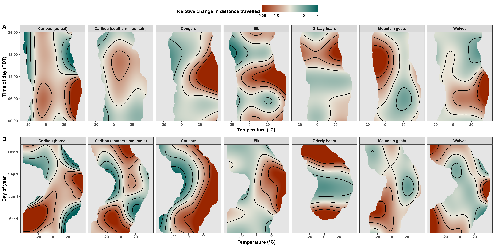

```{r setup, include=FALSE}
# set chunk defaults: don't print code, images text width and centered
knitr::opts_chunk$set(echo = FALSE, out.width = '\\textwidth',
                      fig.align = 'center', cache = TRUE, warning = FALSE,
                      message = FALSE)
```

<!--
available text sizes:
Huge > huge > LARGE > Large > large > normalsize > small > footnotesize > scriptsize > tiny
-->

<!--
six-sentence abstract:

1. introduce the topic
2. state the problem
3. summarize why the question hasn't been answered/what the consequences are
4. explain how you answered the question
5. explain the central findings
6. explain the importance of your findings and their consequences
-->

```{r, echo=FALSE}
abstract <- "Recent widespread warming has caused many terrestrial mammals to change when, how, and where they move. These changes in species' movement behavior have had cascading effects on individuals' fitness and habitat selection with consequences at the population, community, and ecosystem levels. Previous research has quantified changes in mammalian movement behavior, but we are lacking an estimate of the effects of climate change on fine-scale movement and habitat selection. We address this by using Continuous-Time Movement Models and Hierarchical Generalized Additive Models to quantify the effects of temperature on mammal's probability of movement, speed, and habitat selection. We then leverage the estimated effects to predict when, how, and where mammals will move in BC in the current century. We conclude with implications for energetics, encounter rates, habitat conservation, and human-wildlife conflicts."
```

<!-- elements of the title page -->

\noindent \textbf{Article type}: Research article

\noindent \textbf{Words in abstract}: `r stringi::stri_count_words(abstract)`

\noindent \textbf{Words in main text}: `r suppressMessages(wordcountaddin::word_count())`

\noindent \textbf{Figures}: 7

\noindent \textbf{Tables}: 1

\noindent \textbf{References}: 38 (updated on 2024-07-28) <!-- counted by using nature csl -->

\noindent \textbf{Appendices}: 3

\noindent \textbf{Key words:} climate change, temperature, mammals, animal movement, habitat selection

\clearpage

# Abstract {-}

\noindent `r abstract`

# Useful references to add {-}

* @hegel_interacting_2010: weather affects caribou calf recruitment and interacts with predator (wolf) abundance
* @elmore_implications_2017: "thermal environments should be foundational in the understanding of the habitat concept"
* @pease_ecological_2024: the scale at which we measure variables affects their estumated effect
* @hetem_responses_2014:
* rate of climate change is too fast for genetic adaptation to occur in mammals with longevities of decades
* example of suitable habitat prediction to 2050
* to read: https://doi.org/10.1186/s40665-016-0024-1

<!-- place table of contents on a new page -->
\newpage

\singlespacing

\tableofcontents

<!-- start main body on a new page -->
\newpage

\doublespacing

\linenumbers

```{r packages, warning=FALSE, message=FALSE}
library('dplyr') # for data wrangling
library('purrr') # for data wrangling
library('tidyr') # for data wrangling
library('ctmm')  # for movement models
```

<!--

other refs

* A review of climate change effects on marine mammals in United States waters: Past predictions, observed impacts, current research and conservation imperatives https://doi.org/10.1016/j.ecochg.2022.100054
* Global vulnerability of marine mammals to global warming: https://doi.org/10.1038/s41598-019-57280-3

-->

\clearpage

# Introduction

<!-- introduce knowledge gap -->

\noindent It is well understood that mammalian energetics depend on ambient temperature [@brown_toward_2004; @taylor_energetics_1982], but we have a limited understanding of how mammals adapt their movement behavior in response to temperature [@elmore_implications_2017; but see: @milling_seasonal_2017; @montgomery_movement_2019]. Previous work has focused on energetic costs of movement [@taylor_energetics_1982; @dyer_travel_2023], range shifts [@leclerc_determinants_2021], thermoregulation [@mota-rojas_physiological_2021; @melin_effect_2023], and trait-based responses [@mccain_assessing_2019], but there remains a need for a more comprehensive understanding of how mammals will adapt their fine-scale movement and habitat selection to future changes in temperature [@intergovernmental_panel_on_climate_change_climate_2023]. Movement plasticity [@nathan_movement_2008] allows mammals to react to changes in temperature on a shorter timescale than evolutionary physiological adaptations [@levins_evolution_1974]. By changing when, how, and where they move, mammals can conserve chemical and thermal energy as well as reduce the risk of overheating [@alston_temperature_2020; @dyer_travel_2023; @attias_effects_2018; @giroux_activity_2023; @verzuh_behavioural_2023; @williams_range_2018]. We present a multi-species analysis of how mammals adapt their movement behavior in response to changes in air temperature.

<!-- movement plasticity allows for rapid responses, but how does climate change impact this? -->

Recent changes in climate have affected mammals' movement rates and habitat selection [@deb_modelling_2020], but it is still unclear how changes in the current century will affect their fine-scale movement behavior and spatial distribution by the end of the century. In the last 200 years, many ecosystems experienced widespread warming that resulted in milder and shorter winters, hotter and longer summers, and a greater risk of extremely high temperatures and severe forest fires [@intergovernmental_panel_on_climate_change_climate_2023; @zurowski_summer_2023]. Over the next 100 years, these changes will continue to affect mammals' fitness, movement behavior, and habitat selection as they cope with growing heat stress [@deb_modelling_2020; @woo-durand_increasing_2020] and frequency and intensity of extreme events [@bunnell_global_2011] along with anthopogenic pressure [@sih_evolution_2011; @weststrate_how_2024].

<!-- implications for ecology: encounter rates, energetic expenditure, range shifts, consequences for conservation, etc -->

Understanding animals' responses to temperature is essential for anticipating their response to climate change in the coming decades and the cascade of consequences such changes will have. In light of the "30 by 30" conservation initiative, a global effort to conserve 30% of the world's lands and oceans by 2030 [@ref], we must understand which areas are best preserved to maximize the project's effectiveness. Predicting how climate change will affect how, when, and where animals will move is necessary for choosing which 30% of the world is most worth preserving. Changes in movement behavior impact several aspects of animals' fitness, behavior, and odds of survival, including encounter rates [with food, competitors, and predators: @martinez-garcia_how_2020], energetic expenditure [@taylor_energetics_1982], range shifts [@woo-durand_increasing_2020]. Thus, understanding the effects of temperature on animals' movement behavior and their consequences is crucial for effective conservation.

<!-- introduce the study -->

This paper provides an analysis of the effects of ambient temperature on the movement of six terrestrial mammal species in British Columbia (BC), Canada (*Canis lupus*, *Cervus canadensis*, *Oreamnos americanus*, *Puma concolor*, boreal and southern mountain *Rangifer tarandus*, and *Ursus arctos horribilis*; Table \@ref(tab:data-table)). Using over two decades of telemetry data over a large spatial range of Biritish Columbia (Fig. \@ref(fig:bc-map)) and hourly weather data, we estimate how mammals altered their movement frequency, movement speed, and habitat selection in response to air temperature. We then pair the estimated responses with climate change projections to forecast changes in mammalian movement in 2100 under different climate-change scenarios [Shared Socioeconomic Pathways, see @riahi_shared_2017]. We discuss the consequences of these changes in movement behavior with regards to to energetics, encounter rates, habitat conservation, and human-wildlife conflicts.

```{r bc-map, fig.cap="GPS telemetry data and 95% autocorrelated kernel density utilization distributions for the six species in this study."}
knitr::include_graphics('../figures/tels-map.png')
```

\footnotesize

```{r data-table}
readRDS('../models/movement-models-2024-06-06.rds') %>%
  transmute(
    Dataset = case_when(
      dataset_name == 'Canis_lupus_boreal' ~ '\\emph{Canis lupus}',
      dataset_name == 'Rangifer_tarandus_boreal' ~ '\\emph{Rangifer tarandus} (boreal)',
      dataset_name == 'Rangifer_tarandus_southern_mountain' ~ '\\emph{Rangifer tarandus} (southern mountain)',
      dataset_name == 'Puma_concolor_2' ~ '\\emph{Puma concolor}',
      dataset_name == 'Puma_concolor_4' ~ '\\emph{Puma concolor}',
      dataset_name == 'Elk in southwestern Alberta' ~ '\\emph{Cervus canadensis}',
      dataset_name == 'Oreamnos_americanus' ~ '\\emph{Oreamnos americanus}',
      dataset_name == 'Ursus_arctos_horribilis' ~ '\\emph{Ursus arctos horribilis}'),
    animal, # keep animal column for grouping later
    tel = purrr::map(tel, data.frame)) %>%
  unnest(tel) %>%
  group_by(animal) %>%
  mutate(dt = timestamp - lag(timestamp)) %>%
  group_by(Dataset) %>%
  summarize(Start = min(as.Date(timestamp)),
            End = max(as.Date(timestamp)),
            dt = as.numeric(median(dt, na.rm = TRUE))) %>%
  mutate(dt = round('hours' %#% dt, 2)) %>%
  rename('Median \U0394t (hours)' = dt) %>%
  knitr::kable(format = 'markdown', caption = 'Start and end of the GPS telemetries along with the median sampling interval ($\\Delta t$) for each of the species in this study.', escape = FALSE)
```

\normalsize

# Methods

## GPS telemetry data

\noindent Elk (*Cervus canadensis*) data from @ciuti_human_2012 were downloaded from Movebank [study name: Elk in southwestern Alberta, see @kays_movebank_2022], while boreal caribou (*Rangifer tarandus*) and wolf (*Canis lupus*) telemetries were acquired via a public BC Oil and Gas Research and Innovation Society repository ([https://www.bcogris.ca/projects/boreal-caribou-telemetry-data](https://www.bcogris.ca/projects/boreal-caribou-telemetry-data)), and the mountain goat (*Oreamnos americanus*) locations were provided by BC Parks. All other tracking data were obtained from private collaborators. Outlier GPS locations were removed following diagnostic analyses of the distance from the median location as well as straight-line displacement, turning angle, and time interval between consecutive points. Particular attention was paid to points with large turning angles ($\gtrapprox 170^\circ$) and high straight-line displacement, especially if antecedent and subsequent points indicated stationary behavior. The script used to clean the data and all custom functions used are available on GitHub ([https://github.com/QuantitativeEcologyLab/bc-mammals-temperature](https://github.com/QuantitativeEcologyLab/bc-mammals-temperature)).

## Historical temperature data

\noindent Rasters of hourly reanalyzed air temperature data were downloaded from the ERA5 dataset [@hersbach_era5_2023] from the European Center for Medium-range Weather Forecasting server (ECMWF; [www.ecmwf.int](www.ecmwf.int); [https://cds.climate.copernicus.eu](https://cds.climate.copernicus.eu)). Proximal weather conditions were estimated for each location by extracting the values from the corresponding raster cell from the temporally nearest raster using the `extract()` function from the `terra` package [version 1.7-46, @hijmans_terra_2023] for `R`  [@r_core_team_r_2024].

## Estimating mammals' instantaneous speeds

\noindent We modeled each animal's movement using continuous-time movement models [@fleming_fine-scale_2014] via the `ctmm` package [version 1.2.0, @fleming_ctmm_2023] for `R`. We then estimated mammals' instantaneous speeds by applying the `ctmm::speeds()` function on all models with finite speed estimates [416 of 433, see @fleming_fine-scale_2014; @noonan_scale-insensitive_2019]. The 17 telemetries with insufficiently fine sampling were for caribou (15 boreal and 2 southern mountain; see Table \@ref(tab:data-table)).

Since `ctmm`'s movement models assume stochastic but non-zero speeds (i.e., a single, stochastic moving state), data-informed speeds needed to be corrected so that the minimum instantaneous speed could be 0. We performed this correction by subtracting the data-independent, background minimum speed while assuming speeds were $\chi^2$-distributed and correcting the degrees of freedom and confidence intervals accordingly. The function we used is available on GitHub at [https://github.com/QuantitativeEcologyLab/bc-mammals-temperature/blob/main/functions/detrend_speeds.R](https://github.com/QuantitativeEcologyLab/bc-mammals-temperature/blob/main/functions/detrend_speeds.R). To avoid artifacts due to excessively small, non-zero speeds, we determined whether an animal was moving or not using the inflection point of each species' histogram of detrended speed estimates (Appendix A).

## Estimating the effects of temperature on mammals' movement

### Movement frequency and speed

\noindent We estimated the effects of temperature on mammals' state (moving or not) and speed (given the animal was moving) using two Hierarchical Generalized Additive Models [HGAMs, see @pedersen_hierarchical_2019] with the `mgcv` package for `R` [version 1.9-1, @wood_generalized_2017]. The first HGAM estimated the probability that an animal was moving with a binomial family of distributions. The second HGAM estimated an animal's speed (given that it was moving) with a gamma Location-Scale family of distributions [`mgcv::gammals()`, @wood_smoothing_2016]. Unlike the more commonly used gamma family (`stats::Gamma()`), the `mgcv::gammals()` family allows the mean-variance relationship to depend on covariates rather than assuming a constant mean-variance relationship. For example, if mean speed increases with temperature but the scale decreases, the variance in speed will not increase as much as with a constant scale parameter. The animal would then have low average speed but a (relatively) large variance at cold temperatures, and a high average speed with a (relatively) small variance at high temperatures.

The binomial and gamma HGAMs (see code chunk below) included random intercepts for each animal (`s(..., bs = 're')`), fixed intercepts for each species, and factor smooth interactions for time of day, day of year, and temperature for each species [`s(..., bs = 'fs')`, see model S in Figure 4 of @pedersen_hierarchical_2019]. Additionally, the models had three tensor product interaction terms (`mgcv::ti()`) for each species: (1) day of year and time of day, (2) temperature and time of day, and (3) temperature and day of year. These three terms accounted for: (1) seasonal changes in day length, (2) changes in the response to temperature at the hourly scale (e.g., changes in nocturnality), and (3) seasonal changes in the response to temperature (e.g., due to differences in coats), including changes in the timing of migratory behavior. The HGAMs accounted for the cyclicity of time of day and day of year using cyclic cubic splines [`bs = 'cc'`, @wood_generalized_2017]. Together, the binomial HGAM and the gamma HGAM inform us on an animal's long-term average speed, since it is the product of the probability the animal is moving and its average speed when moving. Additional details are provided in Appendix A.

\singlespacing

\small

```{r hgams, eval=FALSE, echo=TRUE}
m_1 <- bam(
  moving ~
    s(animal, bs = 're') +
    species +
    s(tod_pdt, by = species, k = 5, bs = 'cc') +
    s(doy, by = species, k = 5, bs = 'cc') +
    s(temp_c, by = species, k = 5, bs = 'tp') +
    ti(doy, tod_pdt, by = species, k = 5, bs = c('cc', 'cc')) +
    ti(temp_c, tod_pdt, by = species, k = 5, bs = c('tp', 'cc')) +
    ti(temp_c, doy, by = species, k = 5, bs = c('tp', 'cc')) +
    s(log(dt), k = 3) +
    s(log(dt), species, k = 3, bs = 'fs'),
  data = d,
  method = 'fREML', # fast REML
  discrete = TRUE, # discretize the covariates for faster computation
  knots = list(tod_pdt = c(0, 1), doy = c(0.5, 366.5))) # for bs = 'cc'

m_2 <- bam(
  speed_est ~
    s(animal, bs = 're') +
    species +
    s(tod_pdt, by = species, k = 5, bs = 'cc') +
    s(doy, by = species, k = 5, bs = 'cc') +
    s(temp_c, by = species, k = 5, bs = 'tp') +
    ti(doy, tod_pdt, by = species, k = 5, bs = c('cc', 'cc')) +
    ti(temp_c, tod_pdt, by = species, k = 5, bs = c('tp', 'cc')) +
    ti(temp_c, doy, by = species, k = 5, bs = c('tp', 'cc')) +
    s(log(dt), k = 3) +
    s(log(dt), species, k = 3, bs = 'fs'),
  family = Gamma(link = 'log'),
  data = d_2, # data filtered for speed > 0
  method = 'fREML',
  discrete = TRUE,
  knots = list(tod_pdt = c(0, 1), doy = c(0.5, 366.5)))
```

\normalsize

\doublespacing

### Habitat selection

\noindent We estimated the effects of temperature on each species' selection for percent forest cover, elevation, and distance from fresh water (i.e., not sea water) using a series of HGAMs with Poisson families of distributions [Appendix B, also see @aarts_estimating_2008; @alston_mitigating_2022]. While we recognize there are other important drivers of habitat selection, we decided to only use these three proxies to produce results that are relatively comparable between species and to make province-wide predictions simpler. Each species' model had the same structure:

\singlespacing

\small

```{r rsf, eval=FALSE, echo=TRUE}
rsf <- bam(
  detected ~ # 1 for GPS locations, 0 for quadrature data
    # species-level average resource preference
    s(forest_perc, k = 6, bs = 'tp') +
    s(elevation_m, k = 6, bs = 'tp') +
    s(dist_water_m, k = 6, bs = 'tp') +
    # animal-level deviations from the species-level average
    s(animal, bs = 're') +
    s(forest_perc, animal, k = 6, bs = 'fs', xt = list(bc = 'cr')) +
    s(elevation_m, animal, k = 6, bs = 'fs', xt = list(bc = 'cr')) +
    s(dist_water_m, animal, k = 6, bs = 'fs', xt = list(bc = 'cr')) +
    # changes in preference with temperature
    ti(forest_perc, temperature_C, k = 4, bs = 'cr') +
    ti(elevation_m, temperature_C, k = 4, bs = 'cr') +
    ti(dist_water_m, temperature_C, k = 4, bs = 'cr'),
  family = poisson(link = 'log'),
  data = d,
  weights = weight, # based on AKDE
  method = 'fREML',
  discrete = TRUE)
```

\normalsize

\doublespacing

Smooth effects of forest cover, elevation, and distance to fresh water accounted for the species-level average selection strength for each resource. A random effect for each individual animal corrected for uneven sampling across individuals, while factor smooth interaction terms (`bs = 'fs'`) accounted for individual level resource selection (i.e., individual-level deviations from the species-level average). Finally, tensor interaction product terms (`ti()`) of each resource and temperature estimated the effect of temperature on the selection strength for each resource. Each model used a Poisson distribution and a $\log$ link function because detected is the number of animals (0 or 1) within a small, finite amount of space and time. Detections were down-weighted proportionally to their dependence on temporally proximate detections [see Appendix C and @alston_mitigating_2022], while quadrature points had a weight of 1. Finally, we fit each model with fast REML (`'fREML'`) and discretized covariates (`discrete = TRUE`) to optizimize computational efficiency with no meaningful losses to model performance [@wood_generalized_2015; @wood_generalized_2017-1; @li_faster_2020].

## Predicting changes in animal movement during the current century

***check this***

\noindent Rasters of projected monthly average temperature in BC from 2020 to 2100 were obtained via the `climatenaR` package [version 1.0, @burnett_climatenar_2023] for `R`. Since the climate projections did not provide a measure of variation in temperature within each month, we estimated within-month variance by fitting a GAM for location and scale [GAMLS, see @rigby_generalized_2005; @stasinopoulos_generalized_2007] to the monthly variance in temperature using the hourly ERA5 data for BC during from 1998 to 2023 [extremes included, see @hersbach_era5_2023]. The model included smooth terms of the monthly mean temperature, month, and year as well as and a two-dimensional smooth of space and a tensor interaction product term of space and month (Appendix C).

```{r, eval=FALSE}
'Gamma GAMLS code'
```

We accounted for hourly variation in weather by assuming temperature followed a normal distribution with mean specified by the `climatenaR` climate projectionS and variance as specified by the Gamma GAMLS. We then predicted changes in movement behavior and habitat selection as a function of temperature using the HGAMs and HRSFs along with the temperature HGAM described above. For each month within each year from 2020 to 2100 we simulated hourly weather by including temperatures from the 5%, 10%, 20%, ..., 80%, 90%, and 95% (***?***) quantiles and weighted each quantile proportionally to the Gaussian probability density for each value (Appendix C).

# Results

## Effects of temperature on movement rates

\noindent Partial effect of temperature varied across species (Fig. ***AX***), even after accounting for differences in daily and seasonal activity (e.g., sleeping, migration, hibernation; see Fig. ***AX***). Smooth interaction terms were well-behaved and indicated clear shifts in daily activity for all species. The models explained reasonably high proportions of the deviance (11% for the binomial model and 79% for the Gamma model) and had good in-sample prediction (Fig. ***AX***).

```{r dist, fig.cap="\\textbf{Temperature is a strong determinant of how far and when mammals' travel.} Estimated effects of temperature on relative change in distance travelled (probability of moving times speed when moving) over time of day (\\textbf{A}) and day of year (\\textbf{B}). Predictions in the surface plots extend to 10% of the range away from each datum. The color bar is on the $\\log_2$ scale to help visualize patterns in doubling, and values are capped to -75\\% and +300\\% for ease of readability."}

```

Both movement frequency and speed when moving decreased with increasing sampling interval, with a strong common effect (Fig. ***AX***). ***here***

`ctmm` models are scale independent assuming single, homogeneous behavior, but scale-dependency in the behavior (data) causes sampling effects

worse climate-change scenarios corresponded to greater changes in behavior along with greater variance in within years

### Predicted changes in movement during the current century

```{r t-dist, fig.cap="\\textbf{The intensity and direction of changes in movement rates due to climate change vary among species, but worse climate-change scenarios consistently result in the greatest change and greatest uncertainty.} Lines indicate the projected relative change in mean distance travelled (probability of moving times speed when moving) due to changes in temperature within the species' current extent. Shaded areas indicate the mean 95% Bayesian credible intervals. Changes are relative to the mean distances travelled in 2020 across the four Shared Socioeconomic Pathways (SSPs). The SSPs are listed in order of similarity to current conditions, from SSP 1-2.6 (sustainability, best-case scenario) to 5-8.5 (fossil-fueled development, worst-case scenario). The projections only account for changes movement behavior (i.e., movement frequency and speed) and ignore changes in physiology or movement costs."}
knitr::include_graphics('../figures/distance-travelled-local-cc-predictions.png')
```

```{r s-dist}
plot(1, main = '4. spatial projections of distance in 2020 and 2100')
```

## Effects of temperature on habitat selection

```{r hrsfs, fig.cap="\\textbf{Central message.} Estimated resourse selection strength for forest cover (\\%), elevation (km), and distance from fresh water (km) as a function of temperature. The grey contours indicate the extent of each speices' observed locations."}
knitr::include_graphics('../figures/rsf-surface-plots.png')
```

### Predicted changes in movement during the current century

```{r t-hrsfs, fig.cap="\\textbf{The intensity and direction of changes in habitat selection due to climate change vary among species, but worse climate-change scenarios consistently result in the greatest change and greatest uncertainty.} Lines indicate the projected change in relative selection strength for forest cover (\\%), elevation (km), and distance from fresh water (km) due to changes in temperature within the species' current extent. Shaded areas indicate the mean 95% Bayesian credible intervals. Changes are relative to the relative selection strength in 2020 across the four Shared Socioeconomic Pathways (SSPs). The SSPs are listed in order of similarity to current conditions, from SSP 1-2.6 (sustainability, best-case scenario) to 5-8.5 (fossil-fueled development, worst-case scenario)."}
plot(1, main = '6. temporal projections of RSFs within current area')
```

```{r s-hrsfs}
plot(1, main = '7. spatial projections of RSFs in 2020 and 2100')
```

# Discussion

* as temperatures get warmer, we will be pushing into the unknown portion of the surface plots
* our models don’t include any physiological responses to temperature that may impact movement (e.g., hybernation)
* our models also assume the behaviour we modeled now will persist into the future (e.g., hybernation, migration)
* based on the model, temperature doesn't affect grizzlies' hibernation much, and their displacement in winter is very low due to P(moving) being so low:
* if the RSS decreases a lot, individuals may disperse, populations may relocate, or stay where they are and suffer

<!-- - how results answer central question -->

## Effects of temperature on mammals' movement


## Effects of temperature on mammals' habitat selection


<!-- - what it tells us about the broader field -->
## Consequences for conservation

* changes in temperatures are pushing to areas in the surface plots that have little data and may be poorly estimated. We will need to extrapolate to prepare for future changes, which implies some degree of inevitable risk. The best wat to avoid this is by designing models that are statistically sound and interpretable. The models we present provide an estimate of the changes in behavior, but they are not tailored specifically to any of the species in the dataset. Species-specific models should account for more particular variables (e.g., forest age for caribou) and use dynamic resource rasters (i.e., not use a static estimate of forest cover). Nonetheless, we present important results for understanding how mammals will respond to changes in climate and weather during the next ~75 years. 
* energetics
* GPS sampling intervals were large: need more work on fine-scale movement, including accounting for multiple movement sates (e.g., traveling, grazing, resting, hunting, etc.). this would help deal with over-dispersion
* encounter rates (lower encounter rates with food [@hou_cold_2020])
* HWI

<!-- - address any questions presented in the discussion -->

\clearpage <!-- to prevent figures from floating to the references -->

\newpage <!-- place references on a separate page -->

<!-- additional references:

- boars' sleep quantity, efficiency and quality are reduced on warmer days (https://doi.org/10.1098/rspb.2023.2115)

-->

# References {-}

\hangparas{1em}{1} <!-- paragraphs hanging by width equal to font height -->
